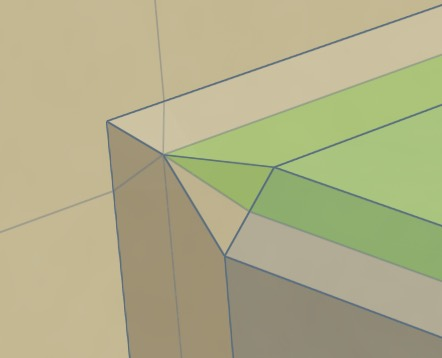
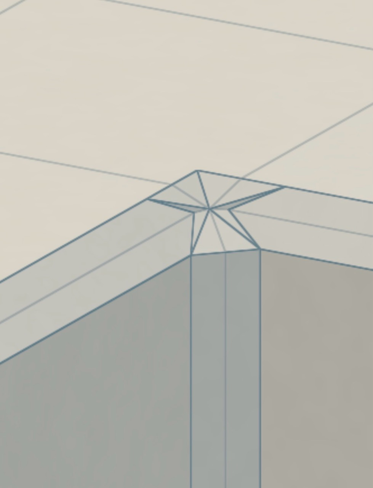

# LUFT bevel miter: the rendered patch was still wrong

Use this case when reviewing procedural mesh topology, bevels, fillets, or a
visual-success claim supported mainly by structural tests.

## 1. Preserve the user's diagnostic framing

The user framed one mixed vertex tightly enough that the failure is the subject
of the image: the highlighted chamfer strip loses its width and collapses to a
point. A later wide architectural capture retained the case but made it too
small to judge. Keep the closeup as primary evidence and use the wide view only
for context.

## 2. Reject a successful render that looks worse

The attempted fix added points, remained watertight, agreed between CPU and GPU
realizations, and passed exhaustive star tests. It nevertheless expanded the
old singularity into a conspicuous high-valence fan of skinny triangles. Name
the visible regression directly. Do not infer visual success from the render
completing, from mathematical intent, or from test volume.

## 3. Compare the topology with an independent oracle

Blender's Arc outer miter carries broad, coherent bevel bands through the mixed
corner without a central star or a collapsing strip. The transferable oracle
is the relationship, not Blender's entire representation: approximately
constant band width, ordered boundary turns, no sliver fan, and a crease graph
that follows the band rather than decorating the old singular centre.

For a similar review:

1. Retain the user's exact crop and state before producing new evidence.
2. Capture the production path at an equal or larger native scale, with guides
   both on and off.
3. Compare silhouettes, band width, angular order, and crease connectivity—not
   only vertex positions, winding, or watertightness.
4. Turn the rejected collapse and pinwheel into geometric regression tests.
5. Keep perceptual status rejected or awaiting review until the user approves
   the closeup.
