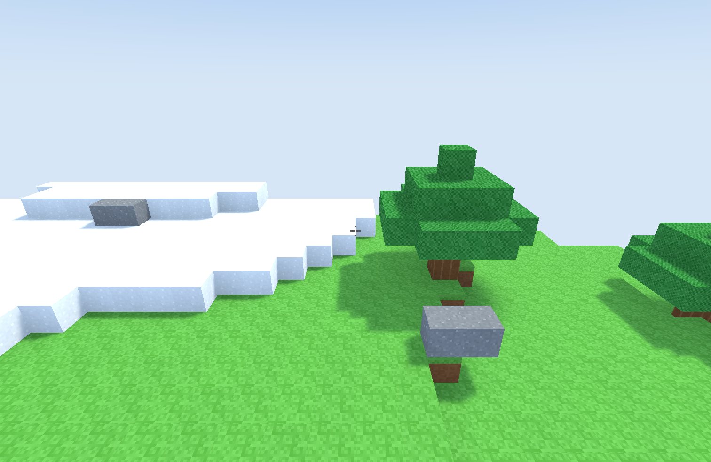

# luv



Luv is an experimental Common Lisp GPU workshop: a small WebGPU-shaped
hardware layer with hand-built Vulkan and native Metal 4 backends, an SDL3
canvas host, Lisp-defined mathematical shaders, and a McCLIM backend for live
tools on GPU surfaces. The aim is not a general-purpose engine; it is graphics
machinery small enough to inspect and redefine while it is running.

The repository contains two game experiments. **Luvcraft** is the original
procedural block world that grew the renderer, simulation, persistence, and
in-world tools. **Luft** is the current second-generation experiment: canonical
cubical topology, packed integer manifold-sheet meshes, and a playable McCLIM
atelier for developing the world from inside it.

## Run the current experiment

Development happens in a durable SBCL image supervised by
[Swash](https://github.com/lessrest/swash):

```sh
./scripts/install-dev-profile       # first setup, or after dependency changes
./sly play luft                     # start the image and open the Luft atelier
./sly status                        # identify the image, target, and canvas health
./sly screenshot build/frame.png    # capture the next rendered frame
./sly stop-playing                  # close the window; keep the Lisp
```

For remote or non-terminal work, `nix develop .#slim` (or
`./scripts/install-dev-profile --slim`) omits libghostty-vt and its large Zig
build graph. The Lisp workbench still loads; use the full profile when opening
a Luvcraft terminal.

`./sly play` without a target opens Luvcraft. The same command also provides
`eval`, `inspect`, `describe`, `apropos`, `edit`, and `xref` against the live
image. See [AGENTS.md](AGENTS.md) for the concise development workflow and
concrete output examples.

Standalone executables are available for release-style testing:

```sh
make
./build/luft-atelier                # current Luft experiment
./build/luvcraft                    # original block world
```

Metal 4 is used natively on macOS; Vulkan is used elsewhere and remains
available on macOS for comparison.

## Explore

- [The workshop wiki](https://mbrock.github.io/luv/) is the design notebook and
  rendered source browser.
- [Luft](wiki/luft.org), [Luft sites](wiki/luft-sites.org), and
  [Luvcraft](wiki/block-world.org) introduce the game experiments.
- [GPU architecture](wiki/gpu-architecture.org),
  [mathematical shaders](wiki/mathematical-shaders.org), and
  [quantities and measurement](wiki/quantities-and-measurement.org) describe
  the machinery beneath them.

Everything here is experimental and under active construction.
