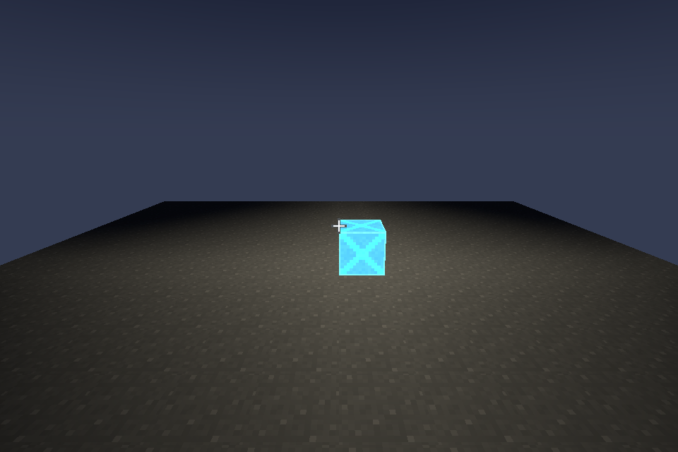
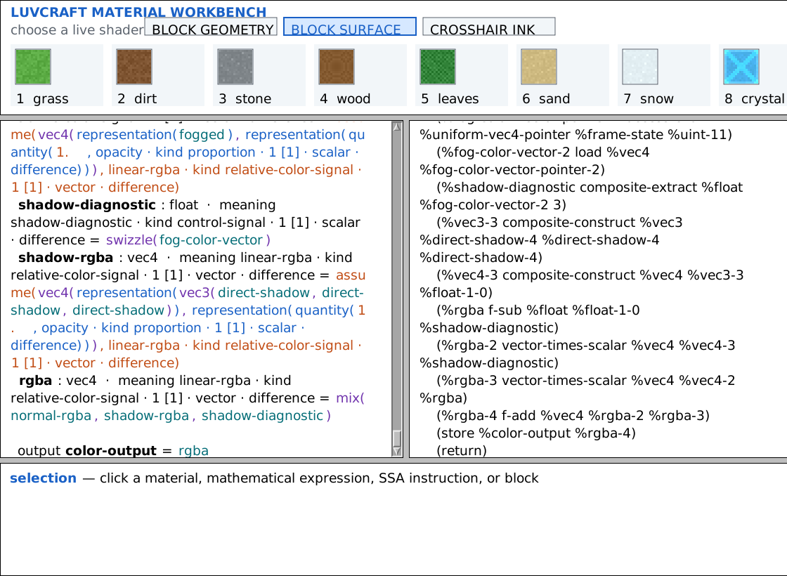
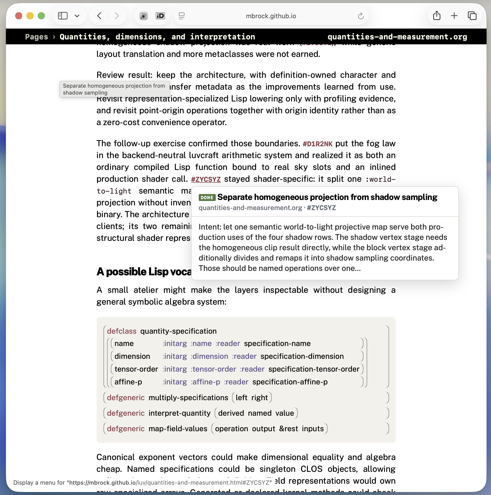
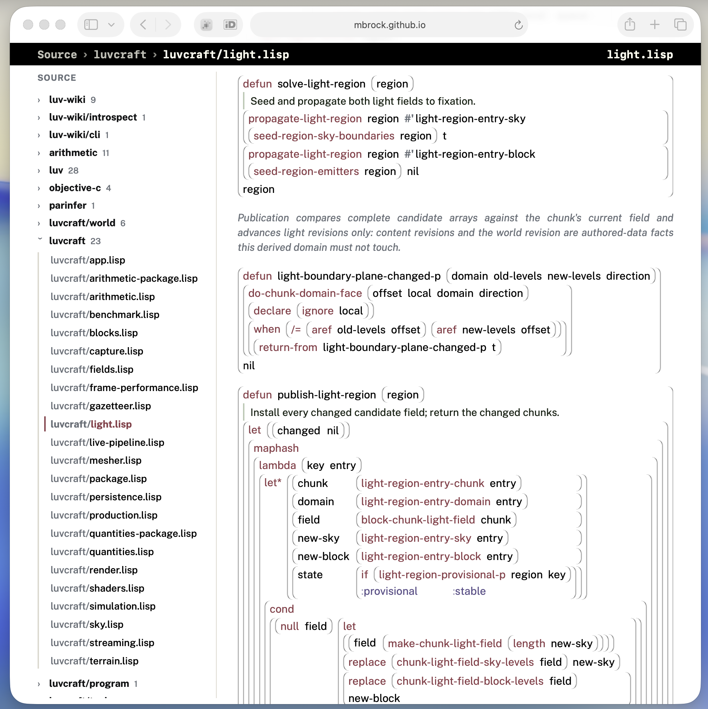

# luv


`luv` is a Common Lisp GPU workshop. It has a WebGPU-ish hardware abstraction
layer with hand-built Vulkan and native Metal 4 backends, an SDL3 canvas host,
a mathematical shader language, a little voxel world called **luvcraft**, and
a McCLIM backend for putting live Lisp tools on GPU surfaces.

It is all rather experimental. The point is not to hide graphics programming
behind an enormous engine. The point is to make the interesting machinery small
enough to inspect, change, and keep running while we change it.

## Start with one live Lisp

Everything happens in one durable SBCL image per checkout, and the game
normally runs inside it:

```sh
./sly play                              # boot the image and open the real game
./sly status                            # identify the image and game state
./sly screenshot build/frame.png        # capture what the game is showing
./sly stop-playing                      # checkpoint and close the game
./sly restart                           # explicit recovery if the image is wrecked
```

`play` starts the checkout's durable image when necessary. `eval`, `inspect`,
`describe`, `apropos`, `edit`, and `xref` all talk to that same process, where
`luvcraft:*session*` names the game. `./sly --help` is the command map.
`build/luvcraft` is the shipped/CI executable, not the ordinary development
entry point.

## A GPU system we can understand

The HAL borrows the useful shape of WebGPU—devices, queues, resources,
descriptors, encoders, passes, submission—but WebGPU is a landmark, not a
specification luv is trying to reproduce.

Here is enough Lisp to open a canvas, ask for the current backend's device, and
put some colour on the screen:

```lisp
(defparameter *canvas* (open-canvas (make-sdl-canvas)))
(defparameter *device* (request-gpu-device *gpu-provider*))
(defparameter *context*
  (make-canvas-context
   *canvas* *gpu-provider*
   (make-canvas-configuration :device *device*)))

(render-canvas-color *context* 0.08 0.12 0.18)
```

Those forms do not know whether the device is Vulkan or Metal. Both backends
are tailored to this project: Vulkan is a hand-owned CFFI layer; Metal goes
straight through a small Objective-C bridge to Metal 4. SDL3 owns the window,
input, and native event loop.

That makes low-level things unusually reachable from Lisp. A command is an
ordinary inspectable object. A shader method can be redefined in a running
image. A queue submission has an explicit lifetime story. When an abstraction
is wrong, we can follow it all the way down and change it.

The longer version lives in [the GPU architecture
notes](wiki/gpu-architecture.org), [the Vulkan field
notes](wiki/luv-vulkan-hal.org), and [the native Metal 4
notes](wiki/metal-backend.org).

## Shaders are Lisp, and the numbers mean something

The arithmetic vocabulary begins with ordinary-looking declarations:

```lisp
(math:define-quantity-kind :lattice-velocity
  :dimension ((:duration -1)))

(math:define-quantity :world-position :kind :lattice-coordinate
  :character :point
  :components (:world-x-position :world-y-position :world-z-position))

(math:define-quantity :player-walk-speed :kind :lattice-velocity
  :non-negative-p t)
```

So a position is a point rather than a displacement, and a walk speed carries
inverse-time dimension even if both eventually become plain machine numbers.
The arithmetic checker rejects expressions that only happen to share a
representation.

A world law can then be written once:

```lisp
(lang:define-arithmetic-function fog-amount-at-view-distance
    ((view-distance :quantity :view-distance :unit :cell)
     (fog-near :quantity :view-distance :unit :cell)
     (fog-far :quantity :view-distance :unit :cell))
  (let* ((fog-span (- fog-far fog-near))
         (fog-progress
           (math:clamp (/ (- view-distance fog-near) fog-span)
                       (lang:quantity 0.0 :unit :one)
                       (lang:quantity 1.0 :unit :one))))
    (lang:interpret (* fog-progress fog-progress)
                    :quantity :fog-amount :unit :one)))
```

That definition becomes both an ordinary compiled Lisp function and an
inlined operation in the production shaders. The shader methods themselves are
also Lisp. This is the complete fragment shader for the crosshair:

```lisp
(define-shader-method shader-specification-for
    block-world-crosshair-fragment-specification
    ((role (eql :block-crosshair)) (stage (eql :fragment)))
    (:stage :fragment
     :inputs ((ink-input :vec3 :location 0
                         :quantity :linear-rgb :unit :one))
     :outputs ((color-output :vec4 :location 0)))
  (let ((rgba
          (assume-quantity
           (vec4 (representation ink-input)
                 (representation
                  (quantity 1.0 :quantity :opacity :unit :one)))
           :quantity :linear-rgba :unit :one)))
    (set-output color-output rgba)))
```

The role and stage are CLOS specializers; the interface and body remain
inspectable objects. Luv lowers them to SPIR-V for Vulkan or structured MSL for
Metal 4 and keeps enough provenance to connect an expression to the SSA
instructions it produced.

[Mathematical shaders](wiki/mathematical-shaders.org) explains the live shader
objects. [Quantities and measurement](wiki/quantities-and-measurement.org) is
the more ambitious account of what the arithmetic system is trying to keep
honest.

## Luvcraft is where the abstractions have to survive



Luvcraft is an editable, procedural block world—not because the world needs
another Minecraft clone, but because a game is a good way to stop a rendering
API from becoming a collection of attractive diagrams.

There is terrain generation, chunk streaming, meshing, collision, block
editing, a moving sky, shadows, block light, textured materials, persistence,
and live shader replacement. CPU work crosses explicit ownership boundaries;
GPU objects stay on the render thread; stale asynchronous results are thrown
away instead of becoming mysterious scenery.

The checked-in pictures come from a small screenshot *gazetteer*: named worlds,
cameras, and times of day rendered through the same hidden SDL/GPU path as the
real application. They are visual fixtures as well as illustrations. See [the
block-world notes](wiki/block-world.org) for the current proof and the possible
worlds beyond it.

## McCLIM, on the GPU, inside the world



CLIM—the Common Lisp Interface Manager—is an old and still unusual way to build
interfaces around semantic objects and commands rather than a pile of inert
pixels. [McCLIM](https://mcclim.common-lisp.dev/) is its open-source Common Lisp
implementation.

Luv has a custom McCLIM backend. Today it can take McCLIM's raster output,
upload it to a GPU texture, and present or composite that texture through the
same canvas system. The shader browser above is a real McCLIM application: the
materials, mathematical expressions, definitions, and lowered instructions are
presentations you can point at and inspect.

The next step is more peculiar: bypass the software rasterizer, retain the
actual CLIM geometry, and render curves and glyphs directly on the GPU. From
there, a listener, inspector, map, or editor does not have to live in a separate
desktop window. It can be a screen, panel, instrument, or object in the 3D
world.

## Live hacking, including by agents

Common Lisp already assumes that a program can stay alive while you inspect and
redefine it. Luv leans into that. `./sly` talks to a durable development image;
every standalone luvcraft process also advertises its own Slynk endpoint, so an
agent can inspect the exact running game, follow cross-references, redefine a
shader, and watch the dependency machinery publish a replacement pipeline.

The repository is arranged for that style of work. [AGENTS.md](AGENTS.md) gives
an agent the concrete operating rules, while the [workshop wiki](wiki/index.org)
keeps architecture, source studies, experiments, and unfinished questions in a
form that both people and agents can navigate from the terminal.

The larger ambition is to stop treating agents as creatures permanently
outside the application. Luvcraft could contain terminals and simulated
devices through which you talk to them, or NPC-like avatars with tools and a
place in the world. Instead of leaving the world to ask an agent to change it,
you might remain inside it and work together there. That part is a direction,
not a finished feature—but much of the introspective plumbing it would need is
already becoming real.

## A wiki you can wander through

[mbrock.github.io/luv](https://mbrock.github.io/luv/) is the project's design
notebook and source browser, rendered from the same repository on every push.
The pages are made of small, stable *figures*: ideas and work marks that can
link to one another, collect backlinks, and open as hover cards without losing
your place.



It also renders the whole Lisp source tree as structural boxes rather than a
flat monospace listing. Symbols link to their definitions; comments and
docstrings read as prose; references in code lead back to the design figures
that explain why the code has its present shape.



You can start with [the quantities and measurement
page](https://mbrock.github.io/luv/quantities-and-measurement.html), jump into
[the source index](https://mbrock.github.io/luv/source.html), or simply follow
whatever link looks interesting. It is intended to be browsed, not read in
order.

## Poking it

The universal installation instruction in 2026 is: point Codex at this
repository and say **set this thing up**. The project-specific facts it needs
are in [AGENTS.md](AGENTS.md).

Once the environment exists, the short human version is:

```sh
make
./build/luvcraft
```

On macOS the bare executable uses the native Metal 4 backend. Pass `--vulkan`
when an explicit MoltenVK comparison is useful; other platforms continue to
default to Vulkan.

While the game is running, this evaluates inside that exact process:

```sh
./sly --luvcraft eval '(type-of luvcraft:*session*)'
```

And this captures the next rendered frame straight from luvcraft's GPU color
attachment—no window focus or operating-system screenshot automation involved:

```sh
./sly --luvcraft screenshot build/screenshot.png
```

This builds a standalone Metal game, waits for quiet streaming, and writes a
Tracy capture containing a half-second baseline followed by one natural chunk
boundary crossing:

```sh
make tracy-streaming
```

And this regenerates the luvcraft and McCLIM images from the real renderers:

```sh
make readme-screenshots
```

This is a workshop, not an authority, and it is very much still under
construction.
