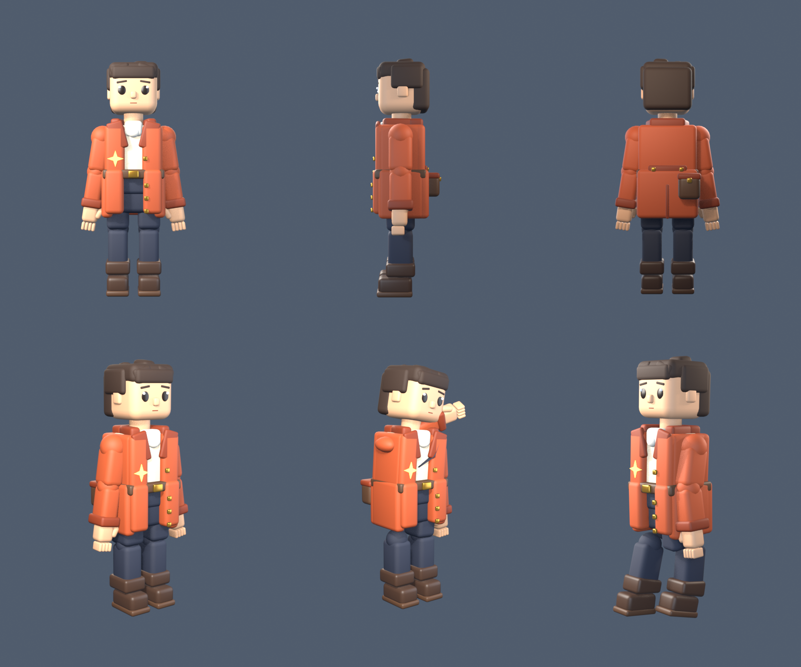

# Claude's avatar

A rigged, animatable figure for Claude to inhabit the luvcraft world: rounded
blocky forms in the spirit of the current voxel look, but with enough mesh and
skeleton to move around, work at terminals, and build things.



| file | what it is |
| --- | --- |
| `build-avatar.py` | the source of truth — the whole avatar as one script |
| `claude-avatar.blend` | generated Blender scene (mesh, rig, materials, clips, lighting) |
| `claude-avatar.glb` | generated glTF 2.0 export: skinned mesh + 3 animations |
| `preview.png` | generated contact sheet |

## Rebuilding

Everything is regenerated from the script; the `.blend` and `.glb` are outputs.

```bash
/Applications/Blender.app/Contents/MacOS/Blender --background --python luvcraft/avatar/build-avatar.py
```

From a live Blender session (how it is normally iterated on), run
`main()` and `render_sheet()` after exec'ing the file.

## The asset

- **1.85 m tall**, origin at the feet on `z = 0`, facing `-Y`.
- **12k verts / 14.5k tris**, one mesh, 13 flat materials, smart-projected UVs
  so it can take real textures later.
- **26 bones**: `root`, `hips`, `spine`, `chest`, `neck`, `head`, and per side
  `clavicle`, `upper_arm`, `forearm`, `hand`, `fingers`, `thumb`, `thigh`,
  `shin`, `foot`, `toe`. Bind pose is an A-pose so the hands hang clear of the
  coat.
- **3 clips**: `Idle` (120f breathing sway), `Wave` (52f), `Walk` (25f loop,
  with hip drop so the feet plant on the floor rather than skating).

## How it is built

Body volumes are overlapping primitives joined into one mesh. Two decisions do
most of the work:

- **Joint spheres.** Every joint is an icosphere sized to the limb, so segments
  always overlap and the silhouette never opens up when the rig bends.
  Icospheres, not UV spheres — a UV sphere's pole shows as a dimple where the
  joint emerges from a limb.
- **Pinned details.** Automatic weights are right for the big volumes but drag
  small applied pieces toward whatever limb is nearby: the chest emblem
  stretched into a banner when an arm lifted, and the coat tore at the
  shoulder. So each applied piece is tagged with the bone it belongs to
  (`tag="chest"`, `"hips"`, `"head"`, `"foot.L"`) and hard-bound to it. The
  coat skirt is pinned to the hips and swings as one piece; the belt hides the
  chest/hips seam.

`root` is marked non-deforming. Left deforming, automatic weights bind the boot
soles to it and they stay on the ground while the rest of the leg walks away.

## Next steps

luvcraft has no mesh or skin loader yet, so the model is currently an asset
without a renderer. To get the figure into the world:

1. A glTF loader plus skinned-mesh drawing (a good fit for the task/mesh-shader
   renderer in `luft/`).
2. An avatar entity driven from `./sly` — walk to a place, look at something,
   use a terminal wall.
3. More clips as they are needed: typing, mining, carrying, sitting.

Baking the 13 materials down to one texture atlas would cut the draw calls, but
keeping them separate is friendlier while the texturing style is still moving.
