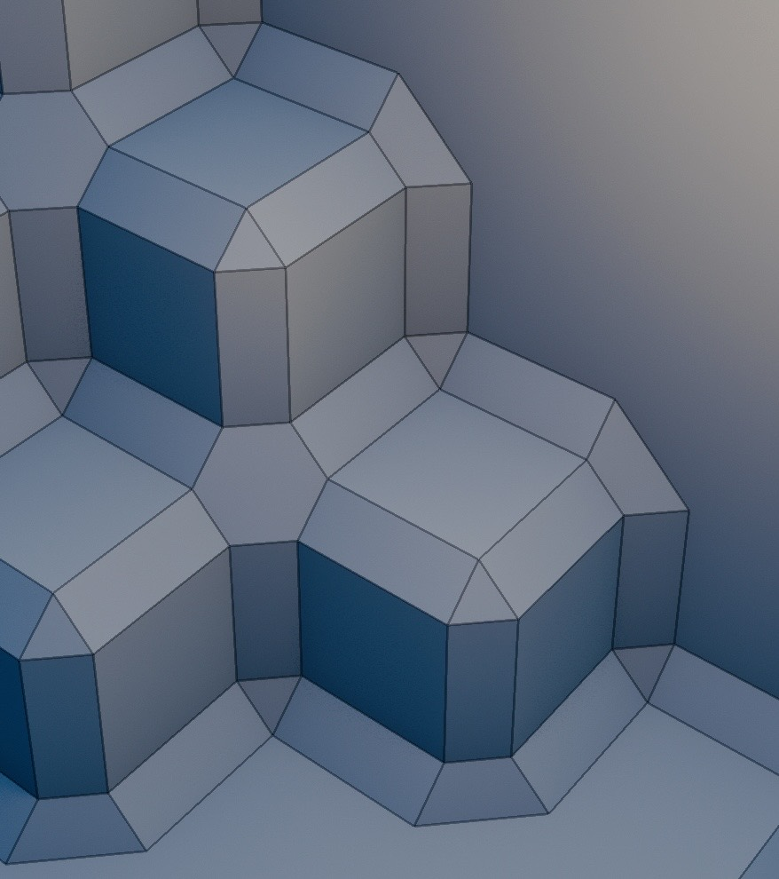

#+title: The bevel junction is an open problem
#+startup: overview

* The sharp bevel is a global map from sites to points
:PROPERTIES:
:ID: 2H7DL8
:END:

LUFT's refounded chamfer has an unusually strong regularity.  A canonical
edge or vertex site $s$, its occupancy star, and the width $w$ determine one
point

\[
G(s)=s+w\rho(\operatorname{star}(s))q(\operatorname{star}(s)).
\]

An oriented face does not invent that point.  It merely includes the same
$G(s)$ as every other face incident to the site.  The CPU classifies four edge
stars and four vertex stars into one 32-bit shape word; the vertex shader
decodes those decisions and realizes sixteen points on the same 4 by 4 patch
for every face.  Fixed positive and negative index templates draw eighteen
triangles.  #RUAWR5 explains the displacement rule and its closure tests.

This is correct by construction in a specific sense: incident faces agree,
the surface is watertight without stitching, cubical transforms preserve the
rule, and CPU decisions have one continuous realization at the live width.
It is also inherently a sharp-miter system.  If several chamfer strips meet at
one lattice vertex, they all have exactly one $G(s)$ at which to terminate.

That limitation is honest and local.  The ordinary convex and concave bevel
geometry keeps its coherent structure; only a mixed junction asks for a
codomain richer than one point.

* A miter arc carries the band; it does not decorate a singularity
:PROPERTIES:
:ID: DJK8HW
:END:

Three user-supplied screenshots preserve the visual argument.  The first is
the original LUFT junction, deliberately zoomed and framed on the problem:
the green chamfer strip loses its width and collapses into the one shared
point.

[[file:images/luft-miter-initial-collapse.jpg]]

The second is the first attempted repair.  Extra points do not carry the
strip around the corner; they enlarge the old singularity into a conspicuous
pinwheel of skinny triangles.

[[file:images/luft-miter-failed-pinwheel.jpg]]

The third is Blender's Bevel modifier with =Outer Miter= set to =Arc=.  It is
an independent visual oracle, not a requirement to copy Blender's mesh
representation.  Broad bevel bands turn through the mixed junction without a
central star, a sliver fan, or a strip narrowing to a point.  Blender's
[[https://docs.blender.org/manual/en/latest/modeling/meshes/editing/edge/bevel.html][bevel documentation]] describes the Arc choice as two vertices near the
meeting joined by a curved arc.

The transferable requirements are relational: approximately constant band
width, an ordered turn, and a crease graph which follows the band.  A broad
architectural plate such as #Z5NDTA supplies context, but it cannot replace
the user-framed closeup as evidence.

* The minimal-arc transition crossed the architecture halfway
:PROPERTIES:
:ID: RJ0RLN
:END:

Commit [[https://github.com/mbrock/luv/commit/4724734bae93bc9d9e7a296ddf10f513f1ba7434][4724734]] tried to move from the sharp junction to an Arc-like one while
retaining a fixed face patch.  It made two changes which need to be judged
separately.

The useful representational observation was that one compact corner direction
cannot describe several directed endpoints around the same vertex.  The
commit therefore replaced the CPU-authored edge and corner conclusions in the
shape word with four complete eight-cell stars.  It expanded every face from
sixteen to twenty-four implicit points by adding two half-edge points at each
corner, and from eighteen to twenty-six triangles.

But this also partly reversed the refoundation's CPU/GPU boundary.  Before the
commit the CPU classified occupancy and the shader decoded the answer.  After
it, the shader again counted occupancy, computed minority moments, projected
half-edge stars, recognized miter configurations, and selected point formulas.
The CPU still extracted a bounded neighborhood into a 16-byte record, so this
was not a return to arbitrary shader-side world reads, but discrete bevel
meaning had moved back into every vertex invocation.

Most importantly, the topology did not make the same transition as the point
data.  Directional endpoints were inserted into the old face-owned patch and
triangulated back to its shared centre.  The representation wanted a coherent
vertex junction; the indices still described a centre-oriented face fan.  The
visible pinwheel in #DJK8HW is that mismatch, not a small tuning error.

LUFT has therefore returned to the sharp baseline.  The failed transition is
kept as evidence rather than retained as latent complexity in every ordinary
face.

* Structural proofs implemented the rejected specification faithfully
:PROPERTIES:
:ID: 7LEM72
:END:

The minimal-arc experiment remained watertight, preserved shared incident-face
positions, transformed over the cubical symmetry group, produced consistently
wound nondegenerate triangles, and agreed between independent CPU and shader
arithmetic to floating-point tolerance.  Those checks established that the
program implemented its specification.

They did not establish that the specification was an Arc bevel.  None asked
whether a strip retained its width, whether the crease graph contained an
unexpected high-valence centre, or whether the triangulation formed slivers.
The rendered closeup rejected the result immediately.

This separates three claims which future work must not conflate:

1. the records and triangles are combinatorially valid;
2. CPU and GPU realize the same formulas; and
3. the formulas and connectivity express the intended bevel.

The first two remain necessary engineering evidence.  The third needs an
independent geometric oracle and human inspection.  Exhausting all 256 stars
cannot rescue a predicate which never states the visible requirement.

* The sharp baseline remains inspectable at the problem scale
:PROPERTIES:
:ID: L7N4MO
:END:

The miter study of #Z5NDTA retains the exact =#xCD= wall termination alongside
five-, six-, and seven-cell junctions.  Two named captures use the production
renderer, the normal 0.11-cell chamfer width, one camera, and construction ink
as the only changed variable.  They are diagnostic fixtures, not approved
goldens.

** The sharp junction with its construction edges
:PROPERTIES:
:ID: 78WA2W
:END:

[[capture:78WA2W-luft-miter-closeup-construction.png]]

** The same sharp junction without diagnostic ink
:PROPERTIES:
:ID: 6X0WRV
:END:

[[capture:6X0WRV-luft-miter-closeup-clean.png]]

* A larger local object may preserve the old system's regularity
:PROPERTIES:
:ID: GBCLEV
:END:

The known constraint is small: one point cannot represent a band entering and
leaving a mixed vertex at distinct locations.  It does not yet determine the
right replacement.  Several questions remain open:

- Is the geometric value at a vertex a cyclic boundary, a filled patch, or a
  small topology identifier whose realization remains fixed and implicit?
- Can ordinary faces keep the sixteen-point sharp path while only exceptional
  vertex stars publish junction records, avoiding a universal per-face cost?
- Should the CPU publish explicit miter decisions, as the refoundation
  intended, or is some bounded star interpretation genuinely better in the
  shader?
- Are outer and inner miters complements of one rule, or distinct policies as
  Blender's vocabulary suggests?
- What independent construction defines constant width and angular order over
  the relevant cubical stars before triangulation is chosen?
- Can all required junctions be selected from the finite 256-star alphabet
  without turning the table itself into an unexplained collection of pictures?

A promising design would generalize the gluing invariant rather than abandon
it: every incident face derives the same ordered boundary from the same
canonical vertex star, and the junction owns whatever fills that boundary.
That is a consequence of the failure, not yet a selected implementation.

** IDEA Find a regular site-owned account of mixed bevel junctions
:PROPERTIES:
:ID: 2PN62B
:END:

/Intent./ Understand whether an Arc-like mixed miter can preserve LUFT's
site-local ownership, CPU-authored discrete geometry, bounded records, and
fixed dense rendering without complicating every ordinary sharp bevel.

/Evidence./ #DJK8HW rejects both the one-point collapse and the centre-oriented
pinwheel.  #RJ0RLN shows that adding direction-qualified points without moving
topological ownership is insufficient, while #7LEM72 shows why closure and
CPU/GPU agreement cannot serve as the visual oracle.

/Done when./ A candidate first defines its ordered junction boundary and
constant-width criterion independently of its triangulation; rejects both
preserved failures geometrically; states its CPU/GPU work grain and ordinary
face cost; and produces construction-on and construction-off closeups for
human review.  Until then this remains an interesting question, not selected
implementation work.
