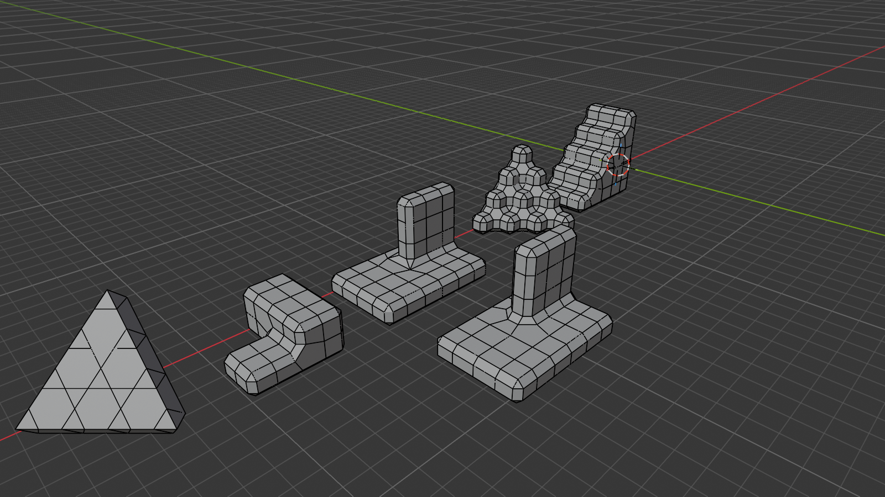

#+title: The beveled surface is a sum over sites
#+startup: overview

This page records the offset construction that came out of the miter study
(#2H7DL8, #GBCLEV) and is intended as the backbone of the next LUFT
renderer.  The short version: the beveled voxel surface decomposes exactly
into face sites, crease-edge sites, and junction-vertex sites; every vertex
of every piece is an intersection of offset lines and therefore an integer
lattice point; junctions are fans of one equilateral tile counted by how far
the bevel band turns; and Blender's Arc bevel realizes the same integers, so
it serves as an executable oracle rather than a mood board.

* Every vertex is an offset-line intersection
:PROPERTIES:
:ID: IQC0Y4
:END:

The sharp system's site map #2H7DL8 sends a site to one point $G(s)$.  The
generalization that resolves the mixed junction of #DJK8HW is not a richer
mystery object: it is the observation that every vertex the bevel ever needs
is an intersection of /offset lines/ — axis-aligned lattice lines displaced
by the bevel offset $m$ along one or two axes, intersected inside the flat
face planes they share.  Band rails, flare points, hexagon corners: each
coordinate is (lattice coordinate) $\pm\, m$ and nothing else ever appears.

With cell size $a$ and integer $m$, every vertex of the entire surface is an
integer triple.  Watertightness becomes equality of integers rather than
agreement to a floating-point tolerance, which retroactively addresses the
oracle gap recorded in #7LEM72: closure can be tested exactly, and so can
planarity ($x{+}y{+}z$ constant across a candidate cap is an integer
predicate).  The chamfer width is $w=\sqrt2\,m$ on the diagonal.

The choice luv is making: cells at $a=8$ lattice units with $m=1$ — an
eighth-cell bevel, visually indistinguishable from the production 0.11-cell
chamfer of #Z5NDTA — so that chunk-local vertex coordinates fit in small
integers all the way into the shaders.  This carries LUFT's packed-word idea
(#RUAWR5) further down: not only the sites but the realized geometry lives
on a lattice.

* One tile counts every junction by its turning
:PROPERTIES:
:ID: EUZLR8
:END:

There is exactly one corner primitive: the equilateral triangle of side $w$
lying in a body-diagonal $\{111\}$ plane.  A junction vertex is filled by a
fan of $k$ such tiles, where $k$ is the turn the skirt boundary makes there,
in units of 60°:

| junction                          | $k$ | fill                        |
|-----------------------------------+-----+-----------------------------|
| convex or concave corner          |   1 | the tile itself             |
| mixed wall-end flare              |   3 | isosceles trapezoid         |
| diagonal staircase saddle         |   6 | flat regular hexagon        |

The trapezoid has legs $w$, near base $w$, far base $2w$ — three tiles in a
strip, which is half of a regular hexagon cut along its long diagonal.  The
saddle hexagon's vertices are the six permutations of $(m,-m,0)$ around the
vertex, all on the plane $x{+}y{+}z=0$: the regular hexagon section of the
cube.  Computed in the session and confirmed by the oracle of #WK4YU4.

Each tile vertex carries exactly ±30° of discrete Gaussian curvature.  A
chamfered cube corner pays its 90° deficit as three +30° quanta; the saddle
pays −180° as six −30° quanta.  Flat regions and band interiors carry
nothing.  The whole junction alphabet is ±30° curvature quanta arranged
around the vertex according to its star, with tiles as the carriers.

* The skirt is the atomic bevel operation
:PROPERTIES:
:ID: C2VXFE
:END:

What beveling does to one isolated flat face is: keep the face, emit a
collar of four edge quads and four corner tiles.  Every shape in this study
is flat faces plus composed skirts.  The skirt carries exactly 2π of
curvature — four tiles × three vertices × 30° — which is Gauss–Bonnet made
discrete: turning "up-facing" into "side-facing" costs a full turn, and the
one annulus pays all of it while the face inside and the walls below stay
flat.  On the Gauss sphere the skirt populates precisely the $\{110\}$ and
$\{111\}$ latitude ring between a face normal and its equator.

Stacking skirts is corner-cutting subdivision: the inner rail is a 4-gon,
the outer an 8-gon, and each additional ring halves the corner angles —
Chaikin's algorithm in 3D, whose limit is the smooth cupola.  A skirt is one
iteration of "round this edge".  No skirt is ever emitted as a unit by the
renderer of #8UGGY0, but it remains the right proof object: every face's
skirt is covered by its incident sites' emissions, with shared vertices
equal as integers.

* Three plane families and one width dial
:PROPERTIES:
:ID: W5L4L3
:END:

Every face of the beveled world, at every offset, has its normal among the 6
axis directions $\{100\}$, the 12 edge diagonals $\{110\}$, or the 8 body
diagonals $\{111\}$ — 26 directions, fixed for all $m$.  The bevel never
invents a direction; it only moves area between the families.  Dihedral
angles never change as $m$ grows: the beveled cell is the Minkowski sum of a
cube of side $a-2m$ and an octahedron of scale $m$, so the dial is a linear
crossfade between two polytopes.

The endpoint $m=a/2$ is a critical point.  Cell faces degenerate to 45°
diamonds; on a unit staircase the convex chamfer through $(x{+}z=c-m)$ and
the concave fillet through $(x{+}z=c-a+m)$ land in the same plane, so the
whole slope fuses into one exact 45° ramp; and the fused diagonal plane is
tiled by the trihexagonal (kagome) pattern — hexagons and triangles, the
classic $(111)$ section of cubic packing.  Between the endpoints the
axis-aligned faces act as spacers of width $a-2m$ holding parallel diagonal
planes apart; "suddenly everything becomes the slope" at the end is just the
moment the spacer width reaches zero.  For luvcraft this is a roundness dial
with exact integer geometry at every stop: $m=1$ is blocks wearing chamfers,
$m=a/4$ is blocks wearing architecture, $m=a/2$ is terrain with honest
45° hillsides where staircases are ramps.

* Turn, don't die: sharp miters leave a (3,1,1) fingerprint
:PROPERTIES:
:ID: GT4Y9J
:END:

The policy decision the miter study was circling (#DJK8HW, #RJ0RLN) has a
crisp algebraic form.  Observed in Blender (cell 4, offset 1), sweeping
every face normal of six voxel test objects against the 26-direction
alphabet:

- With the default /sharp/ outer miter, every terrain grows isosceles
  triangles with edge lengths $\sqrt2 m,\sqrt6 m,\sqrt6 m$ and normals of
  type $(3,1,1)$ — outside the alphabet — wherever a band terminates into
  transverse geometry: staircase noses dying into a side wall, both base
  corners of a wall end, a 2/1/0 height junction.  The sharp miter is
  exactly the band-collapse aesthetic LUFT already rejected, and the
  $(3,1,1)$ triangle is its footprint.

- With the /Arc/ outer miter, all such faces vanish: every normal is
  $\{100\}/\{110\}/\{111\}$, every vertex integer, and each mixed junction
  is the half-hexagon trapezoid of #EUZLR8 (measured at a wall end and at
  the 2/1/0 star; the flat "creases-flat" pieces merge seamlessly into the
  adjacent face n-gons).

So the invariants of #IQC0Y4 and #W5L4L3 are not properties of beveling in
general; they are properties of the turn-don't-die policy.  Bands must turn
through junctions as continuous loops — quad face loops whose poles are
exiled to flat regions where coplanar triangles cost nothing — never
terminate at a shared point.  That is the design content the 4724734
experiment (#RJ0RLN) was missing: it moved points but left the topology
face-owned and centre-fanned.

* Blender's Arc bevel is an executable oracle
:PROPERTIES:
:ID: WK4YU4
:END:

Because all vertices are integers, Blender stops being a visual reference
(#DJK8HW) and becomes a specification that can be diffed exactly: build a
star as a voxel mesh, apply the bevel modifier (offset $m$, one segment,
Arc outer miter), and compare vertex sets and face census against the
tables.  A first sweep of this kind ran during the session that produced
this page:

Left to right: the fully beveled diagonal staircase fused into a kagome
slope ($m=a/2$), the 2/1/0 junction star, the wall-end miter with Arc and
with sharp outer miters side by side, the diagonal ziggurat with its saddle
hexagons, the axis staircase with its coplanar nose bands, and the single
cell wearing its skirt.

The census check: for the diagonal ziggurat (5×5 columns, height
$\max(0,4-(i{+}j))$ cells), a twenty-line combinatorial site counter gives
60 exposed faces, 84 crease edges, 44 turning junctions; Blender's Arc
bevel of the same voxels authors exactly 60 $\{100\}$ faces, 84 $\{110\}$
faces, and 44 $\{111\}$ faces.  The site decomposition and the modifier
agree category by category, which is the independent geometric oracle that
#7LEM72 demanded — exact, automated, and not a screenshot.

* The Arc oracle has a manifold domain
:PROPERTIES:
:ID: TQ8FUN
:END:

The improvised scene established the attractive cases, but did not establish
the domain on which Blender is a specification.  The repository now contains
a headless [[file:../scripts/luft-blender-star-oracle.py][generator]] and its
[[file:../luft/blender-arc-stars.sexp][canonical mapping]].  It constructs the
welded cubical boundary for every one of the 256 vertex stars, applies the
recorded one-segment Arc modifier, extracts the central junction, and checks
integer coordinates, the 26-normal alphabet, all 24 proper rotations, and
occupancy complement.  The corpus is regenerated and compared with:

#+begin_example
make luft-blender-oracle-check
#+end_example

The exhaustive result splits exactly in half.  All 128 /regular/ stars — 12
proper-rotation classes whose boundary is edge-manifold and whose vertex link
is connected — have integer vertices, only $\{100\}/\{110\}/\{111\}$ normals,
rotation-equivariant polygons, and identical unoriented geometry under
occupancy complement.  The other 128 stars are precisely the singular ones:
120 have a non-manifold boundary edge and eight join otherwise separate
surface sheets only at the vertex.  On those inputs Blender emits non-planar
polygons, non-integer points, normals outside the alphabet, or results that
change under a proper rotation.  They remain in the mapping as counterexamples,
not templates.

Blender's Arc bevel is therefore an exact independent oracle for regular
cubical boundary stars, not a policy for singular chains.  LUFT must either
exclude those local occupancies from a terrain materialization, split their
surface sheets before beveling, or state a separate singular-junction rule.
The table of #WJRRK7 cannot silently assign Blender's arbitrary answer to them.

* Faces, bands, and fans: three instance streams
:PROPERTIES:
:ID: 8UGGY0
:END:

The renderer paradigm this fixes: the mesh is not a property of cells — a
cell's relevant neighborhood is 26 cells, whose configuration space is
astronomically large and whose geometry is shared anyway — it is a sum over
sites, each drawn as an instance of a fixed template:

- /Face sites/: every exposed cell face emits one inset quad.  Class is one
  bit.
- /Crease-edge sites/: every creased lattice edge emits one band quad.
  Class is the edge's 4-cell star — 16 configurations: chamfer, fillet,
  flat, checkerboard — with end positions (square, stretched, mitered rung)
  determined by the vertex stars at its ends.
- /Junction-vertex sites/: every turning vertex emits a fan of $k$ tiles,
  $k$ from the 256-entry vertex-star table of #WJRRK7.

A record is chunk-local site coordinates plus a class byte; the vertex
shader decodes class → offset table → lattice ± $m$, in integers.  This
keeps the refoundation's CPU/GPU boundary — the CPU classifies, the shader
realizes — while redistributing the shape word of #RUAWR5: the edge stars
move to the edge stream, the vertex stars to the vertex stream, and the
face record shrinks to almost nothing.  Junction geometry structurally
cannot be triangulated into a face patch, which is the failure mode of
#RJ0RLN made unrepresentable.

Classification visits every lattice vertex of a chunk once (17³ ≈ 5k
byte-wise star reads for a 16³ chunk) but emission scales with surface: the
ziggurat of #WK4YU4 is 144 quad instances plus 44 fans — roughly 350
triangles, every vertex an integer triple.  The instance streams are
literally the crease graph of the terrain with templates stamped on its
elements.

* Bands and fans carry material semantics
:PROPERTIES:
:ID: 41HEJ1
:END:

Assigning shared geometry to one face's skirt forces arbitrary ownership
conventions and loses information; the site decomposition keeps it.  A band
site structurally knows both of its faces, so it is the natural place for
material blending — grass-top to dirt-side across the band's width, with a
canonical rail-to-rail parameter.  A fan knows all the faces around its
vertex and blends them at corners.  And the class id carries the semantic
bit art direction wants most: convex bands are where wear, chipping, and
edge highlights go; concave fillets are where dirt, moss, and occlusion
accumulate.  The creases stop being a rendering problem and become a
material vocabulary — fitting, for a system that began as "make the edges
look good".

* Authored support geometry protects mixed bevel transitions
:PROPERTIES:
:ID: WSEK3C
:END:

The first material-width experiment makes the site's ownership concrete.
Every packed surface stock compiles once to a terrain or architecture bit;
each canonical lattice vertex ORs the bits of its incident stocks and chooses
one width for every primitive that uses it.  Terrain-only sites take width
four, architecture-only sites width one, and genuinely mixed sites width two.
This makes the contact width live without letting adjacent triangles disagree
about their shared point.

Width four is the cubical medial limit.  Many witness triangles collapse
there deliberately, but a mixed field exposed one real topology defect: one
collapsed triangle could leave a neighbour's long edge meeting two shorter
edges.  The variable-width evaluator now contracts that exact T-junction by
retaining the collinear middle point in the surviving neighbour.  In the
five-cell regression [[lisp:luft.render:make-material-bevel-transition-study-scene]],
three unmatched edges become one repair and a closed surface.  Its triangle
quality is no worse than the width-one topology witness:

| policy | triangles | minimum angle | maximum aspect | aspect over 5 |
|-
| mixed 1/2/4 | 190 | 9.46° | 6.17 | 16 |
| width 1 | 220 | 9.46° | 6.17 | 40 |
| width 2 | 220 | 26.57° | 2.50 | 0 |
| width 4 | 68 | 35.26° | 2.12 | 0 |

Automatic transition geometry is still only the fallback.  A modeler protects
an important edge by authoring nearby solid, just as a support loop protects a
classical deformation.  [[lisp:luft.render::scene-builder-staircase]] therefore
offers the sanctuary stair in three otherwise identical forms: open, a flat
one-cell stone border, and a border raised one course as a low wall.  These are
ordinary scene cells and material placements; the mesher has no staircase
case and still evaluates one width per site.

The production measurements show how local the intervention is:

| stair | width 1 sites | width 2 sites | width 4 sites | unmatched before contraction | repairs | triangles |
|-
| open | 7858 | 1002 | 27739 | 459 | 153 | 325512 |
| flat border | 7877 | 1008 | 27712 | 462 | 154 | 325752 |
| low wall | 7897 | 1006 | 27704 | 459 | 153 | 325834 |

The flat border merely relocates the mixed fans and reads as a fussy stepped
edge in the clean plate.  The low wall does something stronger: it keeps the
width-one tread grid and its silhouette inside authored masonry, then moves
the width-two transition to the wall's exterior contact with terrain.  Its
topological repair count is exactly the open baseline's.  That is a promising
division of labour: the automatic site rule closes arbitrary material fields;
authored support geometry decides where an important architectural line should
survive them.  The sanctuary now authors the low wall by default; =:open= and
=:border= remain named experimental variants under the same capture camera.

The capture set also has a small degeneracy atlas rather than asking a whole
landscape to explain local topology.  One isolated cell at widths one, two,
and four makes the medial event literal.  Widths one and two have the same
44-triangle account---12 face, 24 band, and 8 fan triangles---while their
points move inward.  At width four the faces and bands have zero area and are
omitted; the eight corner-fan triangles survive as the medial octahedron.
No zero-area primitive is retained.

The T-junction plate is smaller still.  The evaluator reports the exact
=(left middle right)= split created by a collapsed witness triangle, and
[[lisp:surface-mesh-split-neighborhood]] retains only real output triangles
incident to those points.  Before contraction this is a three-triangle patch:
one face owns the long =left-right= edge while two bands own =left-middle= and
=middle-right=.  After contraction it is four triangles because that face is
split at =middle=.  Both occupy the same geometric surface, which is why an
ordinary wireframe can make the defect invisible; the topology-ink closeup
shows the added diagonal without changing any point.

Finally, the singular-star plate keeps a distinct pathology distinct.  Its
=#x06=, =#x18=, and =#x69= occupancies make cells meet only at an edge, a
corner, or a parity junction.  Those are not medial-width degeneracies.  The
star decomposition separates their incident sheets before bevel realization;
the combined fixture reports ten singular stars and produces 352
nondegenerate triangles in a closed mesh.  The clean and construction plates
show both the apparent separated solids and the fan triangulation that makes
that separation topologically honest.

* Coplanar merging is exact level of detail
:PROPERTIES:
:ID: YGP21F
:END:

Wherever a staircase recedes in both axes, flat $\{111\}$ regions grow as
triangles — the plane meets the three axes symmetrically, so its boundary
against axis geometry runs along the 60° directions — and the construction
is scale-covariant, so the same motif appears at cell scale, step scale,
and terrain scale: a hierarchy of triangles, the octree showing through the
geometry.  Because coplanarity is an exact integer test, dissolving the
interior edges of a coplanar region loses nothing: not a normal, not a
silhouette, not a depth value.  Distant terrain can render the merged
triangle hierarchy while near terrain renders the full ornament, with no
popping, because both meshes are the same surface.  This is a compression
pass over the streams of #8UGGY0, not an ownership decision in the
representation.

The first streaming realization proved a narrower cubical tier: equal-stock
faces became maximal rectangles, but bevel ornament disappeared at the tier
boundary.  The next pass now operates on the /medial surface itself/.  It
groups triangles by exact primitive plane, stock, ambient value, and stream;
cancels shared edges; traces simple oriented boundaries; and ear-clips those
boundaries while retaining every boundary vertex.  A non-simple group falls
back to its original triangles.  All 256 vertex stars preserve closure,
nondegeneracy, and an exact per-plane doubled-area signature against the
unmerged rebuild oracle.

The first 512 by 512 highland sample is promising but names the CPU tradeoff
honestly.  One 84,794-cell outer chunk fell from 65,536 medial triangles to
18,466, a 71.8% reduction with identical plane signatures and the same 1,024
chunk-boundary edges.  Meshing rose from 316 ms and 80 MB consed to 484 ms and
254 MB because this exploratory pass decodes and regroups the finished stream.
That is already substantially cheaper to draw and upload; moving compression
into site-stream construction is the next step if production latency matters.

* DONE Execute width-one chunks as a columnar query
:PROPERTIES:
:ID: BFSI2X
:END:

The first finite-neighborhood implementation proved the right semantics but
still paid for two execution models.  It gathered packed active stars, packed
each face, edge, and fan as another job word, then decoded those jobs into the
general builder, allocating point vectors and hash-interning templates before
a final counting scatter.  That was a batch-shaped prelude to the old mesher,
not yet a batch mesher.

=luft/mesh-query.lisp= is the chunk-only width-one implementation.  It treats
the 256-star tables as dimension tables and executes five explicit stages:

1. materialize one padded occupancy window and select nontrivial stars;
2. project selected stars into local X, Y, Z, mask, and material-base columns;
3. join topology tables into separate face, band, and fan relations;
4. materialize each incident face stock and its algebra summary exactly once;
5. project those relations directly into template-grouped renderer streams.

Band and fan rows retain compact contributor-slot masks, so their final stock
reduction never reconstructs radial transitions or cube-edge identities.
Templates form one immutable 485-row vocabulary compiled from the executable
oracle at load time.  A chunk build therefore creates no builder, point
vectors, template hashes, packed topology jobs, or per-chunk template words.
The surface-proportional and packed-job implementations remain callable as
independent references.  The SB-SIMD occupancy selector also remains: it is a
real native-code example and an interchangeable implementation of only the
selection operator, not the architecture's reason to exist.

The exhaustive differential compares the query with both references for all
256 vertex stars and at real chunk seams.  On the mountain sanctuary's largest
chunk (44,036 cells, 156,252 output triangles), eight warm sequential builds
in one reusable workspace averaged 34.0 ms and 4.55 MB consed for the query,
versus 46.5 ms and 12.34 MB for the packed-job reference: 27% less elapsed
time and 63% less allocation in this x86-64 orb.  This is the first mesher
change in the sequence whose gain is outside measurement noise.

SB-SPROF and disassembly exposed an important failure of representation
intent: the Lisp had typed columns, but the generated code still used generic
arithmetic and hairy vector access around them.  In a 4,147-sample CPU profile,
materialization, planning, patch projection, and the preliminary Z-bounds scan
accounted for 30.6%, 26.3%, 20.5%, and 15.4% cumulatively.  AVX2 selection was
only 1.5%.  Disassembly then showed generic shifts and unions in the tiny
contributor loops, generic arithmetic in projection, and repeated dynamic
array dispatch in planning.

Declaring the actual finite ranges and specialized arrays made the machine
code agree with the data model.  The planner fell from 4,382 to 3,435 native
bytes, contributor compaction from 336 to 153, edge contributor mapping from
275 to 142, materialization from 1,342 to 999, face projection from 906 to 762,
and patch projection from 1,610 to 1,411.  No generic arithmetic or hairy
access remains in those loops; the adjustable selected-site vector performs
one backing-store operation before planning begins.  A new 4,319-sample
profile averaged 26.7 ms per build under the profiler instead of 33.5 ms.
Two ordinary 32-build runs averaged 26.3 and 28.1 ms with 4.55 MB consed,
while the packed reference took 41.5 and 44.2 ms with 12.34 MB.  This is about
another 20% query latency removed by generated-code inspection alone.

The new profile moves the architectural frontier rather than vindicating
SIMD.  Material resolution is 38.6% cumulative, dominated by constructing
canonical sites and probing authored-material hashes; planning is 20.5%, with
runtime contributor compaction and descriptor identity lookup still visible;
the Z-bounds prepass is 20.1%; patch projection is 13.4%; and AVX2 gathering is
2.2%.  These cumulative stacks overlap, but their ordering is decisive.

=make luft-mesher-profile= is the durable production-shaped baseline.  It
selects the mountain sanctuary's largest streaming chunk, uses the real closed
material program and =:air= world-boundary policy, and runs SB-SPROF only on
the standalone image's main thread.  It calibrates an unsampled timing and
allocation pass, then samples the aggregate query and each operational stage
separately.  =build/luft-mesher-profile/summary.{txt,csv}= holds the census and
timings; the eight phase files hold flat reports sorted once by self samples
and once by cumulative samples.  The isolated phases reuse prepared inputs and
warmed capacities.  =halo-index= separately rebuilds the three neighbor tables
which ordinary execution resolves during Z-bounds, so the hidden preparation
cost does not disappear merely because the isolated Z scan sees a warm field.

The first default run under SBCL 2.6.6 measured the 44,036-cell, 9,946-site,
156,252-triangle chunk at 26.18 ms and 4.31 MiB per aggregate build.  Isolated
latencies were material resolution 8.96 ms (34.2% of aggregate), planning 5.04
ms (19.3%), projection 3.87 ms (14.8%), halo indexing 3.78 ms (14.4%), Z-bounds
1.90 ms (7.3%), occupancy 0.84 ms (3.2%), and selection 0.56 ms (2.1%).  These
phases sum to 95.3% of aggregate latency and essentially all allocation.  The
selection-only profile puts the AVX2 gather on 96.6% of that stage's sampled
stacks, while selection itself is only 2.1% of aggregate time.  This is the
precise present meaning of “SIMD contributes about 2%”: SIMD owns its small
operator, but the present query gives that operator too little total work to
move end-to-end latency.  Halo indexing also exposes a new concrete target:
2.08 MiB and 3.78 ms are spent rebuilding hash tables for three already packed
neighbor chunks before the columnar query proper can use them.

* TODO Compile query-native topology dimension rows
:PROPERTIES:
:ID: 3IKS3Y
:END:

The current worksheet #PWUMY7 places chain-local occupancy facts and compiled
material fields before this step; the topology-row proposal itself remains the
same.

The 256 star masks are already a finite dimension.  Compile each mask's face,
oriented edge-band, and fan rows directly into query-native template IDs,
compact contributor masks, source witnesses, and ambient flags.  Planning can
then scan immutable typed rows instead of looking up descriptor identities,
recomputing edge states, and translating cube-edge masks into compact material
slots for every active site.  The statistical profile says those translations
remain a material part of the now-smaller planner; the disassembly says their
scalar loops are finally efficient enough that removing the work, rather than
micro-optimizing it, is the honest next bet.

* NEXT Implement the site-stream LUFT renderer backbone
:PROPERTIES:
:ID: RO2OCL
:END:

/Intent./ Rebuild LUFT's surface rendering on the decomposition of #8UGGY0:
integer lattice cells ($a=8$, $m=1$ to start), three instance streams with
fixed templates, CPU-side star classification into per-site records, and
turn-don't-die junctions per #GT4Y9J.

/Evidence./ The offset construction and tile alphabet are verified at the
computed sites (#EUZLR8) and empirically across six test objects by the
Blender oracle (#WK4YU4), including the exact census match on the ziggurat.
The sharp/Arc contrast (#GT4Y9J) shows what the current sharp system's
collapse looks like algebraically and that the Arc policy stays inside the
26-normal integer alphabet.

/Spike./ The old face-patch ABI has been removed.  The renderer now consumes
one CPU-authored integer triangle mesh containing the three families above,
through one =uvec4= vertex stream and one =uint32= index stream.  The retained
atelier, temporal resolve, camera, and material shader render the isolated
=06=, =18=, and =69= singular fixtures; exact geometric edge counts close all
three.  The material-width pass now also evaluates widths one, two, and four
on one canonical site field, contracts medial T-junctions exactly, and lets
authored support geometry protect the sanctuary stair (#WSEK3C).  Terrain and
#Z5NDTA remain the acceptance boundary for this mark.

/Done when./ A chunk of luvcraft terrain renders through the three streams
with every emitted vertex an integer triple; a closure check verifies
shared vertices by integer equality across stream boundaries; the wall-end
fixture of #Z5NDTA shows the trapezoid junction instead of the collapse of
#DJK8HW, captured with the same construction-on and construction-off
closeups as the sharp baseline (#L7N4MO) for side-by-side review.

* TODO Derive the regular vertex-star table and choose singular topology
:PROPERTIES:
:ID: WJRRK7
:END:

/Intent./ Build the vertex-star table that #8UGGY0's fan stream reads:
for each regular star, derive the incident bands, their offset-line
intersections, the turn count $k$, and the tile fan entirely in integer
arithmetic.  Separately choose whether singular stars are rejected, split into
regular surface sheets, or given their own topology; do not author their
Blender accidents into the table.

/Evidence./ The turn-counting law of #EUZLR8 is verified at the convex
corner, wall end, and saddle; the 2/1/0 star initially looked like an
exception (a skew quad) but resolved to the standard trapezoid under the
Arc policy (#GT4Y9J).  The exhaustive external corpus now exists: all 128
regular stars in 12 rotation classes satisfy the integer, normal, rotation,
and complement invariants, while all 128 singular stars make Blender leave at
least one of them (#TQ8FUN).  The oracle has established the regular domain;
the remaining implementation work is LUFT's generator and singular policy.

/Spike./ LUFT now walks an occupied-side link graph and splits edge-touching
and corner-touching occupied components into regular sheet cycles.  The
committed regular corpus realizes those cycles exactly, with executable
coverage for =06=, =18=, and =69=.  A high-occupancy case such as =6f= exposes
the next representation boundary: one link cycle may revisit a radial
direction through distinct topological copies, so it requires a covered
junction rather than another ordinary eight-bit mask.  The implementation
signals that case instead of importing Blender's singular answer.

/Done when./ The table exists as data with its generating predicate in the
repository; every regular entry is checked against the committed Blender Arc
mapping by exact oriented polygon comparison; and every singular entry is
rejected or decomposed by an explicit topological rule with its own executable
tests and visual fixture.
