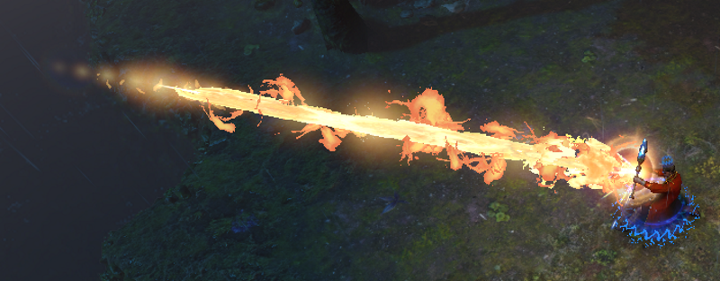

#+title: Luminous spell effects in the Luft atelier
#+startup: overview

The first fireball makes spellcasting playable, but a moving analytic ball is
not yet the visual proposition.  The reference below suggests something more
specific: a spell is a short-lived luminous event which has a readable shape,
an animated hot medium, flying debris, and a visible effect on the world around
it.  This page separates those jobs and asks how Luft can prove them with the
renderer it already has before they harden into a general spell framework.

* Read the reference as several cooperating effects
:PROPERTIES:
:ID: 7DHSH5
:END:

The user-supplied reference image is useful as a visual target, not as evidence
about the engine that produced it.  Its beam reads because several frequencies
agree:

- a narrow, nearly white core holds the direction and endpoint;
- a wider orange envelope gives the beam volume without hiding the core;
- asymmetric curls and lobes make the silhouette look advected rather than
  geometrically inflated;
- sparse sparks carry motion beyond the continuous body;
- the caster and ground receive warm light, attaching the spell to the scene;
  and
- bloom spreads the brightest energy over a larger scale while dark gaps and
  crisp edges remain.

No one layer has to explain all of this.  In particular, making a single noisy
capsule wider and brighter would sacrifice the white core, the negative space
between curls, and the difference between emitting fire and illuminated
ground.  The useful target is the coordination of layers.

* A spell effect should cross the renderer as one small frame
:PROPERTIES:
:ID: TM41II
:END:

For the first experiment, the semantic input can remain deliberately narrow:
origin, target or short spine, age, lifetime, stable seed, width, and an HDR
palette.  One immutable /effect frame/ should freeze those values once per
rendered frame.  Render products may then interpret the same frame as a core,
participating sheath, ribbons, sparks, and light without independently reading
mutable player state or inventing slightly different clocks.

This is a boundary, not a spell class hierarchy.  It resembles the existing
three-=vec4= torch flame instance and pinned =effect-time=: enough identity and
geometry to reproduce a frame, with effect-specific interpretation still local
to the experiment.  Later weapons and spells can teach whether the common
vocabulary is a curve, an emitter graph, events, or something else.  One beam
should not decide that in advance.

#+begin_src mermaid
flowchart LR
  S["cast state"] --> F["immutable spell-effect frame"]
  F --> C["analytic hot core"]
  F --> V["depth-clipped luminous sheath"]
  F --> R["ribbons and sparks"]
  F --> L["small dynamic-light list"]
  C --> H["scene-linear HDR"]
  V --> H
  R --> H
  L --> O["opaque surface shading"]
  O --> H
  H --> E["exposure policy"]
  E --> B["multi-scale bloom and tone map"]
  F -. "only persistent aftermath" .-> X["RGB4 voxel-light solve"]
#+end_src

* Luft already owns most of the difficult substrate
:PROPERTIES:
:ID: 6X6B41
:END:

This proposal begins from current code rather than an imaginary renderer.

- [[lisp:luft.render.shaders::torch-flame-field]] already evaluates a
  deterministic animated field in a bounded proxy.  Its fragment shader takes
  nine fixed samples, converts density into extinction, integrates
  premultiplied HDR emission front to back, and clips the path against opaque
  scene depth.
- [[lisp:luft.render::encode-renderer-frame]] resolves the jittered opaque
  scene first, copies it into a distinct HDR composite, draws procedural torch
  flames there, meters the composite, and only then presents it.  This is the
  concrete extension point described by #4I4Y3Z.
- Material [[lisp:luft.render::material-kind-light-emission]] and
  [[lisp:luft.render::material-kind-surface-emission]] are already distinct
  meanings.  A torch can therefore illuminate the world with quantized RGB4
  while its flame writes scene-linear radiance.
- [[lisp:luft:solve-voxel-light]] computes an immutable RGB4 field with a
  brightest-first frontier and componentwise-max joins.  Meshing samples that
  field at exact mesh points and stores the result in the render population's
  light sidecar.
- The presentation shader already has HDR paper tone mapping, automatic
  exposure, and a cheap two-radius eight-sample highlight gather.

These are strong ingredients, but their ownership matters.  Torch flames are
late procedural radiance; voxel light is durable derived world data; and the
current highlight gather is a lens accent, not a general fire renderer.

* Keep moving light beside the voxel-light field
:PROPERTIES:
:ID: MMH4S2
:END:

The RGB4 field is a good description of persistent local light in a cubical
world.  It attenuates through cells, joins many colored sources monotonically,
and gives independently emitted bevel primitives a canonical shared value.
It is a poor place to put a beam whose source moves every frame: changing that
source means solving a new immutable field and publishing new light-bearing
mesh products merely to follow a transient.

The first spell should instead publish a very small bounded list of
/ephemeral analytic lights/ to opaque shading.  A ray can be approximated by
three to five points along its spine, or evaluated directly as a finite line
or capsule light.  Distance falloff, a conservative intensity clamp, and
perhaps one cheap terrain-visibility term are enough to prove that the ground,
caster, and nearby blocks respond.  It need not cast a shadow in the first
experiment.

This is not a second world-light authority.  Dynamic lights live only for the
render frame and contribute floating-point radiance after the mesh's RGB4
sample has been decoded.  The voxel field remains appropriate when a spell
creates a persistent crystal, burning cell, impact ember, or other authored
aftermath.  That handoff can be a gameplay event, not a per-frame lighting
hack.

A deferred screen-space light pass is an alternative only after Luft has the
evidence for it.  The current composite has depth but not a world-normal
attachment, so a correct screen-space line light would first require another
G-buffer fact or a deliberately approximate normal reconstruction.  A bounded
forward light list is the smaller experiment today.

* Build the visible body from an analytic core and an advected sheath
:PROPERTIES:
:ID: 1DATVA
:END:

The stable directional core can be an analytic capsule or a swept SDF along a
line segment.  It should be thin, subpixel-aware, and much brighter than
display white in scene-linear HDR.  Its color can run from white-yellow at the
centre through the spell palette at the edge.  An analytic coverage ramp is
more valuable here than many ray-march steps: the core is the landmark that
must not sparkle when the camera or endpoint moves.

Around it, extend the torch's bounded volume from coordinates along one flame
axis to coordinates along a beam spine.  Let =s= be distance along the spine
and =r= the radial offset.  A tapered base radius and a few seeded oscillatory
or curl-like displacements define a cheap support; separate density and heat
control extinction and emission.  A distorted density field is not generally
an exact signed-distance field, so the sheath should use fixed-step integration
inside a conservative proxy rather than claim sphere-tracing guarantees it no
longer has.

Animation should transport features.  Scrolling a noise lookup changes values
but often reads as boiling television static.  Advecting coordinates along the
beam, adding seeded helical drift, and using a divergence-free procedural flow
for the broad curls gives the eye features it can follow.  Bridson et al.'s
[[https://doi.org/10.1145/1276377.1276435][curl-noise construction]] is a useful
source here: it derives an incompressible velocity field from procedural noise
and can respect boundaries without paying for a fluid solve.

* Ribbons and sparks provide silhouette events
:PROPERTIES:
:ID: OHWVP3
:END:

Some of the reference's best flame tongues are curves with empty space around
them, not density fluctuations inside one solid tube.  A small deterministic
set of seeded helical paths can become camera-facing ribbon strips or chains of
analytic lobes.  Age controls width, twist, and emissive fade; distance along
the path controls UV or procedural phase.  Unreal's Niagara documentation is
useful precedent: its [[https://dev.epicgames.com/documentation/unreal-engine/how-to-create-a-ribbon-effect-in-niagara-for-unreal-engine][ribbon recipe]]
treats the strip as one renderer fed by particle lifecycle and location, while
the [[https://dev.epicgames.com/documentation/unreal-engine/render-module-reference-for-niagara-effects-in-unreal-engine?lang=en-US][renderer reference]] exposes facing, twist, and distance-based UV tiling as
separate choices.

Sparks can begin even smaller: a fixed-capacity array of points or quads with
seeded birth times, ballistic drift, and an HDR fade.  Their job is to extend
the motion and briefly puncture the silhouette, not to simulate combustion.
Both ribbons and sparks should be generated from the same effect frame so a
pinned seed and time reproduce a screenshot exactly.

This layered reading also appears in production engine tooling.  Niagara and
Unity's Visual Effect Graph organize an effect as cooperating emitters,
particle strips, meshes, and events rather than asking one material to be the
entire phenomenon.  Luft need not inherit either graph system to keep that
lesson.

* Pass order is part of the look
:PROPERTIES:
:ID: 6M978M
:END:

The current torch chooses a clear temporal contract: an unjittered procedural
proxy composites after temporal reconstruction and writes no motion or history
footprint.  That avoids ghost trails and makes its cost bounded, at the price
of giving the temporal resolver no subpixel evidence.  A long spell makes the
trade visible.

A promising split is:

1. Draw the analytic core with the player/fireball scene pass, exact current
   and previous endpoints, and motion output.  Temporal reconstruction can
   then stabilize its subpixel edge.
2. Composite the noisy sheath, ribbons, and sparks after temporal resolution,
   depth-clipped like the torch.  Their rapidly changing detail cannot poison
   history, and their stable proxy can use analytic coverage or modest spatial
   supersampling where needed.
3. Apply spell light during opaque shading, before temporal resolution, so
   illuminated terrain has the terrain's own depth and motion.

This split needs evidence, not faith.  Unreal's
[[https://dev.epicgames.com/documentation/en-us/unreal-engine/temporal-super-resolution-in-unreal-engine][TSR documentation]] calls out translucent VFX precisely because arbitrary
layering, missing velocities, and separate translucency passes complicate
history.  Luft should capture moving endpoints, camera motion, occlusion, and
disocclusion before deciding that every spell layer belongs on the same side
of temporal reconstruction.

Heat distortion belongs later still.  A low-resolution vector field could
offset the resolved scene behind the hot sheath before UI, masked by depth and
faded at silhouettes.  It is attractive, but it changes background sampling
and can expose edge garbage; it should not be bundled into the first proof of
emission and light.

* Exposure and bloom must preserve hierarchy
:PROPERTIES:
:ID: POPM2I
:END:

Luft currently meters the committed HDR composite, including torch flames, and
adapts toward the geometric-mean luminance.  A large sustained beam can
therefore darken the whole picture.  That may be a convincing response to a
blinding spell, but it can also erase the warm environment light that makes the
effect feel powerful.  The reference plate should compare explicit policies:

- meter the complete image and accept the photographic response;
- meter before transient spell radiance while still presenting it at the
  resulting exposure; or
- use a robust histogram or percentile policy which allows a small saturated
  region without letting it command the frame.

Whichever wins should be named.  Quietly lowering the spell's HDR radiance to
placate auto-exposure would also weaken bloom and conflate two controls.

The existing two-ring highlight gather is an excellent cheap accent, but the
reference has at least a tight colored fringe and a much broader faint aura.
A half/quarter/eighth-resolution downsample, blur, and upsample chain—or a
small dual/Kawase chain—would give independently tunable spatial scales while
sampling far fewer full-resolution pixels.  Threshold bloom should remain
derived from linear HDR radiance at first.  If sunlight and pale paper begin to
bloom when only magic should, that is evidence for a named emission attachment,
not for spending scene alpha as an undocumented mask.  Epic's
[[https://dev.epicgames.com/documentation/unreal-engine/post-process-effects-in-unreal-engine][post-process documentation]] is a useful reminder that bloom and exposure are
coupled parts of the same HDR presentation problem.

* Choose the cheapest representation that preserves each cue
:PROPERTIES:
:ID: 23I3D1
:END:

| Technique | What it buys | Cost or failure mode | Place in Luft |
|-
| Analytic capsule or swept SDF | Crisp controllable core and endpoint | Too regular by itself | First proof |
| Fixed-step procedural volume | Soft depth-clipped fire body; reuses torch machinery | Fill cost and overdraw; density is not a true SDF | First proof, tightly bounded |
| Procedural ribbon strips | Large curls and negative space | Sorting, facing, and temporal aliasing | Second layer |
| Sparse point/quad sparks | Fast silhouette punctuation | Overdraw and pool/event ownership | Second layer |
| Authored flipbook volume | Rich detail with predictable shader cost | Memory, repetition, and less live inspectability | Optional art-directed variant |
| 2D gas simulation | Coherent advection at moderate cost | New simulation and render ownership | Later hero experiment |
| 3D gas simulation | Volumetric interaction and lighting | High memory, GPU time, and tooling cost | Not the foundation |

The production literature supports that order.  NVIDIA's
[[https://developer.nvidia.com/gpugems/gpugems/part-i-natural-effects/chapter-6-fire-vulcan-demo][Vulcan fire chapter]] describes the trade among procedural particles,
distortion, and animated volume textures, and warns that indiscriminate
additive blending washes out authored fire color.  Its
[[https://developer.nvidia.com/gpugems/gpugems3/part-iv-image-effects/chapter-23-high-speed-screen-particles][off-screen particle chapter]] treats fill rate and overdraw as first-class
constraints.  Epic's
[[https://dev.epicgames.com/documentation/unreal-engine/niagara-fluids-reference-in-unreal-engine?lang=en-US][Niagara Fluids reference]] positions 2D gas as the efficient game path and 3D
gas as a costlier hero/cinematic tool, with baking to flipbooks as another
trade.

The broader lesson from Frostbite's
[[https://www.advances.realtimerendering.com/s2015/index.html][unified volumetric-lighting course]] is to share optical quantities and
composition rules across participating media.  It does not require Luft to put
torch flames, spell ribbons, fog, and every future volume in one
implementation.  We should unify what density, extinction, emission, depth,
and HDR composition mean before unifying their storage or simulation.

* The experiment should climb one observable rung at a time
:PROPERTIES:
:ID: DZR0E9
:END:

The path below deliberately postpones a generic spell system.

1. Make a fixed reference plate: one beam, pinned camera, time, seed, and
   exposure; analytic white core plus one depth-clipped procedural sheath.
2. Animate transport through the sheath and capture several pinned times.
   Features should travel and curl rather than only fluctuate.
3. Add one bounded dynamic line-light input to opaque shading.  Compare the
   lit ground with the visual emitter disabled and vice versa.
4. Decide the exposure policy and replace the single-scale highlight gather
   only if the plate demonstrates that two spatial glow scales materially
   improve the hierarchy.
5. Add a few ribbons and sparks, still deterministically seeded.
6. Exercise motion, occlusion, and lifetime: caster turning, endpoint crossing
   a wall, camera movement, impact, and fade-out.
7. Only then compare a flipbook, 2D simulation, or low-resolution distortion
   against the procedural baseline.

Every rung should record GPU duration, proxy screen coverage, sample count,
overdraw/resolution scale, peak scene luminance, exposure response, and whether
depth edges leak or temporal history trails.  A beautiful still is necessary
evidence for the art target; it is not sufficient evidence for a moving,
inspectable Luft effect.

** NEXT A pinned luminous-beam reference plate
:PROPERTIES:
:ID: YRDFFH
:END:

/Intent./ Replace the gravitational-ball visual question with one controlled
beam study built from an analytic HDR core and the smallest useful extension
of the torch's depth-clipped volume.  Keep input to one immutable effect frame
and keep dynamic illumination out of the voxel solve.

/Evidence./ The reference in #7DHSH5 identifies the white core, colored
envelope, animated silhouette, local illumination, and glow as independent
cues.  #6X6B41 shows that Luft already owns HDR composition, deterministic
procedural density, opaque-depth clipping, exposure, and a reproducible effect
clock.  The unknown is whether those pieces can produce the desired hierarchy
at a bounded cost along a long screen-space path.

/Done when./ A pinned screenshot has a stable near-white core, a separately
readable orange sheath with dark gaps and at least one broad curl, correct
occlusion against world geometry, and no depth-edge leakage.  A paired capture
shows nearby surfaces lit by a bounded transient light without changing or
re-solving the RGB4 voxel field.  The record includes fixed seed/time/exposure,
sample count, screen coverage, and GPU duration for the new passes.

** IDEA Simulated gas only after the layered baseline
:PROPERTIES:
:ID: VU296C
:END:

/Intent./ Preserve fluid or flipbook fire as a real option for a hero spell
without making it the price of discovering the effect's basic composition.

/Evidence./ Curl-driven procedural fields can already test coherent transport;
the sources in #23I3D1 show that full 3D gas buys interaction at substantial
memory, GPU, and tooling cost, while 2D simulation and baked volumes occupy
useful intermediate points.

/Done when./ The deterministic layered baseline has a measured visual failure
that advection, ribbons, and sparks cannot address, and a simulation prototype
is scoped to that failure with a comparable capture and budget.
