#+title: LUFT: packed sites, chains, and the atelier
#+startup: overview

LUFT is a small complement to luv: a way of naming the vertices, edges, faces,
and cells of a cubical world with one fixnum each, and of treating a block
world as algebra rather than as voxels with decorations.  Its first client
is a greenfield renderer, an atelier free of the luvcraft mesher, that draws
a textureless block world from shaders reading those fixnums straight from a
GPU buffer by vertex pulling.  This page records the vocabulary, the algebra
that makes the surface fall out, the shader-language extensions the GPU path
needed, and the shape of the atelier.  Its temporal frame graph now has a page
of its own: [[file:temporal-antialiasing.org][Temporal reconstruction in the Luft atelier]].
The first fireball has also opened a narrower visual study:
[[file:luft-spell-effects.org][Luminous spell effects in the Luft atelier]].
The relation to luvcraft's semantic substrate — quantities, columnar
records, finite domains, and frontier programs — is read in
[[file:luft-substrate.org][Luft meets the luvcraft substrate]].

* A site is a lattice anchor, an extent mask, and a polarity
:PROPERTIES:
:ID: KE4P5F
:END:

A /site/ is a 60-bit unsigned value: three extent bits =XYZ= and one polarity
bit in the low positions, then a 24-bit X anchor, a 24-bit Y anchor, and an
8-bit Z anchor.  Each extent bit says the site spans the unit interval forward
from its anchor along that axis, so no extent is a vertex, one is an edge, two
a face, and three a cell.  The clear polarity bit is positive and the set bit
negative; [[lisp:luft:opposite-site]] toggles it without changing the site's
geometry.

Incidence is canonical: the high X boundary of the cell at =(x,y,z)= has the
same geometry as the low X boundary of the cell at =(x+1,y,z)=, but the two
faces have opposite polarities.  X and Y wrap with the period a
[[lisp:luft:world-domain]] chooses; Z is 256 non-wrapping planes.

The oriented boundary follows from the ordered axes in the extent: the high
boundary along the =i=-th present axis has the canonical polarity =(-1)^i=,
the low boundary has the opposite polarity, and a negative input site reverses
every result.  Thus [[lisp:luft:map-site-boundary]] returns signed sites
directly, and =∂∂ = 0= is an executable annihilation test in
=luft/tests.lisp=.

* A block world is a 3-chain and its surface is a boundary
:PROPERTIES:
:ID: 9HLYEE
:END:

A [[lisp:luft:chain]] is a collection of signed sites.  Its implementation is
a pair of hash-table ledgers, one per polarity, both keyed by geometry with the
polarity bit masked away.  Adding a site annihilates one opposite site already
in the other ledger.  Private occurrence counts make that result independent
of arrival order; an ordinary solid and its surface still contain at most one
copy of any signed site.

A solid world is the 3-chain containing one positive site for every occupied
cell.  Its visible surface is not a meshing problem but an algebraic fact:
[[lisp:luft:boundary-chain]] applies #KE4P5F's oriented boundary to every
site.  Two solid neighbours send their shared face to opposite polarity
ledgers, so the pair annihilates; only exposed signed faces survive.  A face's
polarity reverses or preserves its canonical orientation to give its outward
normal, and =∂(∂ solid) = 0= says the surface is closed.  Editing a cell later
means adding its signed boundary or the opposite boundary, not remeshing
anything.

The luvcraft mesher walks chunk fields on the CPU and emits atlas-textured
quads (see [[file:block-world.org][the block world]]); LUFT's
[[lisp:luft:surface-chain]] is a pair of polarity ledgers holding signed face
sites.  Both are right for their worlds; the second lets a GPU invocation
reconstruct a face without a CPU vertex product.

* The GPU reads signed sites directly
:PROPERTIES:
:ID: AGVXGM
:END:

A surface face is already one signed 60-bit site, with no separate wrapper or
coefficient encoding.  It remains an immediate fixnum on 64-bit SBCL, and a
specialized vector of sites can be copied directly into the
=(unsigned-byte 64)= buffer the shader reads; no vertex is ever built on the
CPU.  The renderer orders the sites by eight-cell chunk, pads them to whole
chunks for locality, keeps one absent word for an empty surface, and binds the
specialized vector as one storage buffer.  Dense occupancy bits and packed
stock slots let shaders ask about the cells around each site without turning
those cells into vertices first.

The four buffer bits above the site now carry the stock of the solid cell
behind the face.  The chain itself still owns only the low sixty bits; stamping
happens on the copied GPU product after its geometric ordering is complete
(#PWMCOL).

* Storage buffers and bit fields enter the shader language
:PROPERTIES:
:ID: HFX2LI
:END:

The mathematical shader language of #S4H8DR had textures, samplers, and a
vec4-only uniform block, and no way to read an array of 64-bit words.  Two
additions carry a site into a shader:

- A =:storage-buffer= resource with an =:element= type, indexed by
  =buffer-element=; the array has no declared length, and a bare reference to
  the buffer is an error.  Metal lowers it to =const device T* name
  [[buffer(n)]]= bound through the same argument-table address slot as a
  uniform buffer, and SPIR-V to a =StorageBuffer= block holding one
  =RuntimeArray= with an explicit stride, asking for
  =SPV_KHR_storage_buffer_storage_class= in 1.0 modules.
- =ldb= with a literal =(byte size position)= on a =:uint= or =:uint64=
  value, so a shader unpacks a site with the very words =luft.lisp= uses.
  Metal lowers it to a shift and a mask in the operand's width; SPIR-V to
  two logical shifts, because Vulkan restricts bit-field instructions to
  32-bit operands and the language has no 64-bit constants.

Both are raw representations until interpreted: they carry no quantity, so an
unannotated graph stays valid legacy source and an annotated one still
refuses to mix.  The Metal HAL gained the matching =:storage= buffer usage,
=:storage-buffer= binding type, and typed =write-buffer= for unsigned arrays.
Those facilities now serve both backends and outlived the mesh experiment that
first forced them.

* The first mesh-shader experiment found a budget, then ended
:PROPERTIES:
:ID: VAABY9
:END:

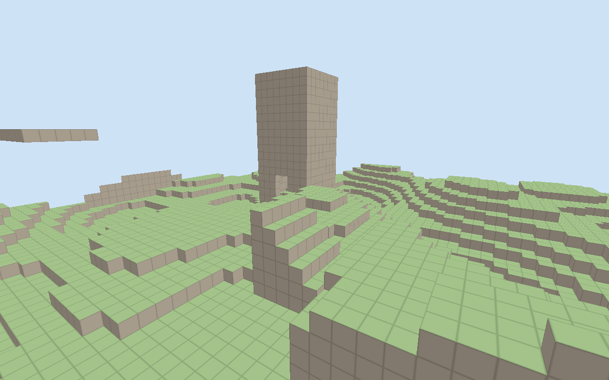

The first GPU path had task and mesh stages and no vertex buffer.  A task
workgroup owned a small brick, culled its bounding sphere, and handed the brick
index through a payload.  Mesh lanes loaded signed sites, unpacked anchor,
extent, and polarity, and emitted their vertices and triangles.  It proved the
central representation claim of #AGVXGM: the boundary operator's orientation
can be rendered directly from its packed site.

Rounded faces made that brick size a hardware contract rather than merely a
batching choice.  One 6×6 face grid emitted 36 vertices and 50 triangles, so a
five-face group declared 180 vertices and 250 primitives, inside
=VK_EXT_mesh_shader='s guaranteed minima of 256 for each.  The earlier
seven-face group declared only 252 vertices but 350 primitives; RADV accepted
the pipeline and then reset the GPU on first submission.  That failure remains
useful evidence: every output budget matters even when pipeline creation does
not reject an excess.

The path then stopped earning its duplication.  Lavapipe executed it slowly;
the project's RX 6600 XT advertised the extension and did not execute it
reliably; and the ordinary vertex path below drew every style on Vulkan and
Metal.  Keeping a non-default technique meant two shader implementations, two
sets of scene resources, technique dispatch, and an environment switch for a
mode nobody should select.  Luft removed the runtime mode, brick data, task
payload, mesh definitions, and their pipelines.  The experiment stays here as
design evidence, not as dormant source.

The fragment stage is textureless by design: a top, side, and bottom tone,
a soft line where faces meet, sun and ambient light, and fog toward the sky.
The whole atelier is =luft/render=: a scene holds the solid chain and its
products, a renderer holds the GPU objects, [[lisp:luft.render:render-to-png]]
draws headlessly, and [[lisp:luft.render:start-viewer]] opens a window with a
fly camera.  Its test turns the camera straight up and expects only sky,
which is the frustum test doing real work.

* DONE The 256 stars make the mesh shader small again
:PROPERTIES:
:ID: 0UAD9N
:END:

The width-one atlas changes the old mesh-shader tradeoff.  Geometry is already
a complete table over all 256 occupancy stars, so there is no brick expansion,
task payload, runtime bevel construction, AO reconstruction, or material rule
at a junction.  One direct 32-lane mesh workgroup owns one active lattice site.
It reads =(X Y Z STAR)=, indexes the immutable atlas, and emits that star's
outward triangle soup.  The largest star owns 25 triangles, within a fixed
75-vertex and 25-primitive declaration.

The renderer uploads the atlas once as 256 fixed blocks of 76 =uvec4= records:
one triangle-count header and room for 75 biased local points.  Streaming
chunks cache each immutable chain as 64x64 columns of four 64-bit vertical
occupancy words.  A query copies its one-cell halo, selects 64 Z positions at
once with =OR(eight cells) AND NOT AND(eight cells)=, and visits only the set
bits to form the exact star byte.  The scalar expression is the definition;
AVX2, SSE2, and NEON implementations change only its load, Boolean, and store
spellings, while instruction choice stays outside the query.  SBCL 2.6.7 also
lets a small Luft-owned AVX-512 VOP classify two adjacent Y fibers in one ZMM.
It remains an explicitly selectable experiment rather than the x86 default:
preserving the established Y/X/Z upload order requires two-row staging, whose
cost exceeds the faster Boolean kernel on Zen 4.  The CPU uploads only four
unsigned words per nonempty, nonfull star.  The sun-shadow pass consumes the
same two buffers through a smaller mesh stage.  There is deliberately no task
shader or runtime fallback; the direct dispatch is the foundation until a
concrete device failure earns a different path.

On the 122,714-cell four-chunk sanctuary under SBCL 2.6.7, seven warmed
200-pass samples pinned to one Ryzen 9 7950X3D logical CPU measured a 2.100 ms
AVX2 median and a 2.260 ms AVX-512 median for the complete direct CPU selector.
Allocation was respectively 2.2620 and 2.2625 MiB per pass.  Both produced the
same 37,602 active stars and 600,570 atlas triangles.  In isolation the
two-star Boolean kernel favored AVX-512, 9.02 ns versus 14.08 ns for two AVX2
calls; the complete result is why AVX2 remains automatic.  These numbers
exclude scene construction, GPU upload, and drawing.

The first scene fragment ABI is similarly narrow: world point, flat triangle
normal, current and previous clip positions, and shadow coordinate.  It uses
one textureless top/side/bottom treatment.  Materials, colored voxel light,
attachment frames, alpha cohorts, and variable bevel policy are outside this
new terrain path rather than dormant branches inside its dense loop.

The old general mesher is gone, not retained as an oracle.  Its packed
template ABI, ambient-occlusion tables, compiled chamfer algebra, edge and fan
planners, material-width variation and repair passes, compression pass, query
profiler, SIMD fiber benchmark, and their historical test corpus can all be
recovered from Git if they ever explain a real problem.  Until then the atlas,
the small star selector, shader compilation, and inspected production frames
are the whole geometry argument.

The standalone atelier still permits semantic reduction.
=LUFT_RENDER_MODE=clear= submits a clear and copy with no shader pipeline;
=sky= adds only the background; each style name creates only its own surface
pipeline; =full= restores every style plus sky and lens, and on Vulkan the TAA
graph of #DOEDL3.  Thus a driver failure can be localized by increasing one
semantic layer at a time rather than constructing the entire atelier before
the first frame.

* The retired vertex-pulling path drew every terrain style
:PROPERTIES:
:ID: NV25VM
:END:

The later renderer drew $K$ vertices per site with no vertex buffer at all.
Each vertex shader invocation divides its built-in index by $K$ to find its
site in the very same =(unsigned-byte 64)= buffer, takes the remainder to
learn which corner of which triangle it is, and unpacks anchor, extent, and
polarity with the same =ldb= forms as #AGVXGM.  A flat face
is six vertices, the two triangles $(0\,1\,2)(0\,2\,3)$ around the anchor
corner, reversed when the polarity is negative so the loop stays
counter-clockwise from outside.  An absent site or a back-facing face
collapses every one of its vertices onto the anchor, and the rasterizer drops
the degenerate triangle.  With twelve thousand faces in the demonstration
world, clipping is cheap enough that the renderer simply draws everything.

The chamfer of #RUAWR5 is the same grid at fifty-four vertices a face: nine
quads of the 4×4 point lattice, each split along the diagonal toward its
nearest corner.  A vertex is one point and needs only the star of its own
nearest corner: six cells
beside the face's solid and air cells, across $U$, across $V$, and across
both, toward that corner's side.  The site rules of #6TEFOS then move it --
corner star at a corner, edge star along a boundary, nowhere inside -- and
because every face incident to a site gathers the same star, the facets meet
exactly.  The rounding of #6TEFOS is the same
again at two rings and a hundred and fifty vertices a face: the vertex's own
grid position says whether it is a shared corner, a ring point, or an inner
point, and the rules BEVEL-POINT-BINDINGS generates per point are chosen at
run time from the same six-cell star.  The watertightness test that was
Metal-only now runs on Linux over every style.  The vertex shaders live
in =luft/render/vertex-shaders.lisp=.  Temporal jitter changes only their last
clip-space step; their world positions remain the stable inputs to motion
(#C7WIN4).

* Fillets and bevels belong to edge and vertex sites
:PROPERTIES:
:ID: 6TEFOS
:END:

Rounding a crease is not something either face beside it can decide alone,
and in LUFT it does not have to be: the crease is an edge site, its four
surrounding cells are its star, and a vertex site has eight.  The star's
solidity classifies the crease — flat, convex, concave, or saddle — and one
rule places the shared point: move toward the star's /minority/ (the lone
solid cell of a convex crease, the lone air cell of a concave one) so that
the point lands on the sphere or cylinder of radius $r$ centred at
$\text{site} + r\,q$, where $q$ is the minority direction clamped to unit
components.  For edges that is the fillet cylinder point at $r(1-1/\sqrt2)$,
for corners the sphere point at $r(1-1/\sqrt3)$, zero on flat and saddle
stars, and a vertex in the middle of a crease run agrees with its edge, so
creases stay straight.

Because every face incident to a site computes that point from the same star,
subdivided faces meet exactly and the surface is watertight without stitching
or corner patches.  =luft/render/shaders.lisp= subdivides each face 6×6:
boundary points use the site rule, ring points inside the radius project onto
the nearest crease's cylinder or the corner's sphere (a pure one-cell corner
is the exact rounded box), and mixed corners such as a block standing on a
floor blend toward the vertex sphere by distance.  The only CPU help is
[[lisp:luft:chain-cell-bits]], the solid chain as one bit per cell, from
which each shaped vertex gathers the cells in its nearest corner's star; the
rounding radius is a live frame lane.  The exact morphological answer for the
mixed stars would be a table over the 256 vertex configurations, which this
heuristic postpones.

* Small planar facets soften convex and concave creases
:PROPERTIES:
:ID: RUAWR5
:END:

The refounded indexed chamfer is the planar case of #6TEFOS.  Every canonical
edge or vertex site reads its complete occupancy star, chooses the strict
minority, and reduces that minority's moment to a signed direction $q$.
Convex creases therefore move toward minority solid cells, concave creases
toward minority air cells, and balanced stars do not move.  The decision is a
property of the shared site rather than of any incident face, so the realized
surface remains watertight without stitching.

[[lisp:luft:site-displacement]] places the shared point at
$w\rho q$.  Ordinary creases use the half reach $\rho=\tfrac12$; a vertex
whose raw moment is a unit cube diagonal uses the centroid reach
$\rho=\tfrac23$.  Each oriented boundary face carries the resulting edge and
corner decisions in one shape word.  The GPU realizes sixteen implicit points
on a 4 by 4 patch and draws its fixed eighteen indexed triangles.  The current
default [[lisp:luft.render:*chamfer-width*]] is 0.11 cell.

The fragment shader recovers each planar facet normal from screen derivatives
of world position.  A 21-bit construction mask records only those edges of
the fixed patch whose adjacent realized triangles actually turn, so the
blueprint view reveals the geometric decision without drawing every hidden
diagonal.  The CPU reference and shader realization are compared point for
point in the renderer tests.

* The miter family portrait keeps the awkward stars in context
:PROPERTIES:
:ID: Z5NDTA
:END:

The shared-point rule of #RUAWR5 is compact and watertight, but it gives every
incident chamfer strip only one place to end at a mixed vertex.  At the
wall-side step this truncates a strip which should continue around the
meeting: the long miter collapses into a narrow triangular fighter shape.
That is the coherent sharp-miter construction reaching the boundary of what
one shared point can express, not a crack or an inconsistency in its ordinary
bevel geometry.

An isolated seven-cell star at =w=0.20 made the defect look grotesque and hid
its architectural scale.  [[lisp:luft.render:make-miter-study-scene]] instead
builds a small Minecraft mountain against a continuous wall at the honest
default =w=0.11.  One orthographic plate then retains the triangular innie and
outie, the six-face hexagonal block party, and both wall terminations of the
truncated fighter miter.  The scene is topology, not a hand-authored mesh: a
regression checks that its five-, six-, and seven-cell vertex stars and its
terrace-to-wall occupancy remain present.

[[capture:Z5NDTA-luft-miter-study.png]]

The image is a named =luv/showcase= recipe rather than checked-in evidence:

#+begin_src sh
scripts/captures render --output build/wiki/media luft-miter-study
#+end_src

The attempted transition, the rejected pinwheel, the Blender comparison, and
the representation questions they expose now live together in
[[file:luft-miters.org][The bevel junction is an open problem]].  #DJK8HW keeps
the closeup as primary evidence; #2PN62B deliberately remains an idea rather
than the next implementation step.

* Rounding is the half-level set of the smoothed occupancy
:PROPERTIES:
:ID: TI9NJP
:END:

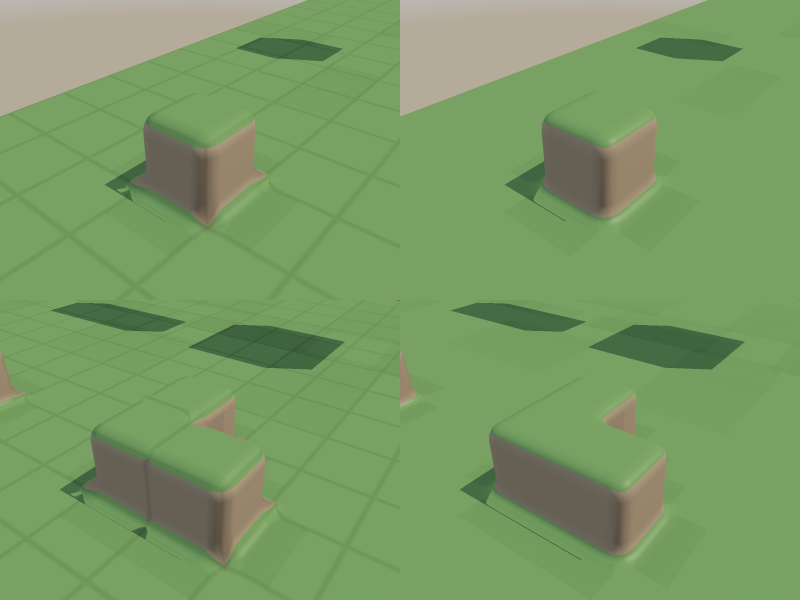

The star rules of #6TEFOS place each shared point by classifying its eight
cells, and the studio of #UTRJ2T shows where that runs out: a block standing
on a floor, a bar's foot, any /mixed/ corner where a convex crease meets two
concave ones.  There the vertical fillet flares into a skirt and the floor's
points and the block's points, placed by different cases, fold into each
other (left column above).  The =:field= style replaces the classification
with a definition (right column).

Smooth the solid's indicator with a tent kernel of half-width $R$ along each
axis.  The result $F$ is the fraction of solid under the tent: one deep
inside, zero in open air, exactly one half on a flat wall, and $C^1$
everywhere because a tent integrated against a step is a quadratic ramp.
The rounded solid /is/ the set $F = \tfrac12$.  Every grid point of every
face, boundary or inner, takes three Newton steps onto that set along
$\nabla F$, and the surface normal is $-\nabla F$.  Faces incident to a site
agree without any stitching because the projection is a function of position
alone; a convex crease becomes a fillet and a concave one a cove of the same
reach $R$; and a mixed star becomes whatever smooth blend the field makes of
it, which is always one surface.  With $R \le \tfrac12$ the tent overlaps
two cells along each axis, so $F$ and $\nabla F$ cost eight cell reads each,
the price of a trilinear sample (=luft/render/field.lisp=).

The fragment stage reads the same field at its own world position and takes
its normal from the gradient there, so the rounding shades smoothly however
coarse the grid -- so smoothly that the =:soft= style draws the six-vertex
flat quads under this very fragment shader and rounds by light alone, at a
distance indistinguishable from the projected grid.  The fragment reads the
field once more under a half-cell tent to learn whether it sits in a hollow
or on a ridge: =*wear-strength*= lightens ridges and darkens cavities by
that measure, the wear of a handled thing.  Its shadow is the field's too:
where every other style walks the sun ray cell by cell and answers yes or
no, so that shadow outlines are staircases of cells, the field style samples
the half-cell tent along the ray and keeps the greatest occupancy met, and
the outline softens over about a cell like the shadow of an area light
([[lisp:luft.render.shaders::field-shadow]]).  The turf and earth tones
meet across the fillet by the smooth normal's upness rather than along a
line through its middle.  The tent may be wider along Z than across
(=*field-vertical-radius*=), rounding the edges of floors and roofs more
than those of walls as weather does, though at extreme ratios the three
Newton steps leave visible wobbles.  The watertightness test of #RUAWR5
passes for the field as for every other style.

* The same field read as a drawing
:PROPERTIES:
:ID: JM9807
:END:

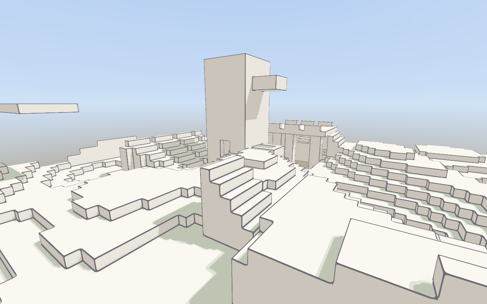

A line drawing of a block world is its creases, and the field of #TI9NJP
knows where those are without any edge detection: wherever the smooth normal
has turned away from the face normal.  The =:ink= style draws the flat
six-vertex quads and inks every crease, convex edges and concave coves
alike, as a pen would; bands the key light into a few flat tones; keeps the
field's soft shadow as a wash; and fades into the paper with distance
instead of fogging.  A pen keeps its width on the page, so the band is
=*ink-width*= pixels wide, measured by how fast the tilt changes across the
screen (the fragment's derivatives), and never wider than the crease itself.
The field's occlusion is the same idea turned along the normal: a few
samples of the half-cell tent out from the point, nearer ones weighted more,
replace the four cell walks of =crowded-sky= with a measure that is smooth
because the field is ([[lisp:luft.render.shaders::field-occlusion]]).

The indexed atelier revives the useful part of this reading at #UWRDQI, but
with a sharper meaning.  The CPU compares the normals of the two realized
triangles incident to each internal edge and records only genuine turns; the
fragment's derivatives decide pixel width, never whether an edge exists.  A
global construction mode draws that topology, while the pointer contributes
only a precise reticle and a small lens onto the otherwise hidden triangle
mesh.

* A world knows what it is cut from
:PROPERTIES:
:ID: ADEAKZ
:END:

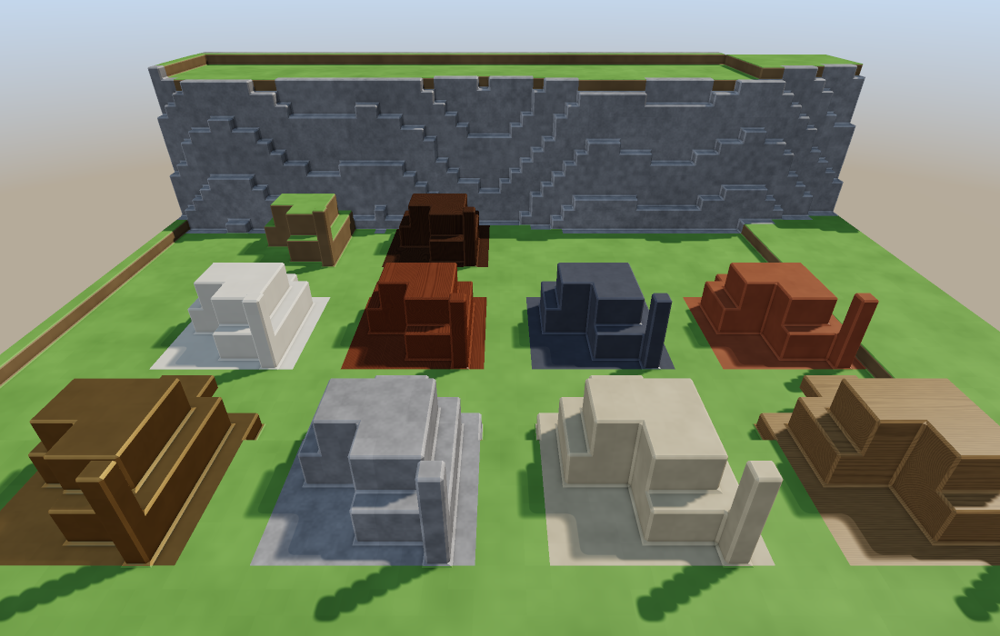

Every style up to here shaded the world in one substance -- turf above,
earth at a cut, dark underneath -- because a face's direction was the only
thing a fragment knew about the matter behind it.  That is enough to read a
solid and not enough to read a building.  A stone pier and an oak deck
differ in colour, in figure, in how they take a highlight, and above all in
what their planed arris does with the light: the chamfer on a mahogany board
is /paler/ than its face because the cut crosses the fibre, and the chamfer
on a bronze rail is /brighter/ than its face because a handled edge
polishes.

A [[lisp:luft.render:material]] is therefore not a shader.  It is a short
list of numbers -- three albedos, a finish, a grain, a mottle, a way of
weathering -- and adding a stone is editing a table.  The =:stock= style
draws the chamfered geometry of #RUAWR5, which is what these materials are
for, and lights it from the occupancy field of #TI9NJP: a soft shadow and a
smooth crowding, so the edges stay crisp while the light stays gentle.

Three procedurals do most of the work, and they are three different kinds
of thing.  A /grain/ is growth: wood gets its figure from a bundle of pith
lines running along an axis on a loose lattice, and the point's distance
from the nearest pith, jittered per trunk and warped by a slow turbulence,
is banded into rings.  A face cutting /across/ the axis therefore meets the
rings as circles and a face along it as the long streaks of a sawn board,
and nothing has to be told which it is
([[lisp:luft.render.shaders::stock-grain]]); the same code with the rings
nearly off and the wander far up is the veining of marble.  A /mottle/ is
simply patchiness at the scale of a cell or two, which is what a stone
wants.  A /bond/ is neither: it is a way of putting a wall together, and
[[lisp:luft.render.shaders::stock-courses]] reads the bed joints off Z, the
perpends off the face's own horizontal, and staggers them half a brick each
course, which is the whole of what a stretcher bond is.

A metal is a fourth case again.  Bronze gets the hemisphere about its
mirror direction and almost no diffuse, which is what makes it read as a
metal rather than as brown paint with a white spot on it; the weathering
measure of the field then puts verdigris in every hollow and leaves every
ridge polished.

** How a cell says which stock it is
:PROPERTIES:
:ID: PWMCOL
:END:

A LUFT site occupies sixty bits and travels to the GPU in sixty-four, so
four bits are free above it (#KE4P5F).  The packed site spends them on which
stock the /solid behind the face/ is cut from: sixteen materials in a world,
at no cost in bandwidth and none in a second lookup.  A
[[lisp:luft.render:world]] is a chain together with one stock slot per cell,
and building code does not pass the material about -- it binds =*stock*= and
fills, the way a shop works from one board at a time:

#+begin_src lisp
(with-stock (:granite)
  (fill-box world 26 27 44 45 0 8))
#+end_src

[[lisp:luft.render:refresh-scene]] stamps each surface site from the cell it
bounds after the geometric sites are ordered, since past bit sixty a packed
site is no longer a LUFT site and nothing may read it as one.  The sixteen
stocks' numbers travel in a storage buffer of their own,
[[lisp:luft.render:stock-table-data]], nine vec4 lanes apiece, rewritten
every frame because the whole table is only a little over two kilobytes.

** An hour is a set of the light knobs
:PROPERTIES:
:ID: KG0EG6
:END:

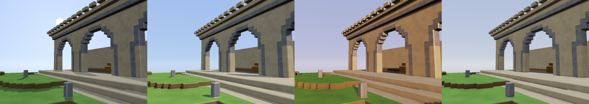

Setting eleven specials by hand is not how anyone chooses a time of day, so
a [[lisp:luft.render:light]] names a set of them together and =*light*= says
which is in force.  =:morning= is low and cool from the east, =:noon= is
nearly overhead and kills the shadows, =:evening= is very warm with the
shadows gone blue, =:overcast= has no sun to speak of and lets occlusion do
all the drawing, and =:afternoon= names nothing at all, so it is exactly the
atelier's own light and every knob still works by hand.

* An architecture of arches, discs, and corbels
:PROPERTIES:
:ID: SY26PO
:END:

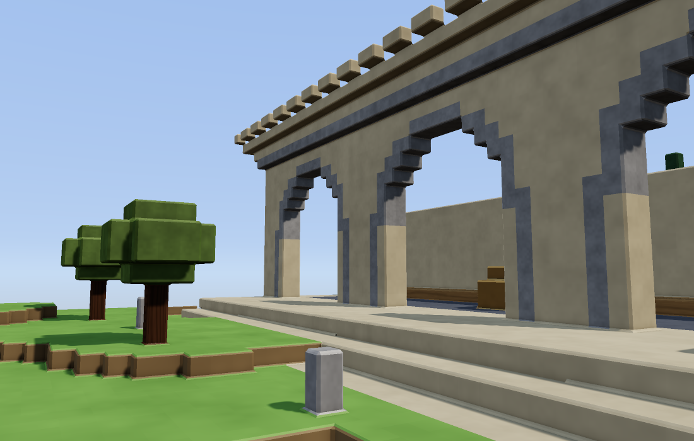

A cube world's reputation for making only boxes is a reputation for having
no vocabulary.  A round-headed opening is a column of cleared cells whose
height follows a circle; a tower is a disc repeated up Z; a corbel is a
course that oversails the one below.  Each is a dozen lines of
=luft/render/architecture.lisp=, and each becomes architecture once the
chamfer runs along its staircase and the stock says what it is cut from.

[[lisp:luft.render:carve-arch]] cuts the opening -- a rectangle up to the
springing, closing above it on $z = \sqrt{r^2 - x^2}$ rounded to cells --
and [[lisp:luft.render:ring-arch]] lays the voussoirs just outside that
curve and brings them down as jambs, so a limestone wall can carry a granite
arch and the opening reads as built rather than as punched.
[[lisp:luft.render:fill-disc]], [[lisp:luft.render:fill-ring]],
[[lisp:luft.render:corbel]], [[lisp:luft.render:crenellate]], and
[[lisp:luft.render:spiral-stair]] are the rest of the mason's kit.  The
grid's own staircase is not a defect to be hidden: the chamfer gives every
step of an arch ring a facet that catches the light differently, which is
what a voussoir does.

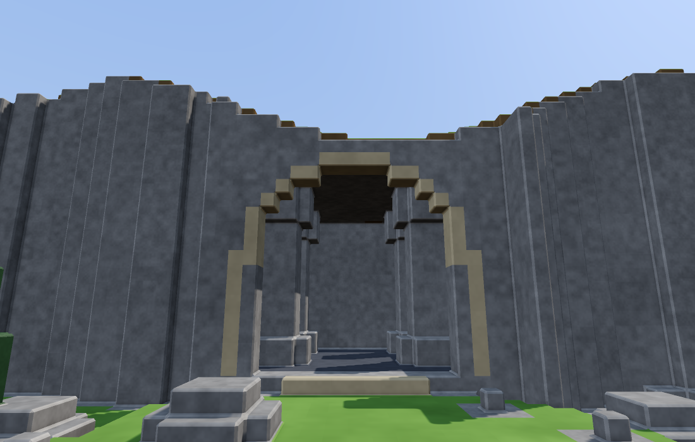

The same three lines carve a doorway and a cave mouth; only the radius
differs.  Above, a fourteen-cell opening cut through the two courses of
granite left standing at the face of a massif, ringed in limestone, with
the rock of the hall behind it left as columns.

** Turf catches where the ground is flat
:PROPERTIES:
:ID: JNJF28
:END:

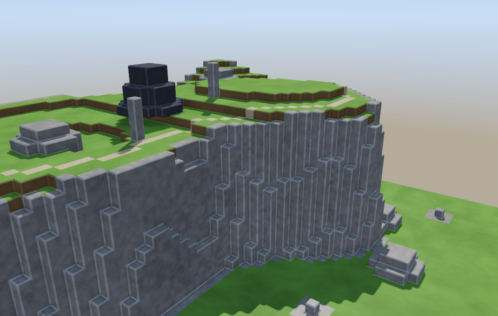

For landscape, one rule does most of the work.
[[lisp:luft.render:lay-ground]] fills the whole floor as rock and decides
nothing about what grows; [[lisp:luft.render:grass-the-flats]] then repaints
the top cell of every column that is within a cell of all four neighbours.
A cliff therefore comes out bare and its top a field, which is the whole
difference between a terrain and a landscape, and the soil colour on the
side of a one-cell turf clod becomes the brown line under every green ledge.

The corollary is that a cliff must fall in about one cell of plan per many
of height.  A face that falls three cells for every one it steps in is not
a cliff but a flight of steps, and the slope rule will turf every tread of
it; eight per one is a cliff with ledges.  Terrain functions here are
written with that in mind.

** Five pieces and a sheet of stocks
:PROPERTIES:
:ID: 6QZYNB
:END:

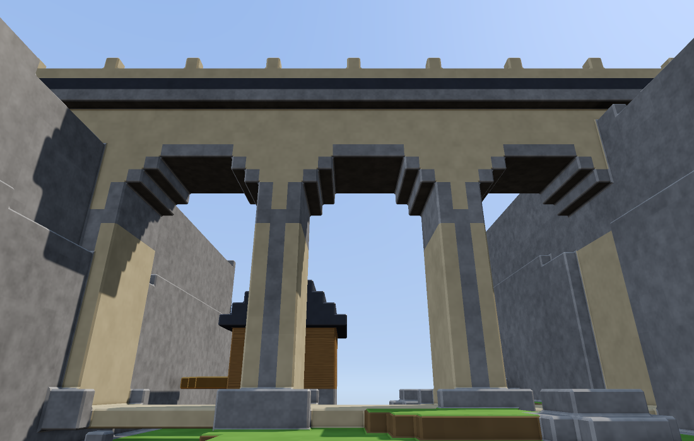

[[lisp:luft.render:atelier-scene]] and [[lisp:luft.render:atelier-cameras]]
are generic functions on a piece's name, so a sheet can ask for all of them
without knowing any of them and a new piece is one method and one entry in
[[lisp:luft.render:atelier-pieces]].  There are eight: =:samples=, every
stock as one small object; =:joinery=, one object of several stocks, so the
creases /between/ them can be looked at; =:arcade=, a wall of round-headed
openings on a stylobate under a corbelled cornice; =:turret=, a machicolated
round tower with a curtain wall and a bailey; =:viaduct=, piers in a box
canyon carrying a road; =:grotto=, a hall cut into a cliff behind an arched
mouth; =:headland=, which has no building on it at all and is the landscape
the others are supposed to stand in; and =:holm=, which is the argument that
they compose.

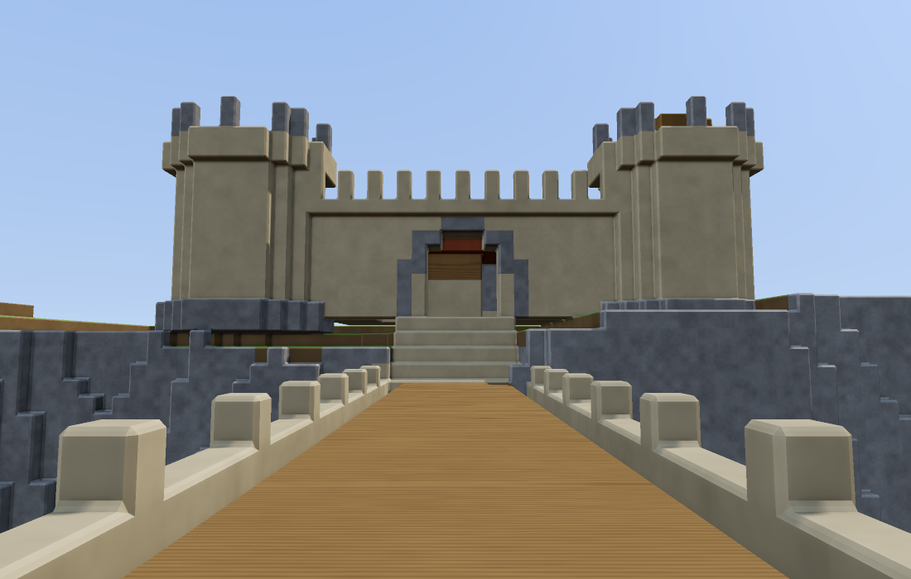

The holm is a rock island with a walled town on it and a bridge out to the
shore: a coastline from the slope rule, a bridge of two arches on piers
standing in the channel, a ramp cut up through the cliff, a curtain wall
with a round-headed gate between two turrets, a hall with an arcaded front,
and houses of stone below and timber above under tiled roofs -- one world,
seven stocks, and no part of it that any earlier piece did not already
teach.  It is also where a mistake is easy to see: the bridge was built
running /along/ its channel rather than across it, twice, and only a plan
view said so.

Each piece carries its own cameras, because a building nobody photographs
from the right place is a building nobody has seen, and the cameras are as
much of the design as the geometry:
[[lisp:luft.render:render-piece-sheet]] puts a piece's views down one
column, [[lisp:luft.render:render-light-sheet]] crosses them with the hours
of #KG0EG6, and [[lisp:luft.render:render-view]] renders one of them as a
picture.

* The lattice need not be square
:PROPERTIES:
:ID: REZ0PU
:END:

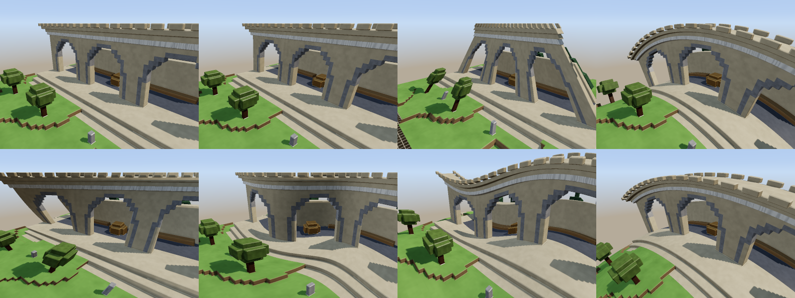

Every shaped point is placed in the lattice by a rule over its star
(#6TEFOS, #RUAWR5, #TI9NJP) and only then turned into a clip position.  Put
a smooth map $W$ between those two steps and the whole world bends, and not
one rule changes.  Eight of them live in [[lisp:luft.render.shaders::deform-point]]
-- a shear, a taper, a bend about a horizontal axis, a twist about a
vertical one, a swirl in plan, a standing wave, and the whole plane wrapped
onto a sphere -- chosen by a uniform rather than by a pipeline apiece, so a
sheet can put them side by side and =*deformation*= is one more special for
a contact-sheet column to bind.

The surface stays watertight for exactly the reason it was watertight
before: the faces incident to a site all compute the same rest point, and
$W$ is a function of position alone, so they all land on the same bent
point.  /A deformation cannot open a crack the lattice did not already
have./

The bent normal follows from $W$ by construction rather than from a
Jacobian anyone had to write down.
[[lisp:luft.render.shaders::deform-normal]] builds a frame in the rest
surface's own tangent plane, pushes its two vectors through the map a
hundredth of a cell away, and takes the cross product of the differences;
that is $\det(J)\,J^{-\mathsf{T}} n$ for whatever map comes next, at the
price of three evaluations.

The fragment stage keeps the /rest/ position beside the bent one and looks
the lattice up there: the occupancy field, the grain, the cell's own tone
and the shadow ray all live in the lattice, and only the view -- the eye
vector, the fog, the specular -- is taken from the bent world.  So the
light bends with the geometry rather than being cast across it, which for a
gentle bend is invisible and for a globe is a decision rather than a bug.

** A lattice that wanders, modulated by what the cells are made of
:PROPERTIES:
:ID: 86IMVU
:END:

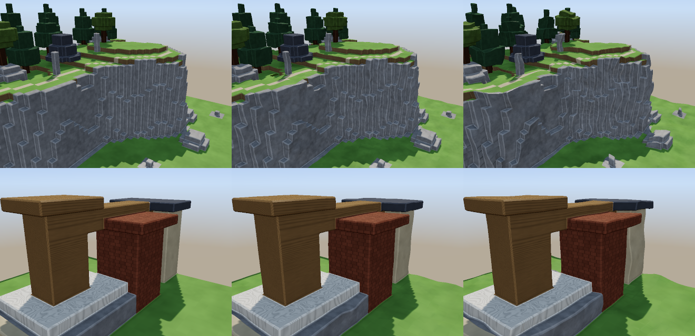

The interesting map is neither smooth nor global: a noise field that shakes
the lattice loose, with an amplitude that differs from place to place.  The
temptation is to take that amplitude from the cell a point sits in, or from
the stock of the face that is asking, and both tear the surface -- a
surface point sits exactly /on/ a cell boundary, where =floor= is a coin
toss, and the faces along a crease belong to different cells.

So the amplitude is a field.  [[lisp:luft.render.shaders::lattice-sample-bindings]]
reads the eight cells whose middles surround the point, weights them
trilinearly, and returns two numbers: how solid they are, and the mean
/grit/ of the solid part, grit being what each stock says it does to the
shape of the world rather than to its surface.  Both are continuous in
position, so every face that asks about a point gets the same answer, and
C0 is all coherence needs.  The occupancy those same eight reads give is
the boundary structure: low where the point stands out on an arris, high
where it is sheltered in a cove, and weather reaches the one and not the
other.

The result is one noise doing different things in one world.  Granite goes
to rubble, turf goes lumpy, conifers go windblown, and the oak post
standing in the middle of it stays dead straight, because the noise is the
same everywhere and the grit is not.  The wandering happens in the lattice,
so a world can be eroded and bent at once.

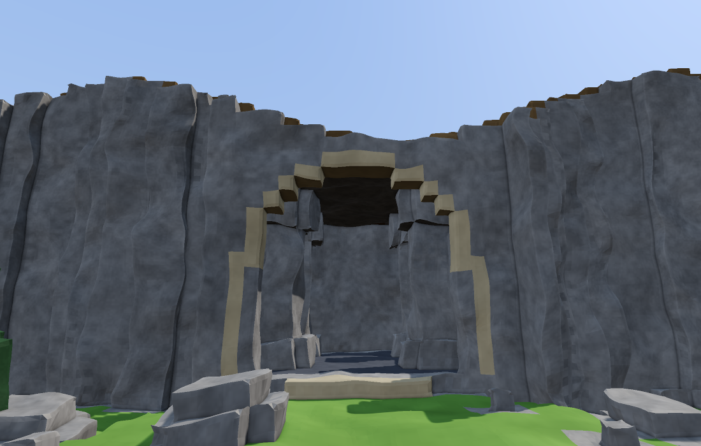

The grotto of #6QZYNB under a lattice eroded by one cell, its chamfers
ruled by stock.  The granite of the cliff has gone to rock, and the
limestone ring of the arch has not: the stone that was quarried and laid
keeps both its shape and its arris, and the stone that was never touched
keeps neither.  Nothing in the scene says which is which -- the mason said
=(with-stock (:limestone) (ring-arch ...))= and the rest follows from two
numbers on the material.

* A chamfer belongs to the crease, not to either face
:PROPERTIES:
:ID: K5MKUT
:END:

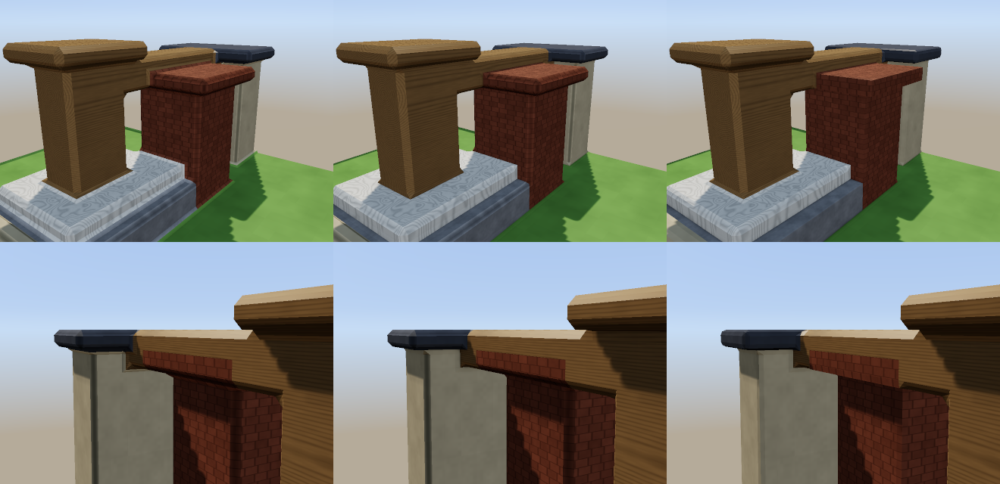

The chamfer width of #RUAWR5 was one number for the whole world and need
not be.  But it cannot be a property of a /face/: two faces meet along a
crease, and if they disagree about how far to move the point they share,
the surface tears.  It has to belong to the site, which means it has to be
a function of the star -- the same four or eight cells every incident face
already reads.  Two such functions are worth having.

=:relief= asks the star its shape.  An outward arris is planed wide and an
inward cove left nearly sharp, which is what weather and hands actually do
to a building, and which also disposes of a long-standing artifact: the
pale wedge where three coves meet at a re-entrant corner simply stops
existing once the coves are narrow.

=:stock= takes the least chamfer any solid cell of the star asks for.  A
crease between a planed timber and a pecked stone comes out as sharp as the
stone -- the sharper stock wins, which is what a mason does with a stone
that will not take an arris.  A minimum over the star is symmetric in it,
so every incident face computes the same width from the same cells,
whichever of them it happens to be.

** What the watertightness test caught
:PROPERTIES:
:ID: HJ6YTC
:END:

Both rules were wrong the first time, and the sky-through-the-floor test of
#RUAWR5 said so before any picture did.

First: classifying a crease by the sign of the minority's dot with the
/face's/ outward normal is right at an edge, where that dot is exactly
$\pm 1$ and the star determines which, and wrong at a mixed corner, where
the same eight cells give one incident face a positive dot and another a
negative one.  Counting fixes it.  An edge's four cells are a crease
exactly when the two across it agree, and what they agree on says which
kind; a vertex's eight are convex when three or fewer are solid and concave
when five or more.

Second, and less obvious: an inset that varies from site to site tears the
seam /even where every displacement agrees/.  A face's boundary points
along one edge are spaced by the insets of its /other/ edges, and the
neighbour across that edge is spaced by different edges again; with one
radius they coincide by accident, and with per-site radii they do not.  So
=*chamfer-width*= became the band the grid reserves and no rule may exceed
it, and each site takes up to all of it.  The facet is then not exactly
forty-five degrees where a site takes less than the whole band, which is a
price worth paying for a surface that is closed.

The claims are in [[lisp:luft.render.tests::a-site-width-and-a-bent-lattice-keep-the-surface-closed]]:
three chamfer rules against eight lattices, three erosions, and an erosion
and a twist together, over a scene of four stocks with every kind of star
in it -- and no sky anywhere inside the floor.

* The distance codomain was tried, and argued against itself
:PROPERTIES:
:ID: A7BV7E
:END:

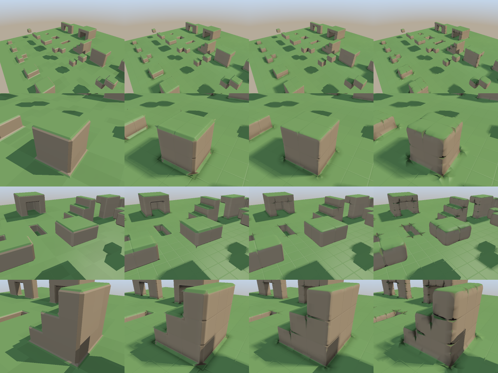

The reconstruction-alphabet note
([[file:../luft/render/idea-for-reconstruction-alphabet.org][idea-for-reconstruction-alphabet.org]])
asks what the star alphabet of #6TEFOS could grow into.  One candidate was
a signed distance field: keep the same edge and vertex stars, counted
exactly as #HJ6YTC counts them, and let an alphabet entry be a distance
combinator instead of a moved point.  Box distances make the flat solid; a
convex half-edge star subtracts a cut prism, a concave one unions a fill
wedge, a pure one-cell corner is capped across its diagonal; smooth CSG
over two frame-block knobs sweeps the whole family from planed chamfer to
wide fillet; the mesh walks onto the field's own zero set by Newton steps,
and the fragment stage does what only true distance can -- a sphere-traced
sun shadow whose penumbra widens with how narrowly the ray misses, and
occlusion read off distance taps along the normal.

The promise that justified the experiment was /structural coherence/: a
field is a function of position alone, so two faces cannot disagree about
it, and the case-by-case watertightness discipline of #K5MKUT and #HJ6YTC
would come for free.  The experiment ran all the way to the seamless sheet
above -- flats exactly flat, both knobs live -- and still argued against
itself, because the promise turned out to be false.  A star-local field is
only defined from the eight cells around the nearest lattice vertex, so it
is only trustworthy within about half a cell of the surface, and every
authored term reaches farther than that unless it is individually fenced.
Coherence was not structural; it was re-proven per term, which is the same
discipline the mesh rules already impose -- except that a mesh tears
loudly where a field paints its seams as quiet shading cracks, and the
sky-through-the-floor test of #RUAWR5 has no analogue that catches them.

Two other codomains fell out along the way.  Realizing the chamfer's own
geometry as a field reproduces #RUAWR5 at great cost and adds nothing.
The genuinely field-native codomain -- every solid cell a rounded box,
smooth-unioned, so a lone cell is a sphere at radius one half and
diagonal contacts grow bridges -- is a real look, but it cannot keep a
flat continuation flat: coplanar cells always meet in a quilted seam,
because per-primitive unions have no way to know two faces are one plane.
Knowing that is exactly what the star classification is, and once it is
back, the field is re-deriving #RUAWR5 with worse tools.

The verdict: the tent field of #TI9NJP remains the right field answer for
a world that keeps its flats -- coherent by construction, eight cheap
reads -- and the site rules remain the right authored answer.  The
classified-field implementation lives in the withdrawn commit
[[https://github.com/mbrock/luv/commit/8e8cc65][8e8cc65]] and stays
withdrawn.  The rounded-cell variant is the one part that did exactly
what it defined, and it came back as a style of its own: #2TQEBB.

** Every term needed a fence, and the fences were the finding
:PROPERTIES:
:ID: 4PX7PL
:END:

The evidence is the list of what the field needed before it stopped
painting vertex-cube boundaries on the surface:

- Every cut prism and fill wedge needed an axial bound overhanging its own
  vertex by exactly one blend reach, so collinear half-edges overlap
  seamlessly while an ending crease dies inside its cube.
- Both needed quadrant legs -- clips against the crease's own face planes
  -- without which a wedge reaches around a corner its cove never turned,
  as half-cell fins of phantom material.
- The legs then needed relaxing outward by the facet width, or the old
  arris reads as a near-zero ridge that Newton mistakes for surface, and
  the surface hugs a wall's face underneath the fill facet as a slot.
- Corner caps are one cube's private term, so they needed a conical
  spatial falloff on top of their legs.
- The smooth-CSG reach needed a hard cap, $0.25 - 0.35\,w$, the reach at
  which every term is either shared with the neighbouring vertex cube or
  exactly inert toward it.
- Newton onto a smooth-CSG field needed its step clamped both by length
  and by a multiple of the distance value, because junction ridges cancel
  a tetrahedral gradient and fling vertices as fins.
- The box-union interior is full of near-zero phantoms -- internal cell
  faces read as surface from inside -- so every consumer had to be audited
  for which side of the trusted band it samples.

Each fence is small and each was found honestly; the trouble is that the
list is open-ended, mixed corners were still puckering when the experiment
stopped, and closing them would have meant the full canonical case table
the codomain was supposed to dissolve.  Method note for the next field
experiment: a plain-Lisp replica of the shader algebra, probed with plane
scans and zero-set root scans around one exhibit of #UTRJ2T, located every
one of these failures in seconds, where staring at renders had only
produced theories.

* Clay: the golf ball, a field that is its own definition
:PROPERTIES:
:ID: 2TQEBB
:END:

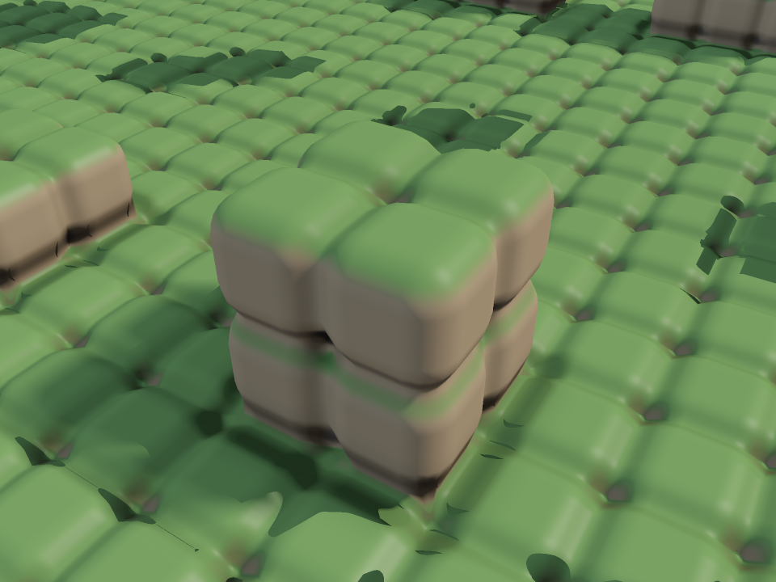

The one survivor of #A7BV7E, kept as the =:clay= style
([[file:../luft/render/clay.lisp][luft/render/clay.lisp]]), because it
meets the standard the classified field failed: the field /is/ its
definition.  Every solid cell is a rounded box -- the cell's box shrunk by
the radius, its distance lowered by the radius -- and the world is their
smooth union at one melt reach.  The surface is that field's zero set,
exactly; there is no target it approximates, no fence tuned against a
picture, and nothing in it with a reach that needs policing.  A solid cell
outside the star of the nearest lattice vertex stands at least half a cell
from that vertex's cube, so with the melt at most one half the eight-cell
reading agrees with the global union everywhere near the surface.

What the object truly looks like: coplanar cells meet in a quilted seam
-- the golf ball -- because per-cell primitives cannot know two faces are
one plane; convex arrises round at the radius; coves fillet by the blend;
and diagonally touching cells, which every mesh rule of #6TEFOS must keep
separated, grow a bridge, because a smooth union cannot do otherwise.
At a radius of one half a lone cell is exactly a sphere and a bar a
string of pearls.

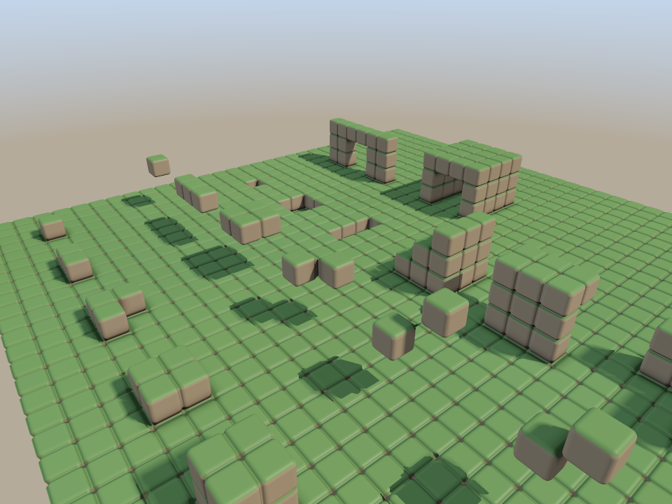

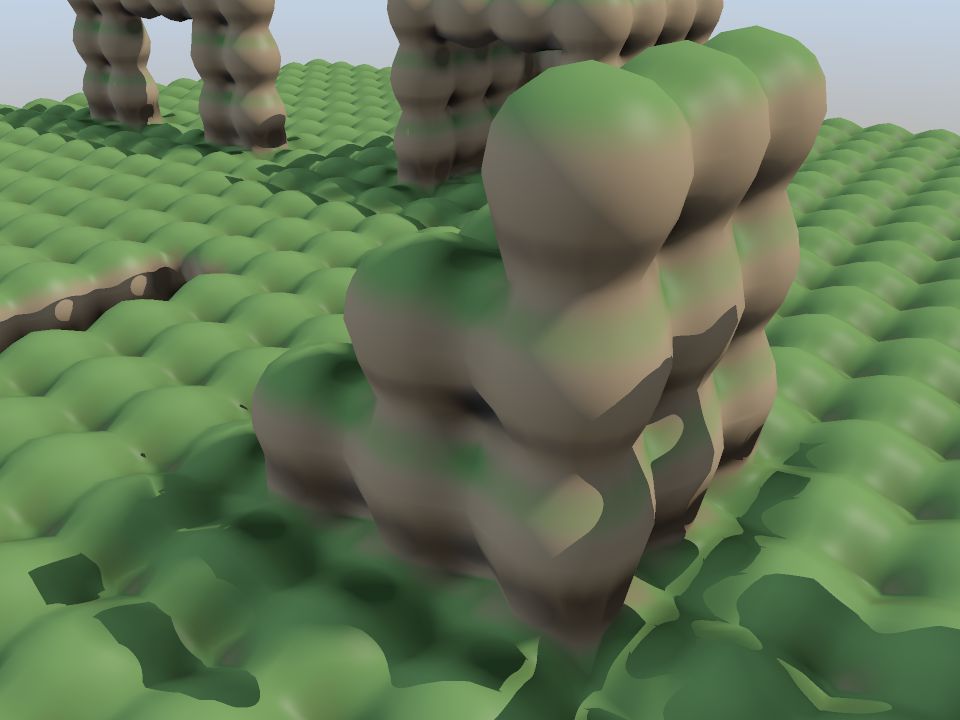

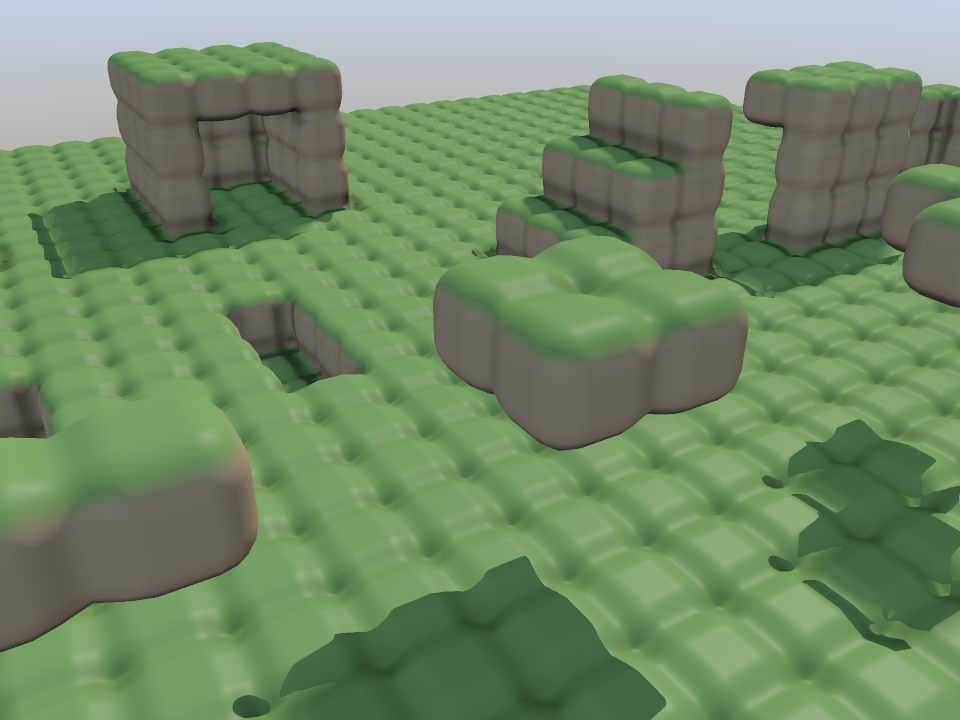

The mesh is the two-ring grid of #RUAWR5's family with every point walked
onto the zero set by two Newton steps, tetrahedral gradients, the step
clamped by length and by a multiple of the distance value so a medial-axis
point cannot fling a vertex.  The shading is what true distance buys and
the tent field of #TI9NJP cannot honestly offer: the sun shadow is sphere
traced with a penumbra set by the narrowest miss along the ray -- a
contact shadow that hugs the quilting -- and ambient occlusion is read
off four distance taps along the normal.  =*clay-radius*= and
=*clay-melt*= ride in the frame block, so a film can breathe them
continuously; such a film runs without temporal accumulation rather than
pretending its history is reusable.

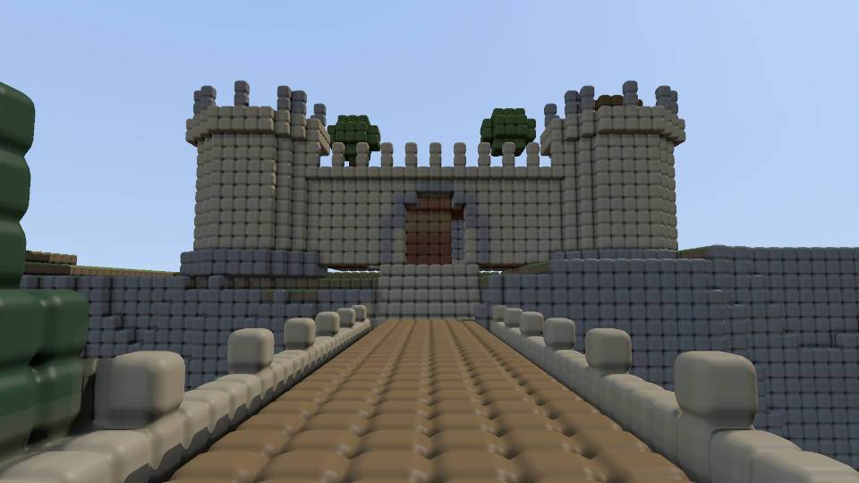

The stocks of #ADEAKZ come along by the same definition rather than by a
trick: a smooth union carries its own partition of unity, each cell's
share being the softmin weight of its rounded-box distance over the melt
reach, and the surface colour is the weight-averaged stock albedo.  A
timber deck melting into a granite rampart blends its colour exactly
where the geometry blends, and nowhere else.

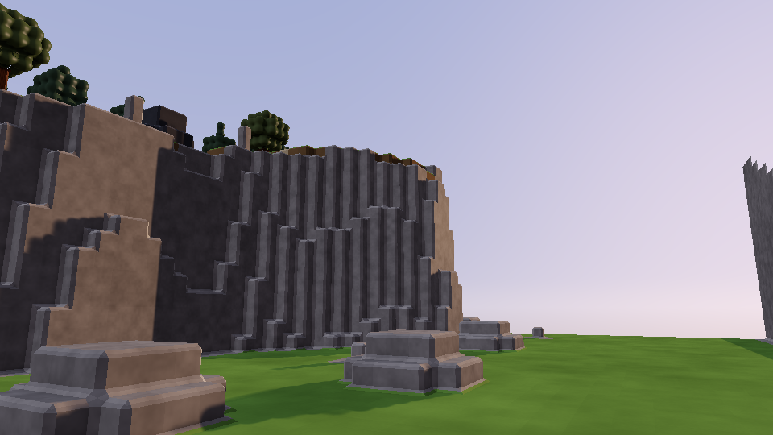

Clay also mixes with the other styles by stock rather than by scene:
=*clay-stocks*= names materials the clay overlay owns, their packed
slots ride a spare frame lane, each vertex stage collapses the faces the
lane claims -- the clay rule draws exactly those -- and the clay field
treats every unclaimed cell as air.  A world of chamfered masonry whose
conifer and leaf crowns are full-radius clay blobs is then one extra
draw, and the clay knobs ride two more spare lanes so the chamfer keeps
its own width beside them.

* The studio: a world of stars under the same cameras
:PROPERTIES:
:ID: UTRJ2T
:END:

A shaping rule is judged at its sites, and a demonstration world with
thousands of them shows none well.  The refounded atelier therefore keeps two
complementary fixtures.  [[lisp:luft.render:make-gallery-solid]] isolates the
small occupancy stars on separate plots; [[lisp:luft.render:make-miter-study-scene]]
composes the mixed stars into the wall-side stepped mountain of #Z5NDTA.  Both
run through the ordinary [[lisp:luft.render:start-viewer]] and
[[lisp:luft.render:capture-viewer-frame]] paths.  Named =luv/showcase= recipes
own cameras and output sizes when a picture becomes durable evidence, while
the live atelier remains free to orbit, point at, and reload the same scene.

** DONE The atelier itself is a McCLIM application
:PROPERTIES:
:ID: OK62XM
:END:

/Intent./ Make McCLIM the application model of the new atelier, not a widget
kit added after a renderer has already invented commands, focus, and
lifecycle.  LUFT should be able to grow into the next game one feature at a
time without growing a second application beside it.

/Evidence./ [[lisp:luft.render:viewer]] is now both the canvas event handler
and a =standard-application-frame=.  It deliberately has no frame process and
no second native window: portable canvas events resolve through layered CLIM
command tables and execute inline on the canvas owner.  Movement press and
release, reset, pointer escape, fullscreen, and Control-Q are named commands.
Native close, Control-Q, standalone cleanup, and interactive
[[lisp:luft.render:stop-viewer]] converge on one idempotent teardown with a
frame-boundary barrier before renderer resources disappear.

The system boundary says which direction dependency flows.  =luft/renderer=
owns packed-site shaders, materializations, and GPU resources;
=luft/render= adds the McCLIM atelier.  The portable key-event/gesture bridge
lives in =luv/mcclim= and luvcraft imports it, so LUFT did not copy the old
game's application glue in order to inherit its behaviour.

/Done when./ Done: the viewer is an application frame, its bindings are
ordinary CLIM commands covered by executable tests, the renderer loads without
the atelier, and the existing luvcraft command layer uses the same event
bridge.

** DONE Pointing reveals a site's topology
:PROPERTIES:
:ID: UWRDQI
:END:

/Intent./ Make the first workbench pane answer the question the picture raises:
which packed LUFT site is under the pointer, and how did its local shape rule
turn that site into the geometry being seen?

/Evidence./ [[lisp:luft.render:raycast-site]] walks the retained solid chain and
returns one sparse [[lisp:luft.render:site-inspection]] at the semantic UI
boundary: oriented face site, solid cell, hit point and distance, stock, and
shape word.  The viewer presents those values through a McCLIM application
pane mirrored into the existing canvas, so no second window or input owner is
introduced.  Each dense face record also carries a 21-bit construction mask:
the internal U, V, and chosen diagonal edges whose two realized facet normals
actually differ.  The fragment shader uses screen derivatives only to keep
those approved edges crisp.  =C= toggles the resulting global construction
drawing; a cyan reticle marks the ray intersection and reveals the complete
local triangle lattice without an area fill or distance halo.  Face rims remain
lighter evidence of the cubical complex that owns those triangles.

/Done when./ Done: Escape releases the pointer, moving it ray-casts the world,
the inspector follows semantic site crossings, =C= globally toggles stable
construction lines, and a ray hit is a crisp blueprint reticle rather than a
dark smudge.

** NEXT Grow the workbench and the game as one command vocabulary
:PROPERTIES:
:ID: WO50UR
:END:

/Intent./ Add atelier tools, authored-world interaction, and eventually game
features as panes, presentations, commands, and command-table layers of this
one frame.  A feature crosses from luvcraft when LUFT owns its semantic command
and state transition; the old implementation remains an oracle until then and
is deleted after the crossing.  Rendering continues to consume immutable
scene/view snapshots rather than acquiring input or UI policy.

/Evidence./ #OK62XM establishes the frame, owner thread, shared gesture bridge,
and renderer/application split.  #7OH71A now supplies the shared default status
line, M-x, metabar, lobby radio and panel, capture, Tracy, live-artifact,
lifecycle, and agent boundaries; LUFT contributes commands, settings, fields,
and instrument attachment through thin methods.  #HXD14I added a real modal
editing layer with semantic Edit World, Undo, and Redo commands over immutable
scene transactions; the playable sanctuary now exercises it as its ordinary
path.  The next application slice is not another input loop: it is a visible
material chooser and geometric placement preview expressed through this same
frame.  Parameter prompting remains #OL2JZ1, and no luvcraft gameplay path has
yet crossed with its old owner removed.

/Done when./ One editing tool uses presentations and a modal command layer,
and the first luvcraft gameplay feature has crossed with its former application
path removed rather than maintained in parallel.

** DONE The retired page renderer proved linear boundary edits
:PROPERTIES:
:ID: 3QNZC1
:END:

/Historical intent./ Make a voxel edit the sparse chain delta it is.  If the
solid is $C$, its surface is $S=\partial C$, and an edit is the signed 3-chain
$\Delta$, the complete update is

\[
 C' = C + \Delta, \qquad
 S' = S + \partial\Delta = \partial(C + \Delta).
\]

/Historical evidence./ The retired =apply-scene-edit= page renderer performed
exactly that addition after validating the whole edit against binary
occupancy.  Its surface was also a direct sum of 8³ chunk ledgers.  A chunk
had at most
$3\cdot8^3=1536$ face geometries -- one 8³ set for each face extent -- so it
owned one stable, exactly bounded GPU page.  Only summands met by
$\partial\Delta$ were reordered; their page offsets never moved.  Occupancy
was updated one 32-bit word at a time, and a bounded revision history let
several renderers catch up incrementally or fall back honestly to a full
cohort.

That viewer removed its hit cell with left click and placed into the preceding
empty cell with right click.  Differential tests crossed chunk boundaries and
the horizontal torus through additions, removals, and eighty successive
toggles; after every group the incremental surface, packed pages, dense
occupancy, and fresh [[lisp:luft:surface-chain]] agreed.  A Vulkan test observed
one ordinary edit as two writes -- one face page and one occupancy word --
smaller than the full scene upload.

The retired =film-atelier-construction= turned the proof into three films: the
Holm rose, wound into place, or was subtracted from a sacrificial granite
prism.  The 49,294-cell spiral uploaded 4,484,904 bytes across all of its
incremental publications; one full reserved scene cohort was 3,801,088 bytes
by itself.  The renderer which owned those fixed pages has since been removed;
#HXD14I retains the signed-chain transaction in the current regional mesher
instead of describing this historical implementation as live.

/Done when./ Historical experiment complete: the reference and GPU tests
passed and all three construction orders finished at the exact authored solid
and boundary.  This is evidence for the current transaction, not current API
documentation.

** DONE Editable streaming scenes publish immutable revisions
:PROPERTIES:
:ID: HXD14I
:END:

/Intent./ Bring smashing and placing into the current playable atelier without
letting a mesh worker observe half of an edit.  Keep the useful camera turn in
ordinary play as well: =Tab= and =Shift-Tab= orbit the following camera by 45°,
whether or not authoring mode is active.

/Evidence./ [[lisp:luft.render:edit-streaming-scene-cell]] validates one signed
cell transition, rejects occupied/empty mismatches and cells reserved by torch
attachments, then constructs the successor solid, chunk, copy-on-write
material field, scene-closed material program, and authored light generation
before replacing any scene value.  The viewer separately prevents placement
through its player.  A monotonically increasing
content revision enters each mesh request stamp.  Every worker request borrows
an immutable scene input containing the old chains, material table and program,
and light generation; after an edit that old request remains executable but
cannot be published as current.  The canvas schedules the resident canonical
owners as one cohort, so the GPU sees the old world or the complete new world,
never a seam assembled from both.

M-x =Edit World= enters [[lisp:luft.render:world-edit-mode]].  The existing cyan
ray reticle identifies its target; left click removes the hit cell, right click
places the selected material on the outward side, and middle click picks the
hit material.  Escape returns to play.  M-x undo and redo replay the same
transaction, while the status line names the selected material and latest
result.  The playable sanctuary now starts as a streaming scene so this path
is the ordinary application rather than a diagnostic fixture.

/Done when./ Done for the preliminary path: model tests cover reversible
occupancy/material/light state, stale snapshot isolation, material-program
expansion, protected attachments, player overlap, and busy cohort publication;
the viewer exposes the mode and both camera turns.  Rapid coalesced painting,
a visible material speedbar, and a geometric target outline remain separate UI
and scaling experiments.  Until incremental light solving exists, one edit
copies the authored material table, resolves the complete light field, and
remeshes the resident cohort deliberately.

/Measured follow-up./ The first live edit returned from the canvas in 0.42 s
and became visible in 3.46 s.  Extending the finite query to bevel widths two
and three and bounding torch attachment scans reduced those numbers to
0.016--0.020 s and 0.77--0.88 s.  Renderer publication itself is only 0.008 s;
the remaining delay is preparing every resident owner against one globally
coupled light generation.  #WLLATM now owns the regional-light succession and
repeatable burst-measurement experiment; weakening atomic publication is not
the next lever.

** IDEA Compact surviving faces only when measurement earns another path
:PROPERTIES:
:ID: WQ611A
:END:

/Intent./ If vertex invocations over absent or back-facing sites become a
measured bottleneck, compact visible face indices before drawing.  Compute
compaction plus an indirect draw and a future mesh/subgroup path are competing
experiments; this mark does not pre-authorize a second permanent terrain mode.

/Evidence./ The current world draws thousands of faces at trivial cost.  The
mesh experiment of #VAABY9 duplicated substantial renderer and shader truth
without becoming the reliable default, so it was removed.  A new path needs a
profile and a deletion story before it needs subgroup vocabulary.

/Done when./ A representative larger scene shows face reconstruction as a
bottleneck, one compaction experiment improves measured frame cost on a real
backend, and its surface input remains the encoding of #AGVXGM.

** IDEA Draw the torus, not only its fundamental domain
:PROPERTIES:
:ID: PGRM80
:END:

/Intent./ A camera outside the fundamental domain sees a cut world: faces at
=x=0= that a solid neighbour at =x=period-1= cancels are honestly absent.
The vertex stage could translate each site's anchor by the domain period
toward the camera, or the host could draw the nearest translated instances,
so the wrap becomes visible instead of surprising.

/Evidence./ The first render, taken from =x=-6=, showed exactly this cut.

/Done when./ Flying across the seam of a small domain shows the world repeat
without a gap.

* Going indoors must not hide the player
:PROPERTIES:
:ID: 75OOSW
:END:

The follow camera of [[lisp:luft.render::follow-walking-player]] frames the
wizard from an isometric yaw family and tracks softly outside a quiet radius.
[[lisp:luft.render::constrain-viewer-follow-camera]] already ray-casts from its
look-at point toward the smoothed eye and shortens that eye ray before sanctuary
geometry can hide the player.  That is a useful visibility guard, but under a
roof it trades the stable exterior composition for a close camera without
making the floor, near walls, and enclosing architecture jointly readable.
Nothing in shading or the world model yet has a notion of /indoors/.  This
blocks ordinary interior composition before caves or dungeons exist, and the
spell work sharpens the stakes: dark interiors are where RGB4 torch light and
the transient spell light of #MMH4S2 pay off most, and where the exposure
policy of #POPM2I meets its hardest scene.

A cubical world offers three honest mechanisms, in rising order of ownership.

1. /A screen-space reveal./  Fragments of world geometry standing between
   camera and player inside a screen-space aperture are dithered or faded
   away.  This invents no new world truth — the terrain fragment stage already
   has depth, and the player's projected position is one more uniform — but
   the hole must be tuned to read as a lens, not as damage.
2. /A horizontal cutaway./  Draw nothing above the player's current storey,
   dollhouse style.  This is the most cubical answer — ledgers are already 8³
   pages keyed by anchor — but the surface is a boundary: $\partial C$ has no
   faces inside walls, so a cut exposes honest absence and needs a cap or a
   stylized ceiling-section treatment before it looks deliberate rather than
   broken.
3. /Room semantics./  Detect roofed connected volumes as rooms; entering one
   switches camera target, cut height, and light regime.  This is the
   eventual gameplay-bearing answer and by far the most machinery, and it
   would still want one of the first two mechanisms as its presentation.

These are not exclusive: a shipped isometric game typically pairs a reveal or
cutaway with room knowledge.  But only one of them is the smallest observable
experiment.

** NEXT A reveal that keeps the room readable under stone
:PROPERTIES:
:ID: 1PH7XR
:END:

/Intent./ Prove one de-occlusion mechanism — the screen-space reveal first,
the cutaway as the competing bid — so that walking into the castle interior
keeps the player, the floor underfoot, and the near walls readable without
introducing a world-model concept of rooms.

/Evidence./ The existing camera constraint guarantees a clear eye-to-player
ray by moving the eye inward; it does not preserve the useful isometric view or
reveal the floor and near enclosure together.  The reveal needs only
per-fragment facts the terrain shader already has plus the player's projected
position; the cutaway first needs a cap policy for boundary meshes before its
cut looks intentional.

/Done when./ A pinned pair of screenshots shows the wizard outside and inside
the castle with the interior readable, the reveal stable under small camera
and player motion (no shimmering aperture edge), and the record naming the
mechanism, its parameters, and its per-frame cost.
