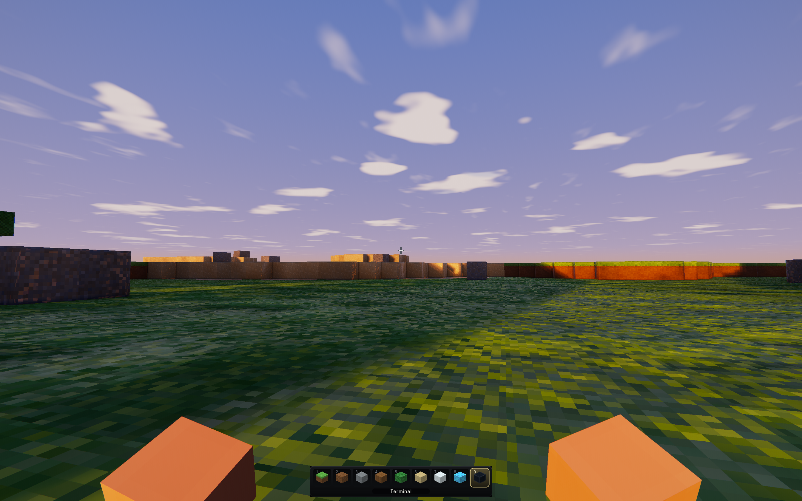
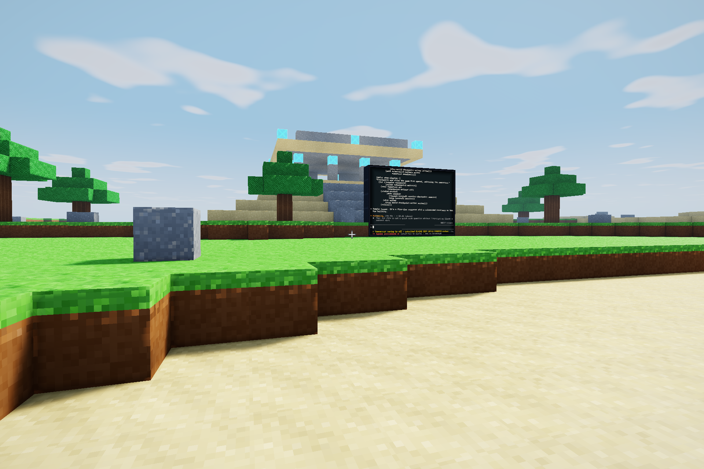
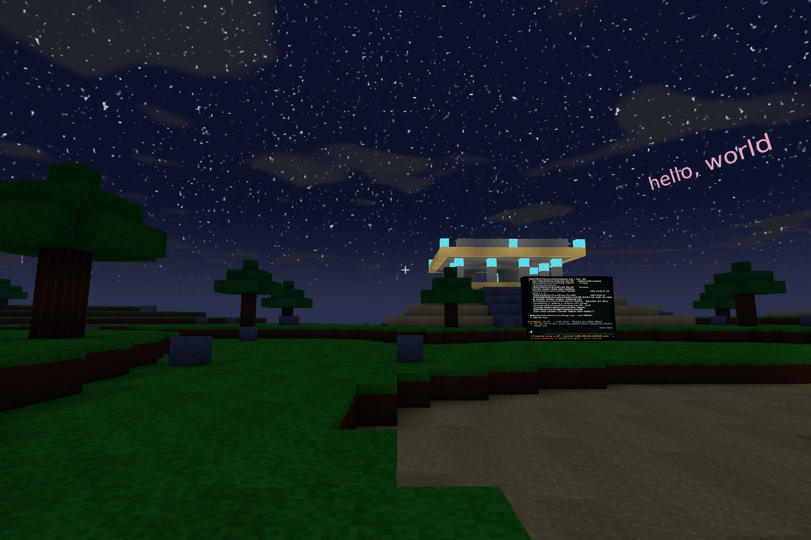
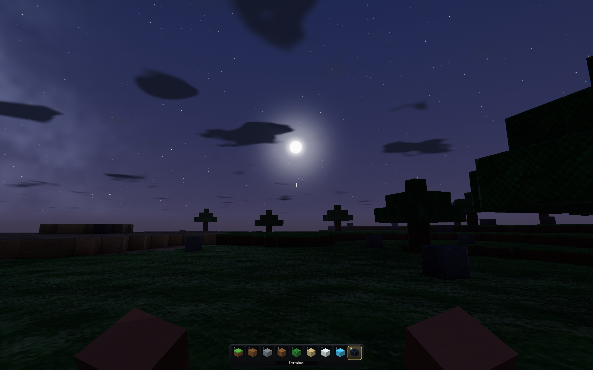
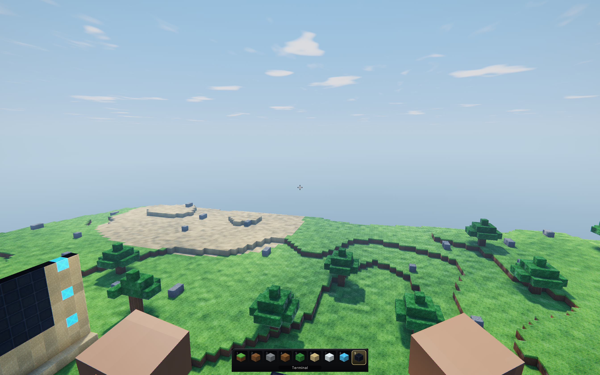

#+title: Sky, atmosphere, and voxel light for the little block world
#+startup: overview

* Status: implementation notes and remaining plan
:PROPERTIES:
:ID: SK7L2T
:END:

This page records the sky and lighting system for luvcraft: an animated sky
and primary light, caves and overhangs which become dark for the right reason,
light-emitting blocks, relighting after edits and residency changes, and a
clean route to HDR bloom and directional shadows.

The important outcome of the design review is that shader-language growth is
part of the work, not a cost to evade.  Frame-wide facts still belong in Lisp;
spatially varying image mathematics belongs in shaders; and the boundary
between them should become more capable as the renderer asks more of it.

Phases 0--4 and the first directional-shadow pass now have implementations in
the codebase, and the HDR presentation stack the last phase asked for has
landed: a linear floating-point scene attachment, a filmic curve, a bloom
chain, and light shafts (#IC14P3).  The sky it presents became procedural
image mathematics rather than a two-colour gradient (#9SSXDJ), and the block
surface grew a shape of its own from what the mesher knows about each face's
edges (#J19EBO) and what the atlas paints beside each material's colour
(#CHUKWD).  A later round took the shading itself toward physical argument:
no two faces are the same card any more (#3AVEKC), the specular lobe and the
ambient are microfacet and hemispheric rather than fitted (#2T8CCH), the sky
became an atmosphere (#8X33G2), and the cloud deck became a plane both halves
of the renderer can find (#RSGLTL).  Each phase below has a visible result and
an evidence gate, so it can be revised from measurements without undoing the
preceding phases.

* What the critique changed
:PROPERTIES:
:ID: SKCRIT
:END:

The first draft had a useful inventory and a good instinct for dense chunk
data, immutable mesh snapshots, and last-known-good shader replacement.  It
also optimized too hard for making no new machinery.  These are the changes
which make the plan durable.

- *Grow the shader language on purpose.*  Avoiding =max=, =clamp=,
  =smoothstep=, normalization, and exponentiation is not a design objective.
  They are ordinary graphics vocabulary needed immediately by fog, a sky
  gradient and sun disc, tunable light response, and later tone mapping.  Add
  them as one coherent typed-math extension and keep their source-to-SPIR-V
  provenance inspectable.
- *Do not make the present world height a lighting invariant.*  The current
  generated world resides only at chunk Y=0, but =block-world= and
  =voxel-space= already admit arbitrary chunk coordinates and shapes.  A
  3x3-horizontal regional proof becomes false once a sky opening can affect a
  tall column.  The runtime solver will therefore be incremental and
  height-independent; a from-scratch solver remains its oracle.
- *Keep source and derived revisions distinct.*  Block content revisions say
  that authored world data changed.  Light revisions say that a derived field
  changed.  Relighting must not impersonate a block edit by bumping content
  revisions; mesh dependency stamps should name the source and derived field
  revisions explicitly.
- *Residency is a lighting input.*  Arrival and departure alter the boundary
  conditions of retained chunks.  Eviction cannot merely invalidate a mesh
  and leave its baked light untouched.  Lighting receives content and
  residency dirtiness, and unknown terrain is not silently reclassified as
  open sky.
- *Add light in linear space.*  Screen blend is bounded and convenient, but it
  is not a useful foundation for several light sources and it destroys the
  headroom emissive surfaces need.  The material sums sky, direct, and block
  illumination, adds self-emission separately, then fogs and eventually tone
  maps.
- *Do not spend alpha as an undocumented bloom bus.*  Propagated blocklight is
  not the same fact as material emission, and the current sRGB scene target
  cannot retain HDR energy anyway.  Emission gets an explicit material input;
  bloom follows a deliberate linear-HDR scene path.
- *Measure scheduling claims.*  There is no evidence yet that a relight is
  sub-millisecond or that a one-mesh-per-frame ripple is pleasant.  The system
  will expose work counters and latency, publish light atomically, and move
  captured work to the existing producer only if measurements justify it.

* What exists today: verified touch points
:PROPERTIES:
:ID: SK9INV
:END:

- [[file:../hal/shader/language.lisp][=hal/shader/language.lisp=]] is already an open compiler.  Operators are symbols,
  and parsing, typing, lowering, result naming, and documentation are
  EQL-specialized generic functions.  A new operator should be a cohesive
  method cluster, not another central dispatch table.
- The expression language has floats, =vec2..4=, arithmetic, =dot=, =mix=,
  =swizzle=, texture sampling, and the first GLSL extended-math family:
  =min=, =max=, =clamp=, =smoothstep=, =abs=, =sqrt=, =expt=, and
  =normalize=.  A small shadow-ready follow-up added =step=, a typed
  =:depth-texture-2d= resource, and depth-image sampling that feeds ordinary
  scalar math through =swizzle=.  It still has no branching, loops, matrices,
  boolean values, or general uniform packing.  Uniform blocks intentionally
  consist only of aligned vec4 lanes.
- [[file:../hal/vulkan/spir-v/instructions.lisp][=hal/vulkan/spir-v/instructions.lisp=]] now models =OpExtInstImport= and =OpExtInst= as structured
  module sections in logical-layout order.  Lowering requests =GLSL.std.450=
  once per module when needed, while modules with no extended math acquire no
  import.
- The live shader path in [[file:../luvcraft/live-pipeline.lisp][=luvcraft/live-pipeline.lisp=]] transactionally rebuilds complete
  vertex/fragment pipelines and retains the last-known-good pipeline after a
  bad edit.  New sky and post materials should use that path rather than a
  parallel compilation mechanism.
- The block vertex shader and sky shaders share one frame uniform block, and
  the host derives the uniform byte size from the shader-visible layout.
  Fog now has explicit near/far semantics with clamped quadratic shaping.
- The visible material reads the shared sky/environment lanes, samples raw
  vertex light, computes sky, sun, and block contributions in linear space,
  adds surface emission, and then fogs.
- The mesh vertex is four =:float32x3= attributes: position, UV plus AO,
  normal, and =(sky block emission)=.  The 48-byte stride fits the backend's
  current vertex format support.
- Meshing copies a one-cell block and light halo to an immutable worker
  snapshot.  Corner AO and corner light sampling use separate named rules, and
  mesh results are rejected when their dependency stamp is stale.
- The current scene target is the canvas's LDR sRGB format.  It is rendered
  offscreen and then copied to the surface, which is a useful post-processing
  seam but not yet an HDR or multi-pass pipeline.

* The rendering model
:PROPERTIES:
:ID: SKRMOD
:END:

There are two related systems, not one.

1. The *environment* is continuous and changes every frame: sky radiance,
   primary-light direction and colour, ambient colour, fog, exposure, and
   time of day.  Lisp evaluates its small time/profile model once per frame
   and writes a uniform block.  Sky and material shaders evaluate spatial
   image functions from those parameters.
2. The *voxel light field* changes when block content or residency changes:
   sky access, propagated blocklight, opacity, and emission.  It is a dense
   derived field associated with resident chunks, revised independently from
   block content, and sampled into immutable mesh snapshots.

The block fragment material starts from a linear-light equation rather than a
blend trick.  In schematic form:

#+begin_src lisp
(let* ((sky-level      (light-response sky-input))
       (block-level    (light-response block-input))
       (n-dot-l        (max 0.0 (dot normal sun-direction)))
       ;; Lateral skylight gives ambient visibility but not a hard sun beam.
       (sun-visibility (smoothstep 0.90 1.0 sky-input))
       (sky-light      (* sky-color sky-level ao))
       (sun-light      (* sun-color n-dot-l sun-visibility day-factor))
       (local-light    (* block-light-color block-level))
       (reflected      (* albedo (+ sky-light sun-light local-light)))
       (radiance       (+ reflected (* emission-color emission-input)))
       (fogged         (mix radiance fog-color fog-amount)))
  (set-output color-output (vec4 fogged 1.0)))
#+end_src

The exact response curves and balances are art parameters, not baked mesh
facts.  Vertices carry normalized raw levels; shader edits can change the
curve without remeshing the world.  AO modulates diffuse sky access, not
self-emission.  When the HDR phase arrives, radiance above 1.0 survives until
tone mapping and can feed bloom naturally.

Propagated skylight is not a directional shadow map.  It makes caves dark and
canopies reduce ambient sky access.  A separate GPU depth pass now shadows the
moving sun; vertical canopy shade remains ambient access, not an angled sun
shadow.

* Phase 0: give the shader language the mathematics this work needs
:PROPERTIES:
:ID: SKSHDR
:END:

Add the SPIR-V and expression-language capability before designing visual
effects around its absence.

** SPIR-V structure

- Define =OpExtInstImport= and =OpExtInst= in the instruction vocabulary.
- Give =spir-v-module= explicit extension and extended-instruction-import
  sections in SPIR-V logical-layout order.  Imports are durable structured
  objects, not instruction forms inserted ad hoc by individual shaders.
- Let lowering request =GLSL.std.450= once when an operator needs it.  Repeated
  operators in one module share the import ID; modules which use no extended
  math do not acquire one.
- Preserve the bidirectional expression/instruction provenance used by the
  shader lab.  An extended operation must still highlight as the instruction
  belonging to its source expression.

** Typed operator vocabulary

The first useful family is =min=, =max=, =clamp=, =smoothstep=, =abs=,
=sqrt=, =expt=, and =normalize=.  Use CL's symbol where its meaning matches
the compiled subset; use exported shader symbols for words CL does not have.
Each operator gets explicit accepted scalar/vector signatures rather than a
promise that every GLSL overload exists.  The existing EQL-method protocol is
the extension mechanism; a convenience definer may emit ordinary methods but
must not hide a registry.

This phase does not add branching, loops, matrices, or every GLSL function
pre-emptively.  It establishes the import/lowering machinery and a coherent
math baseline with immediate consumers.  Later language growth remains a
normal feature, not an architectural exception.

** Uniform and vertex ABI checks

- Keep vec4-lane uniform blocks for this phase: they are simple, aligned, and
  sufficient.  Derive or assert the host byte size from the shader-visible
  layout so the 96-to-N-byte change is not duplicated magic.
- Verify that the same frame uniform block can be declared in both vertex and
  fragment specifications at binding 2.  Both stages must declare identical
  member order and offsets.
- Use a fourth =:float32x3= block vertex attribute for =(sky block emission)=.
  Do not quietly write =:float32x2= into the plan while the backend rejects
  it.  General vertex formats remain a worthwhile GPU-API project when a
  consumer benefits from them.

** Gate

Unit tests cover successful and rejected signatures, a single shared import,
logical module ordering, deterministic lowering, and provenance.  Generated
modules pass =spirv-val --target-env vulkan1.0=.  A live invalid edit preserves
the old pipeline, and a corrected use of an extended operator installs on the
running Vulkan path.

* Phase 1: a real sky driven by a small Lisp clock
:PROPERTIES:
:ID: SKDYCY
:END:

A =sky-clock= belongs to the luvcraft session because it has mutable runtime
identity worth inspecting: time, rate, paused state, and an optional pinned
time for deterministic capture.  A sky profile is ordinary data: keyframes
for sky/horizon colour, primary-light colour, ambient colour, fog, and
exposure.  There is no class hierarchy or generic dispatch until more than one
actual sky model exists.

=sky-frame-parameters= evaluates the clock and profile once per frame.  CPU
trigonometry is appropriate for a single sun direction; it is not a reason to
move per-pixel sky shaping out of the shader.  The frame uniform grows by
aligned lanes for at least:

- sun direction plus day factor;
- sun colour plus angular size or intensity;
- zenith and horizon colours;
- ambient colour plus exposure;
- fog colour and near/far shaping.

The three hardcoded sky literals have been replaced by this one frame result.
The clear value is merely a safe fallback.

A live =:sky= pipeline draws a fullscreen triangle before block geometry in
the existing scene pass, with depth writes disabled.  Its fragment shader
reconstructs or receives a view ray and uses =normalize=, =smoothstep=,
=max=, and =expt= for a vertical gradient, horizon band, sun disc, and a soft
forward glow.  A tiny static fullscreen vertex buffer is acceptable; integer
vertex-index support is not a prerequisite unless it is independently useful.

The block shader reads the same environment lanes directly.  Fog becomes a
clamped function with explicit near/far semantics.  The sky pass itself is
not fogged into its own colour.

The clock advances in =render-luvcraft-frame= from its bounded delta.  SLY can
pause it, set a time, change its rate, or replace the profile without
restarting.  Smoke capture pins it; interactive play animates it.

** Gate

Noon, dusk, and night captures show a continuous sky, matching fog, and a
moving primary light in the actual renderer.  The shader lab can inspect the
sky specifications.  A fixed clock produces a byte-identical smoke image;
unpinning it visibly advances without changing block content or remeshing.

* Phase 2: make voxel light an explicit derived field
:PROPERTIES:
:ID: SKSTOR
:END:

Each resident =block-chunk= may own a =chunk-light-field= with:

- sky and block arrays of =(unsigned-byte 8)= values constrained to 0..15;
- a light revision and six light-boundary revisions;
- a state such as =:unlit=, =:stable=, or =:provisional=.

The semantic light-field object belongs at the chunk boundary; its 4096-site
columns remain dense arrays.  Two u8 arrays cost 8 KiB for a 16-cubed chunk.
Nibble packing is deferred until memory or bandwidth measurements say it
matters.

Block light behavior is distinct from collision.  Add both protocols now:

#+begin_src lisp
(defgeneric block-light-opacity (block)) ; 0..15
(defgeneric block-light-emission (block)) ; 0..15
(defgeneric block-surface-emission (block)) ; linear material intensity
#+end_src

Air answers zero for all three.  A =block-kind= method reads configured slots
with opaque/non-emissive defaults; particular kind instances carry the data.
Propagation strength and visible surface radiance are separate even when one
crystal configures both.  The solver dispatches once per palette entry to
build dense opacity and light-emission lookup vectors, then its hot loops index
those vectors.  It does not call a generic for every cell.

Light publication advances light revisions only.  The mesh dependency stamp
contains the target chunk's content and light revisions plus the opposing
content and light boundary revisions of sampled neighbors.  That preserves
the reason a mesh became stale and avoids feedback in which derived light
looks like another authored edit.

This field is a sibling materialization over the chunk's domain, not a second
spatial domain merely because it has its own revisions.  The current
=light-region= nevertheless rebuilds world decomposition, dense offsets, and
face enumeration, while meshing rebuilds related traversal for its resolved
neighborhood and immutable halo.  #WUB581 records that concrete duplication;
#K3KZTG makes the shared domain/window vocabulary the next structural proof.

* Lighting semantics and boundaries
:PROPERTIES:
:ID: SKBOUND
:END:

- Blocklight begins at =block-light-emission= and loses at least one level per
  six-neighbor step, with opacity contributing further loss.
- Direct sky enters from a boundary known to be open to the sky.  It travels
  downward through transparent cells without losing a level; lateral and
  upward propagation attenuate.  This rule works across any number of vertical
  chunks.
- A missing resident neighbor has one of three meanings: known open boundary,
  known closed/outside boundary, or unknown terrain.  Only the world/source
  policy may decide which.  The lighting solver never equates =:absent= with
  open sky merely because the mesher currently chooses =:air= for missing
  geometry.
- Provisional results may be rendered at a residency edge, but their
  dependency includes that boundary state.  Arrival or departure dirties the
  retained face and schedules reconciliation before a new stable light
  revision is published.
- Residency events accumulate until reconciliation.  A same-key
  remove-and-arrive replacement must run both sides of the transition: remove
  the old incarnation's influence from retained neighbors, then seed the new
  resident chunk.

The little generated world can initially declare open sky above its known
vertical extent and a closed lower boundary.  A future vertically streamed
source can provide sky-column knowledge or retain =:unknown= until the upper
stack is known.  That source protocol, rather than a hardcoded chunk Y=0 test,
is the growth seam.

* The solver: reference truth plus incremental runtime work
:PROPERTIES:
:ID: SKRELT
:END:

Implement two algorithms with the same semantics.

1. A *from-scratch reference relight* clears a finite captured region, seeds
   known sky boundaries and emitters, imports explicit boundary values, and
   propagates to fixation.  It favors obvious correctness and is used by tests,
   inspections, and recovery.
2. The *runtime relighter* maintains removal and addition queues.  Content
   changes first recompute direct-sky seeds for affected columns.  Decreased or
   invalidated values enter the removal queue; surviving sources and alternate
   paths enter the addition queue.  The same mechanism crosses resident chunk
   faces and works for both edits and residency transitions.

The old 3x3-horizontal recomputation remains a useful test case and perhaps a
current-world fallback: with a 0..15 attenuating lateral field and one known
vertical chunk it bounds local influence.  It is not the public correctness
argument and no caller may assume that shape.

A =luvcraft-lighting-state= owned by the session records dirty cell/column or
chunk coordinates, residency-boundary changes, queue counters, and an
in-progress candidate.  World content hooks and residency publication feed
that state; a dirty bit stored only on a chunk would lose departures and give
too little information for future vertical columns.

Reconciliation runs before mesh snapshots are captured, but it does not expose
half-solved arrays.  Work is accumulated in candidate copies of touched light
fields and published as one owner-thread transaction when the queues settle.
Until then meshes continue to use the previous stable revision.  A new edit
either merges into or invalidates the candidate explicitly.

Start with bounded owner-thread work and record cells popped, chunks touched,
milliseconds, restarts, and edit-to-publish latency.  If real captures show
hitches, capture immutable block/light/boundary inputs in a new production
request and publish a complete candidate through the existing
=perform-production-request= / =publish-production-result= protocol.  Its
dependency stamp rejects stale results.  Do not add a second worker system.

* Meshing carries raw light, not an art-directed bake
:PROPERTIES:
:ID: SKMESH
:END:

=make-block-mesh-snapshot= copies sky and block u8 columns for the same
one-cell halo as block samples, after stable lighting publication.  A
=sample-light-at= generic is justified at this representation boundary: the
live world/neighborhood and immutable snapshot each provide one method, while
the dense inner representation remains arrays.

Corner lighting samples the face-adjacent air cells around each vertex.  It
may share the existing AO traversal after a test establishes the intended
sample coordinates, but AO occupancy and light averaging remain separately
named results.  Occluded samples and absent/unknown samples have explicit
rules rather than falling through =block-solid-p=.

The mesh adds one attribute at location 3:

#+begin_example
light-material-input :vec3 = (sky-level / 15,
                              block-level / 15,
                              surface emission)
#+end_example

That widens the current 36-byte vertex to four =:float32x3= lanes and a
48-byte stride, which the backend can describe today.  It is intentionally
plain for the first proof.  Record generated vertex bytes and mesh time; if
bandwidth becomes material, add normalized packed vertex formats to the GPU
API as a measured optimization rather than obscuring the initial format.

Light revision changes schedule remeshing through the existing snapshot and
stale-result machinery.  Relit visible chunks receive priority; an
artificially slow “pleasant ripple” is not an acceptance criterion.  Measure
solver completion and mesh publication separately so either bottleneck is
visible.

** Gate

Caves, overhangs, and canopy shade work across chunk seams.  Arrival and
eviction do not leave stale bright or dark borders.  A vertical multi-chunk
test world works even though the current generator resides at Y=0.  Random
edit and residency sequences leave the runtime field bit-identical to the
reference relight after queues settle.

* Meshing also carries what a fragment cannot see
:PROPERTIES:
:ID: J19EBO
:END:

#SKMESH establishes why light readings belong in the vertex product: they are
what the mesher knows and the fragment stage does not.  Face *edges* are the
same kind of fact, and they turn out to be the difference between a block
world which reads as carved solids and one which reads as a lit grid.

A block face is flat geometry, but a real surface rounds over where it ends
and fillets where it meets a wall.  Perturbing the shading normal near the
face's boundary gives both, and needs no mesh change beyond knowing where the
fragment sits inside its cell.  Doing it at *every* boundary, though, draws a
seam across the middle of an open plain, where the face merely continues into
an identically oriented neighbour and there is no edge at all.  A fragment
cannot tell those cases apart; the mesher can.

So =block-face-edge-shaping-components= classifies each face's four in-plane
edges once, from the same neighbourhood the corner occlusion already samples:

| classification | what lies across the edge  | what the surface does           |
|----------------+----------------------------+---------------------------------|
| concave (-1)   | a block rises at the edge  | fillet inward, gather occlusion |
| flush (0)      | the same plane continues   | nothing                         |
| convex (+1)    | nothing                    | round over                      |

The four signed values become a fifth vertex lane, =:float32x4=, and the
fragment stage multiplies each of its four boundary ramps by the matching
sign.  One expression therefore serves all three cases, and the sign is what
turns a round-over into a fillet.  The two in-plane axes are chosen from the
face normal by the same rule on both sides of the ABI, which is what makes U
and V mean the same thing to the mesher and to the shader.

This widened the vertex from a 48-byte to a 64-byte stride, and required the
portable vertex-attribute vocabulary to grow past =:float32x3= alone --- a
gap #SKMESH's "four =:float32x3= lanes" had left standing in both backends.

Two later corrections, both about making the round-over read as a *shape*
(#YUB8CH).

* A round-over is an arc, not a leaning plane
:PROPERTIES:
:ID: YUB8CH
:END:

The first version of #J19EBO's shaping added a scaled tangent to the face
normal and normalized the sum.  That can only ever reach the arctangent of
the scale --- a strength of 0.42 buys 23 degrees --- so a legible edge needs
an implausible scale, and even then the shading bunches into the last sliver
of the ramp because the tangent grows linearly while the angle saturates.

Rotating the normal through an angle instead sweeps it evenly from the face
toward the edge, which is what a fillet of a given radius actually does.  The
in-plane lean gives the direction and the ramp gives the fraction of a
quarter turn, and the normal is the corresponding point on that arc.  The
guarded denominator matters more than it looks: over the flat middle of a
face the lean is exactly zero, so the direction is undefined and only the
guard keeps it from being a division by zero --- but the angle is zero there
too, so the undefined direction is multiplied away.

The second correction is that a round-over is only legible if it is a few
pixels wide.  Held to a fixed fraction of a cell it dwindles as blocks
recede, and everything in the middle distance flattens back into a card long
before it is genuinely unresolvable.  The block material already measures its
own texel footprint from screen derivatives of the atlas coordinate, for the
relief fade; the same measurement grows the bevel width until the edge is
worth drawing, bounded above so it never eats the face it is an edge of, and
then fades it out.  So the two shapings share one measurement and use it in
opposite directions: relief shrinks with distance, the round-over widens.

* The atlas paints relief as well as colour
:PROPERTIES:
:ID: CHUKWD
:END:

Colour is only half of what a material looks like.  The other half is its
micro-surface: whether it is granular, grooved, tufted, or faceted.  luvcraft's
atlas was already generated arithmetic rather than an asset, one
=paint-block-atlas-tile= method per numbered tile, so the honest place for
that half is the same arithmetic.  =paint-block-atlas-relief= paints a height
field; colour variation reads that field, and =make-block-normal-atlas=
materializes its tile-clamped central difference as a linear tangent-space
normal map.  The block material reads that map once instead of reconstructing
the gradient with four dependent texture taps per fragment.

The colour atlas stays sRGB with ordinary opaque coverage.  The normal atlas
is linear RGBA8: RGB is the encoded unit normal and alpha retains the source
height for inspection.  The shader declares those sampled meanings as
=:surface-normal-sample= and =:surface-relief= rather than treating channels
as unlabeled numbers.  #SKOPEN's decision that bloom must not commandeer
*scene* alpha remains independent of both material textures.

Relief and bevel are both sub-block detail, so both fade out on a measured
texel footprint from the atlas UV derivatives: distant terrain neither
sparkles nor shows a lit grid.  A material's relief is one EQL method, so a
live image can re-sculpt grass tufts or stone cracks and rebuild both dense
atlases without touching the rest of the palette.

* No two faces are the same card
:PROPERTIES:
:ID: 3AVEKC
:END:

The atlas has one tile per material and the world has thousands of faces per
tile, so #CHUKWD's relief only made every grass block the same card seen again
in better light.  Three fields now make each face its own, and none of them
costs a texel.

A hash of the cell a face belongs to is constant across that face and
different on the next one.  The cell is found by stepping half a cell back
along the face's own normal, which lands inside the block whichever of the six
faces this is.  Value noise over the world point knows nothing about where
faces begin, so it drifts across a whole plain the way ground does, at a scale
of about a dozen cells.  A grain finer than a cell supplies the last octave,
and --- the part that matters --- two more taps of that grain, a step along
each of the face's own in-plane axes, give its gradient there, which leans the
shading normal.  The ground is then not merely painted unevenly but lit
unevenly, which is what the eye actually reads as texture.

Value and hue move together but not identically: brighter patches are also
warmer, and a face's own constant drifts its hue as well as its value, so a
plain of grass is many greens rather than one green at many brightnesses.
Every scale fades out on the footprint that scale resolves at --- the
texel-scale terms on the relief fade, the cell-scale ones on the bevel fade of
#YUB8CH --- and all three amplitudes ride one =surface-detail= knob.

* A roughness the relief already knew
:PROPERTIES:
:ID: 2T8CCH
:END:

The block material's specular was one fitted power under a Fresnel weight.  It
is an ordinary microfacet lobe now --- GGX distribution, Smith's
height-correlated visibility in the form that already carries the
$1/(4\cos\theta_l\cos\theta_v)$, Schlick's Fresnel at a dielectric's four per
cent --- which would be unremarkable except for where its roughness comes
from.

Nothing in the palette declares a roughness.  But #CHUKWD's normal atlas is
each material's own slope at texel scale, and a steep texel is the best
evidence available about what happens below a texel: grass tufts are rough, a
glass pane is smooth, and the atlas already knows which is which.  So the
roughness is read from the tangent normal's tilt.  When that relief fades out
with distance its variance has to go somewhere, and the honest place is the
same roughness --- Toksvig's argument --- so a highlight keeps its size across
the draw distance instead of sharpening into a sparkle on every distant face
at once.

What is not the sun also stopped being one grey.  A face turned up sees the
zenith, a face turned sideways the horizon, and a face turned down what the
ground bounced; one interpolation over the normal's own vertical component,
against the zenith and horizon colours the frame environment already carries
for the sky, is the whole of it.  The same sky evaluated in the direction the
surface actually reflects, weighted by roughness and a grazing Fresnel, gives
the sheen that tells a smooth face from a rough one out of the sun.  Those two
terms are the difference between blocks standing under this weather and blocks
standing under a light bulb.

One thing had to move that is not shading at all.  The palette was authored
display-referred, before the renderer worked in linear radiance, and sand at
0.59 linear reflects more light than fresh snow does.  A microfacet lobe over
an albedo that bright is a white card with a highlight on it, so the natural
materials came down to the range a real one occupies and the exposure came
down with them.

* Phase 3: one crystal proves emission and edit propagation
:PROPERTIES:
:ID: SKCRYS
:END:

=*crystal-block*= carries light emission 12, surface emission 1.2, and its own
atlas tile.  Its surface-emission value makes the crystal face luminous; its
light-emission value seeds the propagated field around it.  Those are related
but distinct facts, which is why the mesh carries material emission separately
from the blocklight level.

Add it to =*placeable-block-kinds*= and make the key range and title derive
from the palette length instead of a fixed seven-material assumption.  A
block removal or placement feeds the ordinary content-change path: direct sky,
blocklight, light publication, mesh invalidation, and GPU replacement all
complete without a special crystal edit command.

** Gate

At pinned night, a crystal remains visibly emissive and warms neighboring
surfaces with a continuous cross-chunk falloff.  Placing and removing it
converges to the reference field, rejects any stale mesh work already in
flight, and updates the visible neighborhood within a measured latency budget.

* Phase 4: HDR scene colour, tone mapping, and restrained bloom
:PROPERTIES:
:ID: SKHDR
:END:

Bloom is not “three easy passes” on the current target.  First add an explicit
linear HDR scene format (normally RGBA16F) to the GPU API/backend and render
sky plus world into it.  A live fullscreen post pipeline tone maps into an LDR
sRGB presentation target which can be copied to the surface as today.

Then add half-resolution bright extraction, separable blur, and composite.
The extraction can use HDR luminance and a threshold/knee expressed with the
new shader math.  If art direction later requires “emissive materials only,”
add a named emission attachment and multiple render targets; do not overload
scene alpha.  All intermediate textures have explicit session ownership,
resize handling, usage flags, and completion-safe destruction.

The first bloom target is deliberately the crystal at night.  Exposure,
threshold, radius, and intensity are live profile values, while the pinned
smoke profile keeps deterministic output.

* What the presentation stack became
:PROPERTIES:
:ID: IC14P3
:END:

The plan of #SKHDR is built, and the shape it took is worth recording because
two of its decisions were made by the implementation rather than by the plan.

The scene attachment is =:rgba16-float= and every scene-stage pipeline targets
it: block surfaces, the sky triangle, world text, the terminal wall's glyph
and cell runs, the crosshair.  Only the presentation image is an sRGB
eight-bit surface, and the hardware encode on that write is the only gamma
step in the frame.  Fragments therefore write radiance, and a sun disc, a
specular glint, or a crystal is allowed to be many times display white.

Presentation runs a quarter-resolution lens chain between the scene pass and
the tone map: a soft-knee bright pass with four scene taps per chain texel, a
separable nine-tap gaussian expressed as five linear samples, and a radial
sweep toward the solar disc.  The chain ping-pongs between two attachments, so
the blurred bloom ends in one and the shafts in the other, and presentation
adds both into linear scene radiance before the fitted ACES curve, a small
vignette, and the sRGB write.

Two departures from the plan:

- The four lens stages are *four CLOS roles*, not one shader with a mode lane.
  =:bloom-bright=, =:bloom-horizontal=, =:bloom-vertical=, and =:sun-shafts=
  share a bind group shape and a fullscreen vertex stage and differ only in
  which fragment method they name, which is how the rest of #M3D7QK's live
  pipelines already work.
- The shafts do not march the shadow map as #BAP0QU proposes.  They sweep the
  already-blurred bright image toward the sun's screen position, because
  terrain which occludes the sun is already dark in that image.  The cheaper
  effect arrived first; the marched version remains worth measuring against it.

Grading is art direction rather than architecture, so exposure, bloom gain,
threshold, shaft gain and decay, and vignette are ordinary special variables
that a SLY eval retunes on the running game without rebuilding a pipeline.

* A sky worth tone mapping
:PROPERTIES:
:ID: 9SSXDJ
:END:

An HDR path only pays for itself if something in the frame is genuinely
bright, and a two-colour gradient with a soft disc is not.  The sky fragment
stage became image mathematics over the view ray and the frame environment: a
shaped vertical gradient between the profile's horizon and zenith colours, a
warm low band and two Mie lobes around the sun, a fractal-noise cloud deck
projected onto a plane at cloud height and drifting with an elapsed time the
frame environment now carries, stars at night, and a solar disc drawn at a few
times the sun's true angular radius and pushed far past display white so the
bright pass has something real to feed on.

Only the last few degrees above level fade into the fog colour distant terrain
fades to.  The wide horizon blend the earlier gradient used washed the whole
lower sky into haze, which reads as a rendering limitation rather than as
weather.

The noise is lattice value noise, and its hash taught a lesson worth keeping:
hashing the collapsed index $x + 57y + 113z$ through a sine gives every plane
of constant index the same value, and at star-field frequencies those planes
are plainly visible as streaks across the sky.  Folding a site's own
components against each other has no preferred direction, and costs less than
eight sines besides.

* The sky became an atmosphere
:PROPERTIES:
:ID: 8X33G2
:END:

#9SSXDJ gave the sky something worth tone mapping.  What it drew was still a
gradient with weather painted over it, and five of its terms were wrong in the
same way: each was a fitted curve standing where a physical argument was
available.

- The vertical gradient resolved inside the first few degrees above level, so
  seven eighths of the hemisphere was one flat zenith colour.  A small
  exponent over the elevation spreads it across the whole sky, which is what
  an optical depth along the ray does.
- Two fitted powers stood in for the glow around the sun.  One
  Henyey-Greenstein phase function evaluated at two asymmetries replaces both,
  and gets for free the thing the powers could not: the same medium gives a
  huge soft glow when the sun is low and a tight one when it is high.
- The warm band at sunrise ran all the way round the horizon.  It is sunlight
  that came the long way through the atmosphere, so it is the sun's own colour
  at that hour, laid exactly where the ray runs both low and toward it.  The
  east burns and the west stays blue.
- Stars were value noise raised to a power, which makes blobs the size of the
  lattice and smears them into streaks along its cell edges.  A star is a
  point: hash the cell to a position, a magnitude, and a twinkling phase, and
  draw a small gaussian around it.  Behind them is a galaxy band with dust
  lanes, and opposite the sun a moon, which puts one of them up for exactly
  the hours the other is not.
- Below the horizon the sky stands in for terrain too far off to be resident,
  and did it with a flat wall of fog colour.  It calls the same
  =aerial-perspective-color= the block surface's fog calls now, so the two
  cannot drift apart, and it samples the ray's own meeting with the ground
  plane, so the lower half of the frame has land in it.

The cirrus deck above the cumulus is new, and so is the deck lighting: one
extra tap of the cloud field along the deck toward the sun is the shape's own
shadow, and therefore its lit face and its dark underside.

* A cloud deck is a plane both halves of the renderer can find
:PROPERTIES:
:ID: RSGLTL
:END:

The cumulus deck used to be a plane a fixed distance above the camera, sampled
in camera-relative coordinates: clouds at infinity, which is a perfectly good
cheat until something on the ground wants to know about them.

It is a plane at a fixed height in the world now.  The sky finds it along the
view ray; the block material finds it by following the sun up from the
fragment, and asks the very same field the very same coverage question there.
The answer multiplies the direct sun only --- never the ambient, which is the
sky the cloud is part of --- and its threshold is wider than the sky's,
because a shadow thrown from that far off is blurred by the sun's own angular
width long before it lands.

One fractal noise per fragment buys what no amount of material work could: a
plain at noon stops being one flat sheet of light, because the weather is
moving across it.

* Later: real-time shadows, not baked animated sunlight
:PROPERTIES:
:ID: SKLATR
:END:

If trees and terrain need shadows which rotate with the sun, add a GPU shadow
map (or another explicitly evaluated real-time technique).  Do not bake a
directional term into chunk meshes and invalidate the whole resident world
every time the clock moves.  The voxel skylight field remains useful ambient
visibility underneath that future pass.

The core shader language should stay mathematical.  A word such as
=shadow-visibility= belongs in a shader-abstraction layer or in luvcraft
material vocabulary, where it can expand into ordinary operations: sample a
depth image, select a lane, compare receiver depth with a bias, and filter
neighboring taps when PCF becomes useful.  This keeps the same abstraction
available to a directional sun, a spot torch, or an eventual point-light atlas
without making any one light shape a compiler primitive.

Other later capabilities should be earned by a concrete scene: coloured
blocklight needs three propagated channels; translucent foliage needs opacity
values between air and stone plus suitable material blending; clouds need a
separate sky layer.  None requires replacing the environment/derived-field
split above.

* Verification and observability
:PROPERTIES:
:ID: SKTEST
:END:

The strongest lighting test is differential: generate finite random worlds
including multiple vertical chunks, apply random content edits and
arrival/departure sequences, settle the incremental queues, and compare every
resident sky/block value with a from-scratch solve using the same explicit
boundary conditions.

Targeted tests cover:

- open columns, roofs, tunnels, shafts, overhangs, and partial opacity;
- blocklight falloff, removal, competing emitters, and alternate paths;
- all six chunk seams, including vertical seams;
- known-open, known-closed, and unknown residency boundaries;
- same-key chunk replacement before reconciliation;
- independent content/light revisions and stale snapshot rejection;
- corner interpolation without light leaks through two occluding sides;
- shader operator typing, imports, provenance, uniform ABI, and invalid-edit
  recovery.

Runtime counters exposed to SLY report lighting queue sizes and cell visits,
candidate age/restarts, chunks and bytes touched, light publication latency,
remesh latency, mesh bytes, and relevant frame CPU time.  Performance claims
come from those counters and repeated captures, not estimates in this page.

Visual review uses the actual moving renderer at pinned noon, dusk, and night:
walk from sunlight into a cave, move under and around trees, cross residency
edges, and place/remove a crystal on both sides of a chunk seam.  The ordinary
verification loop remains:

#+begin_src sh
make test
make smoke
scripts/luv gazetteer build/gazetteer --view glow-floor
md5 -q build/luvcraft-smoke.png
#+end_src

Every shader module added by a phase also passes =spirv-val=.  A visual phase
changes the smoke hash deliberately only after inspecting the image; a fixed
clock then keeps the new hash stable.

* Playable implementation sequence
:PROPERTIES:
:ID: SKPHAS
:END:

1. *Shader mathematics.*  Done: extended-instruction structure, typed math
   operators, clamped existing fog, uniform-size validation, =spirv-val=, and
   live replacement proof.
2. *Sky.*  Done: session clock/profile, shared frame parameters, fullscreen
   live sky pipeline, animated material/fog, and pinned deterministic captures.
3. *Skylight.*  Done as a first CPU proof: light-field objects and revisions,
   explicit boundary/source
   semantics, reference and incremental solvers, snapshot light halo, raw
   vertex light, and caves/canopies visible in tests.
4. *Crystal.*  Emission/opacity block vocabulary, propagated blocklight,
   dynamic palette keys, and measured edit-to-photon behavior.
5. *HDR and bloom.*  Linear scene target, tone mapping, then a restrained
   crystal bloom with explicit resource lifetime and resize behavior.
6. *Real-time shadows.*  Done as a first credible pass: shader abstractions,
   separate GPU depth, stable projection, filtered receiver sampling, and
   isolated plus consecutive-play evidence.  Animated light remains outside
   mesh products.

Each checkpoint is useful on its own.  The sequence deliberately builds
general shader and lighting capabilities where the feature needs them, while
keeping the frame sequence, ownership boundaries, dense hot data, and live
development behavior direct and inspectable.

* Light work marks
:PROPERTIES:
:ID: WKLITE
:END:

These are the current work marks for the lighting path.  They use the wiki's
work-mark convention #W3K9MK: each item is a figure with a small status,
intent, evidence, and done condition.

** DONE First CPU voxel-light proof
:PROPERTIES:
:ID: WLDONE
:END:

Intent: make sky/block light a derived chunk field with its own revisions,
incremental reconciliation, raw mesh transport, and shader-side response
curves.

Evidence:

- =luvcraft/light.lisp= owns reference and incremental solvers.
- =luvcraft/mesher.lisp= snapshots a one-cell light halo and emits the
  =(sky block emission)= attribute.
- =luvcraft/light-tests.lisp= checks reference equivalence, mesh light transport, and
  same-key chunk replacement before reconciliation.

Done when: =:luvcraft= tests pass and the wiki describes the implemented
Phase 0--2 state rather than the pre-implementation plan.

** DONE Player-placeable crystal
:PROPERTIES:
:ID: WLCRYS
:END:

Intent: turn the test-only glow block into a real material the player can
select, place, remove, and inspect in motion.

Evidence:

- =luvcraft/blocks.lisp= defines public =*crystal-block*= with atlas tile 9,
  propagated light emission 12, and surface emission 1.2.
- =luvcraft/app.lisp= and =luvcraft/render.lisp= derive selection titles and
  number-key bounds from =placeable-block-kinds=.
- =luvcraft/tests.lisp= covers palette slot 8, key selection, title text,
  atlas size, and the crystal material readings.
- =luvcraft/light-tests.lisp= covers crystal placement/removal across a chunk boundary,
  reference-field convergence, affected light revisions, and mesh emission.
- The gazetteer =glow-floor= view showed the crystal face glowing and warming
  nearby floor surfaces.

Done when: a pinned-night capture shows the crystal face glowing and warming
nearby surfaces, while tests cover placement/removal and cross-chunk falloff.

** TODO Measure light-to-mesh latency
:PROPERTIES:
:ID: WLLATM
:END:

Intent: find out whether owner-thread relighting plus one mesh capture per
frame feels immediate enough during edit bursts and residency churn.

Evidence to gather:

- SLY-visible counters or capture logs report relight cells popped, chunks
  touched, light publication latency, remesh latency, and mesh bytes.
- A repeatable edit/residency script exercises a worst-plausible visible
  burst without relying on hand timing.

Done when: the next scheduling decision is evidence-backed: keep owner-thread
lighting, tune frame limits, or move captured light work into the existing
production system.

** DONE Shadow-ready shader math substrate
:PROPERTIES:
:ID: H9Q1Q0
:END:

Intent: prepare the core shader language for shadow-map expressions without
adding a high-level =shadow= primitive.  The core vocabulary should remain
ordinary typed mathematics and resource sampling.

Evidence:

- Commit =2d22815= adds =spv:step= through the existing EQL operator protocol.
- =shader-type= records sample result and depth-image metadata; the expression
  language accepts =:depth-texture-2d= as a typed resource.
- =sample= still lowers as ordinary =OpImageSampleImplicitLod=; depth samples
  remain =vec4= in valid SPIR-V and feed scalar depth math through =swizzle=.
- =hal/shader/tests.lisp= covers a depth-texture sample, =swizzle :x=, and =step=
  as the comparison-shaped math a future shadow abstraction can expand to.
- =make test= and an explicit =spirv-val --target-env vulkan1.0= check on the
  depth-sampling fragment module passed.

Done when: a shader can express the depth-read and receiver-depth comparison
pieces of shadow visibility using only core mathematical operators.

** DONE Shader source abstractions for reusable shadow expressions
:PROPERTIES:
:ID: DXYHT4
:END:

Intent: add a source-expansion layer above the core shader operator set, then
define shadow vocabulary there instead of teaching the compiler a special
=shadow= primitive.

Evidence:

- =define-shader-abstraction= adds an open EQL-method source vocabulary beside
  the core =define-shader-operator= protocol; =expand-shader-source-form=
  rewrites abstractions before ordinary expression parsing.
- =shadow-depth-test= is the one-sample abstraction over =step= and a biased
  receiver depth.  =shadow-visibility= is also source vocabulary, composing a
  3x3 grid of those tests.  Neither is a shader operator or a special lowering
  primitive.
- =hal/shader/tests.lisp= proves the expanded graph lowers through
  =OpImageSampleImplicitLod= plus the existing extended =step= path, that
  abstraction redefinition affects fresh parses, and that a bad expansion
  signals during parsing while already parsed graphs remain ordinary data.
- =make test= passed.

Done when: shader authors can define reusable shadow source vocabulary that
compiles to the same mathematical expression graph as handwritten core shader
forms.

** DONE Shadow-map producer pass and light projection resources
:PROPERTIES:
:ID: 2WX9PW
:END:

Intent: make the renderer capable of producing a shadow depth map as a
separate GPU product owned by the luvcraft session, with light-space
projection data carried through the ordinary frame uniform.

Evidence:

- The Vulkan backend accepts a depth-only render pass and a vertex-only
  graphics pipeline; the depth attachment can be stored instead of discarded.
- The live pipeline artifact can now watch a =:vertex= shader role directly,
  so the shadow pass remains hot-reloadable through the same CLOS/MOP path as
  visible materials.
- =luvcraft= owns a 1024x1024 =:depth32-float= shadow texture, view, sampler,
  and =:block-shadow= pipeline, and encodes a shadow pass before the normal
  sky/material/crosshair pass.
- The shared frame uniform grew by four light-space rows, and
  =block-world-shadow-vertex-specification= projects mesh positions with dot
  products against those rows.
- =make test= passed; an explicit =spirv-val --target-env vulkan1.0= check on
  =build/block-world-shadow.vert.spv= passed; =make smoke= rendered a hidden
  frame successfully.

Done when: the frame produces a stored shadow depth map from block geometry
without changing visible lighting yet; visible sampling moves to #MFBOFD.

** DONE Sample the shadow map in the block material
:PROPERTIES:
:ID: MFBOFD
:END:

Intent: consume the shadow depth map from the block material using the
=shadow-visibility= abstraction, so moving sun light gets real direct shadows
while voxel skylight remains the ambient term.

Evidence:

- The Vulkan bind-group path now accepts multiple textures, samplers, and
  buffers in one layout, so luvcraft can bind the atlas, shadow depth map, and
  frame uniform without a one-texture special case.
- The block vertex shader exports light-space shadow UV and receiver depth to
  the fragment shader using the frame uniform's shadow rows; the core shader
  DSL still only sees ordinary vector math and typed resources.
- The block fragment shader multiplies only the direct sun term by
  =shadow-visibility=; ambient skylight and blocklight keep their current
  semantics.
- The first smoke capture was not strong enough evidence: it mostly proved the
  frame survived.  The follow-up =shadow-yard= gazetteer view now isolates a
  bright snow receiver, a tall stone pillar, a low bright sun, and a
  high-contrast sky profile; a shadow-disabled control made the earlier
  over-shadowing failure obvious.
- The light-space forward axis now points from the sun toward the world.  With
  that sign fixed, =build/gazetteer/shadow-yard.png= shows the pillar casting
  a long, dark, pillar-shaped shadow across the receiver.
- =make test=, =make smoke=, and
  =scripts/luv gazetteer build/gazetteer --view shadow-yard= passed.

Done when: a pinned scene shows moving geometry casting real-time direct-light
shadows through the shader abstraction, with all new textures, bind groups, and
pipelines retiring through the existing completion frontier.

** DONE First isolated visual evidence standard for shadow changes
:PROPERTIES:
:ID: 0BHYRT
:END:

Intent: keep shadow work from passing on screenshots that are merely plausible
or too dark to inspect.  This was the first gate; #CH2CD0 records why it was
necessary but insufficient for representative-play acceptance.

Evidence:

- A shadow-map change needs at least one pinned gazetteer view whose scene is
  composed for inspection: bright receiver, isolated caster, stable camera,
  known sky/direct-light inputs, and enough contrast that the cast shape is
  obvious without zooming.
- A smoke capture can remain a survival check, but it is not evidence that
  cast shadows are correct unless the shadow shape is obvious in frame.
- When the visual result is ambiguous, capture a control image with shadow
  sampling disabled or otherwise isolated, then compare the receiver region
  before accepting the implementation.

Done when: future shadow iterations cite the pinned view and inspection
condition they used, not just the existence of a rendered PNG.

** DONE Shadow credibility in representative play
:PROPERTIES:
:ID: CH2CD0
:END:

Intent: replace the weak inference "the isolated yard contains a cast shadow,
therefore shadows are good" with separate, falsifiable evidence for shadow
geometry and for shadow behavior in the moving block world.

Evidence:

- =scripts/luv gazetteer build/gazetteer-review --view shadow-yard= now exits
  normally and reproduces the analytic 960x640 caster/receiver image.  The
  long pillar shadow keeps its expected direction and contact while the edge
  is filtered instead of a raw depth interpolation.
- =shadow-forest= is generated terrain at 1512x982.  The command
  =scripts/luv gazetteer build/gazetteer-review --view shadow-forest --count 4
  --forward-step 0.2= captures four neighboring camera positions from one
  live session.  Inspection of frames 000--003 found the tree and terrain
  shadows anchored across movement, with no projection jump or detached
  contact.  The bright snow remains clipped by the known LDR path; that is
  evidence for #WLHDRB, not a shadow-map success claim.
- At this checkpoint the 1024x1024 map covered a 128-world-unit square, so one texel was 0.125
  world units.  The light-space footprint snaps to that grid.  A 3x3 PCF
  kernel uses explicit nearest depth reads and a receiver bias of 0.00045 plus
  =0.0015 * (1 - n-dot-l)=, replacing the coarse constant 0.003 bias.
- A 60-frame hidden run at 1512x982 measured 10.81 ms/frame wall time with
  3x3 PCF.  A one-tap abstraction in a separate fresh process measured 10.90
  ms/frame.  At this workload the difference is below run noise; these are
  end-to-end frame-loop timings, not GPU-only measurements.
- =luvcraft/tests.lisp= proves that a 0.01-world-unit camera translation
  leaves the first two light-space rows unchanged while a 0.25 translation
  crosses the snap grid.  =hal/shader/tests.lisp= proves nine depth samples and
  valid SPIR-V.

Done when: both the isolator and representative moving-view evidence are
credible, the documented CLI can reproduce them without hanging, and the
implementation has an explicit stable projection, filtering, and bias rule.

** DONE Tool and live-definition hardening after the shadow review
:PROPERTIES:
:ID: 9250U7
:END:

Intent: remove the review findings which made the shadow evidence or live
shader story less trustworthy than their documentation claimed.

Evidence:

- The tools entrypoint now leaves the process main thread to Cocoa and runs
  dispatch on a worker, matching the executable.  The formerly hanging
  documented =scripts/luv gazetteer= path completed for both single and
  consecutive captures.
- Parinfer now models vertical-bar symbols and single escapes; its unit tests
  cover =|foo(bar|=, =foo\\(bar=, an escaped bar, an unterminated bar, and an
  ordinary repair.  Reader-valid escaped symbols are not rewritten.
- Shader-producing methods reparse their small source form, abstraction
  definitions advance a locked revision, and each live artifact attempts that
  revision transactionally outside the MOP callback.  A live GPU probe changed
  =shadow-visibility= and observed =(:installed t t)=: installed status,
  advanced abstraction revision, and a replaced native pipeline.
- =make shader-validate= now emits and validates the shadow vertex module.
  The generalized descriptor path no longer carries unused singular readers
  or six obsolete sampled-image/sampler compatibility wrappers.
- =make test=, =make smoke=, strict repo-wide parinfer, and the documented
  gazetteer paths pass.

Done when: escaped symbols survive the checker, abstraction edits reach a live
pipeline without sacrificing last-known-good behavior, every shader stage is
validated, and the public capture path exits cleanly on macOS.

** DONE Moving-sun shadow shape and temporal evidence
:PROPERTIES:
:ID: UDVPDW
:END:

Intent: make rotating sunlight read as a smooth depth cue during the ten-minute
day without pretending that pinned-sun camera captures establish temporal
quality.  Preserve truthful block occlusion, but prefer a round, contact-aware
filter footprint over visible square texel steps.

Evidence:

- #CH2CD0 pins the sun at day fraction 0.42.  It establishes camera-translation
  stability only; it does not exercise the light-space basis or rasterized
  silhouettes while the sun moves.
- The earlier equal-weight 3x3 PCF kernel had a square footprint.  Diagonal
  projected edges could therefore expose both the depth map's texel grid and
  the filter's axis alignment, especially as long sunset shadows moved.
- =shadow-frame-rows= now uses world Y continuously.  The tilted solar orbit
  never reaches that pole, so the former =abs(forward.y)= 0.92 reference-axis
  switch and its whole-map rotation are gone.  A regression test compares the
  neighboring orientations through that old threshold.
- The map is now 2048x2048 over the same 128-world-unit square, or 0.0625 world
  units per texel.  =shadow-visibility= is a weighted 17-tap disk: a heavy
  inner ring and half-sector-rotated outer ring avoid reinforcing a square
  light-space border.  Its two-to-six-texel radius grows from the center
  depth's receiver/blocker separation, the 192-unit light-depth span, and the
  sky profile's sun angular width.
- This is deliberately a center-sample, PCSS-shaped approximation, not a full
  blocker-search PCSS implementation.  A minimum two-texel footprint keeps
  lit-side edges filtered; the sampled separation makes deep projected canopy
  masses softer without inventing spherical caster geometry.
- Consecutive capture accepts =--day-start= and =--day-step=.  The command
  =scripts/luv gazetteer build/shadow-dusk-review --view shadow-forest --count 6
  --forward-step 0 --yaw-step 0 --day-start 0.70 --day-step 1/600= inspected a
  fixed camera at one-real-second-equivalent intervals in the ten-minute day.
  The long tree shadow swept as a cohesive soft mass without a projection pop.
  This sampling exposes gross discontinuities and changing silhouette shape;
  it does not by itself prove sub-frame temporal smoothness at display cadence.
- The updated =shadow-yard= capture retained pillar contact, direction, and a
  readable far edge.  =make test= passed with valid fragment SPIR-V and 17
  explicit disk samples, and =make smoke= completed through the executable.
- A 60-frame hidden run at 1512x982 measured 10.66 ms/frame wall time after one
  captured warm-up frame.  The previous 3x3 checkpoint recorded 10.81
  ms/frame, so this pair shows no obvious end-to-end regression; both are
  single-run wall measurements rather than an isolated GPU A/B.

Done when: the light basis remains continuous through the old threshold; the
gazetteer can capture a fixed camera at explicit neighboring sun times; a
rounder, distance-aware filter and any resolution change pass shader validation
and are inspected in both the analytic yard and representative forest; and the
wiki records what each capture can and cannot prove.

** DONE Temporal derivatives and continuously filtered shadow decisions
:PROPERTIES:
:ID: GKEHPF
:END:

Intent: turn moving-shadow shimmer into inspectable temporal evidence, then
remove discrete nearest-sampled comparison flips without adding a whole-scene
temporal reconstruction system prematurely.

Evidence:

- The 17-tap disk in #UDVPDW read nearest depth values and applied binary
  comparisons.  Its weighted result therefore moved through discrete levels
  as a rotating silhouette crossed light-space texels; changing edge/lattice
  alignment accounts for the reported angle-dependent beat frequency without
  requiring a floating-point precision failure.
- Linear filtering of raw depth is not the desired fix because interpolated
  depths across a discontinuity invent surfaces.  The renderer now has a
  separate linear comparison sampler.  Each =sample-compare= classifies the
  four neighboring depths and Vulkan bilinearly filters their visibility;
  ordinary nearest sampling remains available for the center blocker-distance
  estimate.  The shader language lowers this explicitly to
  =OpImageSampleDrefImplicitLod=, and =spirv-val= accepts the fragment module.
- Gazetteer sequences accept =--difference-scale=.  They write amplified
  grayscale first and second derivatives plus unscaled normalized mean,
  maximum, and changed-pixel fractions in =VIEW-temporal.csv=.  The first run
  immediately falsified its own fixed-world premise: a large derivative spike
  was terrain and trees publishing halfway through the sequence because the
  ordinary screenshot threshold waits for only nine useful products.  Temporal
  capture now waits for every desired chunk product before frame zero.
- The settled comparison used 60 fixed 960x640 frames, =--day-start 0.70=,
  =--day-step 1/36000=, and no camera motion: one display-frame-equivalent step
  for a ten-minute day.  Against the otherwise identical nearest-comparison
  sequence, mean first-derivative magnitude fell from 0.00011173 to 0.00009798
  (12.3 percent), and peak changed-pixel fraction fell from 0.02354 to 0.01829
  (22.3 percent).  Mean second derivative rose slightly, from 0.00022243 to
  0.00023217, while its peak changed area fell from 0.04544 to 0.04367.
- Those CSV values measure final 8-bit RGB, not isolated shadow visibility.
  The derivative plates reveal many one-code-value material and sky changes,
  so numerical second differences are a sensitive regression detector rather
  than a complete perceptual shimmer score.  Inspection of the moving first
  and second derivatives shows less concentrated edge chatter, and the
  analytic =shadow-yard= still has attached pillar contact and a coherent
  penumbra.
- This is spatially continuous comparison filtering, not temporal AA.  Full
  TAA would require jitter, history buffers, motion/reprojection, disocclusion
  rejection, and a policy for moving block edits.  The narrower change attacks
  the observed light-space texel transitions without adding that stateful
  reconstruction system.
- Strict Parinfer, =make test= (including 17 comparison-sampled disk taps),
  fragment SPIR-V validation, the 60-frame runtime capture, and =make smoke=
  pass.
- Immediate play after this checkpoint still showed substantial constant
  flicker.  That falsifies any stronger perceptual reading of the final-colour
  averages above: this work established comparison filtering and temporal
  capture substrate, not a complete shimmer fix.  #X9Q2YS isolates the
  shadow term and identifies the missed failure.

Done when: gazetteer capture can emit first and second temporal derivatives
plus numerical summaries; a 60-Hz-equivalent fixed-camera sun sequence makes
the shimmer measurable; the chosen sampling change reduces derivative chatter
without detaching contact shadows; and tests, SPIR-V validation, smoke, and the
wiki distinguish spatial comparison filtering from full temporal AA.

** DONE Receiver-plane shadow evidence and self-shadow stability
:PROPERTIES:
:ID: X9Q2YS
:END:

Intent: explain and remove the constant frame-by-frame flicker which survived
#GKEHPF, and make temporal capture observe the shadow decision directly rather
than infer it from final colour.

Evidence:

- =--shadow-only 1= uses the otherwise-unused fog-colour W lane to replace
  block material output with =direct-shadow=.  It preserves the exact runtime
  shadow map, projection, sampler, kernel, and sun sequence while removing
  albedo, ambient colour, fog, and most final 8-bit colour quantization as
  confounds.
- The diagnostic made the missed phenomenon unmistakable: supposedly lit
  horizontal faces were covered by fine alternating light/dark stripes.  As
  the sun rotated, this self-shadow acne crawled across the whole receiver.
  The original final-colour mean hid a spatially coherent alternating-sign
  pattern inside a small image-wide scalar; raw shadow visibility showed about
  19 to 20 percent of block-surface pixels changing per display-equivalent
  frame.
- A fixed five-texel radius falsified the single-nearest-blocker hypothesis as
  the principal cause: both first and second temporal derivative measures grew.
  The adaptive two-to-six-texel footprint remains.
- A pure 120-frame transform probe found the light-space center's one-texel
  stabilization steps at frames 31 and 78, while the strongest raw-shadow
  first-derivative events occurred at frames 70, 89, and 80.  Texel snapping
  can still make an occasional grid event, but it does not explain the
  field-wide constant pattern in this reproduction.
- Every old PCF tap compared its displaced depth texel to the center
  fragment's receiver depth.  On a face oblique to the light, the receiver's
  own depth changes substantially across a two-to-six-texel kernel; the test
  therefore misclassified the receiver plane itself as a sequence of
  occluders.  A larger scalar slope bias can hide this only by increasing
  peter-panning and detached contacts.
- The block fragment shader now derives an analytical receiver-plane depth
  gradient from the face normal, normalized light-space right/up/forward rows,
  and the orthographic world-span/depth-span ratio.  The denominator is bounded
  near grazing incidence, where direct sun is negligible.  Each of the 17
  comparison taps adjusts its reference depth by the dot product of that
  gradient and its UV offset before applying the small ordinary bias.
- In otherwise identical 120-frame, fixed-camera, 60-Hz-equivalent sunset
  captures, raw-shadow mean first derivative fell from 0.00188675 to
  0.00073287 (61.2 percent), and peak changed area fell from 0.20165 to 0.07720
  (61.7 percent).  Mean second derivative fell from 0.00279323 to 0.00096447
  (65.5 percent).  The diagnostic plates change from field-wide stripes to
  activity concentrated at actual cast-shadow boundaries.
- In the ordinary rendered first 59 comparisons, mean first derivative fell
  from 0.00009798 to 0.00001835 (81.3 percent), peak changed area from 0.01829
  to 0.00565 (69.1 percent), and mean second derivative from 0.00023217 to
  0.00005004 (78.4 percent).  The analytic yard retains attached pillar
  contact and the same coherent penumbra.

Done when: a capture mode exposes shadow visibility without material and sky
confounds; the broad crawling receiver pattern is visible before and absent
after an explained geometric correction; normal and shadow-only derivatives
both improve substantially; contact remains attached; and tests, SPIR-V
validation, runtime capture, and smoke pass.

** DONE The shimmer that only noon could show
:PROPERTIES:
:ID: 0604PY
:END:

Intent: #X9Q2YS removed the field-wide receiver-plane acne and left cast
shadows shimmering anyway.  Play reported the residue as worst near noon,
which is a strong clue: a defect with a preferred hour has a mechanism that
depends on the sun's elevation.

Evidence:

- A frozen-sun, frozen-camera control over 20 frames produced a first
  derivative of exactly zero, so the capture is bit-deterministic and every
  measured change is sun motion rather than instrument noise.  Worth doing
  first; it costs one run and it retires a whole class of explanation.
- Presentation now hands the =--shadow-only= diagnostic through ungraded.
  Exposure, the filmic curve, the lens chain, and the vignette had all
  arrived between #X9Q2YS and this work, and every one of them distorts the
  quantity the diagnostic exists to measure.  An instrument that shares a
  pipeline with the picture needs saying so.
- At pinned noon the diagnostic plate showed fine vertical striping across
  wall faces, not activity at cast-shadow boundaries.  Those are faces the
  sun barely reaches, where the receiver plane runs almost parallel to the
  light: every filter tap lands an ill-conditioned distance away and the
  answer is noise.  #X9Q2YS's bounded denominator keeps that finite without
  making it mean anything.  Near noon it is *every vertical face at once*,
  which is the hour dependence.
- A surface turned away from the light has no shadow decision to make, so
  the material now fades the decision toward lit as the cosine falls, handing
  over exactly where the denominator bound begins.  It costs nothing visually
  because the same cosine multiplies the direct term to zero.  Raw shadow
  visibility at noon: mean first derivative 0.00117895 to 0.00052242, changed
  area 0.08791 to 0.03441.
- The second cause was the light basis, and it is the one #X9Q2YS could not
  have found at dusk.  Texel snapping stabilizes the projection against
  translation and can do nothing about rotation, so the roll about the light
  axis is a free choice worth making well.  World up is badly conditioned for
  it: the sun's angle to world up changes all day, the transverse component
  collapses toward the orbit tilt as the sun climbs, and the roll rate
  therefore peaks at noon --- spinning the whole texel grid under the world
  exactly when the sun is highest.  The sun's own axis of revolution
  (=sky-sun-orbit-axis=) keeps a constant angle to the sun at every hour.
  Noon fell further, to 0.00020979 and 0.02110: 82.2 and 76.0 percent below
  the start.
- The trade is real and was measured rather than assumed.  At dusk the new
  basis is slightly *worse*, 0.00050110 to 0.00061021, because world up
  happens to be near-stationary when the sun is low.  A uniformly conditioned
  reference costs a little at the best hour and saves a great deal at the
  worst one; the worst hour is what play notices.
- In the ordinary rendered image at noon, mean first derivative fell from
  0.00016889 to 0.00006079 (64.0 percent) and changed area from 0.02105 to
  0.00812 (61.4 percent).  The analytic yard keeps attached pillar contact
  and a coherent penumbra.
- The specular lobe added with #IC14P3 was missing its cosine, which had
  given the noise a path into the visible image on exactly the faces where it
  was worst.

The lesson worth keeping is about evidence rather than shadows: #X9Q2YS
settled on one explanation using captures pinned at 0.70, and its
measurements were honest.  The hour it chose was the hour where the second
cause is weakest.  A defect that play reports as time-dependent should be
measured across the day before it is explained.

Done when: a frozen control proves the instrument; the diagnostic is
ungraded again; both causes are separately measured at the hour that shows
them; the day-long trade is stated rather than hidden; and contact remains
attached.

** DONE The shadow lattice turned about the world origin
:PROPERTIES:
:ID: QWTQ6R
:END:

Intent: play still reported every cast shadow flickering and jittering
whenever the clock ran, at any day length, and calm only once the clock
stopped.  #0604PY had already chosen the best roll for the light basis; the
residue was too fast and too uniform to be roll.

Evidence:

- The live capture at day fraction 0.42, stepping the sun by one frame of a
  ten-minute day (0.000028) with the camera fixed and the shadow-only
  diagnostic on, showed a penumbra pixel of the big tree's shadow run
  24, 23, 18, 10, 0, 0, 0, 12, 22 over nine frames: the sun moved one way
  the whole time and the edge went back and forth.  Distant wall-foot
  contact lines lit up in every frame difference.
- The mechanism is the snap, not the roll.  SHADOW-FRAME-ROWS rounded the
  camera's light-space position to whole texels, which makes the lattice
  of texel boundaries the set of world points with p . right in t Z: a
  family of planes through the world origin, rigidly attached to the
  rotating basis.  A rotation by d turns that family about the origin, so
  at a point p the lattice slides by |p_xy| d.  The camera stood at
  x = 127, y = 7, about 144 units from the origin axis: 2.5 cm, 0.4 texel,
  every frame of a ten-minute day -- a six-centimetre sawtooth at 24 Hz
  under every shadow edge, and four times a second even at an hour per
  day.  The amplitude is one texel whatever the day length; only the rate
  scales, which is why slowing the clock never cured it.
- The pivot is now a persistent anchor (luvcraft-session-shadow-anchor)
  that walks toward the camera each frame by whole texels of that frame's
  right and up, and freely along forward.  Whole-texel steps cannot move
  the lattice, so translation stays exactly stable, and the sun's rotation
  turns the lattice about a point within a texel of the eye.  The anchor
  is kept in double precision so the walk does not itself wobble anything.
- Same capture afterwards: the same penumbra pixel runs 6, 7, 8, 9, 9, 10,
  11, 11, 12, 13 -- monotone, one level a frame, the shadow simply moving.
  The distant contact lines are quiet except for the occasional single
  texel step that a rotating lattice at thirty metres must still take.

What remains is the irreducible part: the lattice still turns about the
eye, so a shadow edge r units away sees a one-texel step every t / (r w)
seconds -- at ten metres and a ten-minute day, one every 0.6 s; at an hour
per day, one every 3.6 s.  Below that lies the quantization every
rasterized shadow map has, a silhouette that can only move in texels.  The
candidates from here are finer texels near the eye (a near cascade), a
wider minimum filter so one texel is a smaller fraction of the penumbra,
or a projection onto a fixed ground-plane lattice, which removes the
rotation altogether for receivers at the reference height at the cost of
redoing the receiver-plane gradient for a sheared basis.

Done when: the frozen-camera, stepping-sun capture shows the penumbra
moving monotonically; SHADOW-LATTICE-TURNS-ABOUT-THE-CAMERA-NOT-THE-ORIGIN
holds a probe three units from an eye seven hundred units out to a
hundredth of a texel across one frame of sun; and walking still leaves
the footprint exactly still under sub-texel translation.

** DONE HDR crystal bloom
:PROPERTIES:
:ID: WLHDRB
:END:

Intent: give emissive materials headroom and bloom without abusing alpha or
the current LDR scene target.

Observed: the scene attachment is =:rgba16-float=, presentation applies
exposure and a fitted ACES curve, and a quarter-resolution bright/blur/sweep
chain adds bloom and shafts in linear light before that curve (#IC14P3).  The
crystal-at-night capture in #IC14P3 shows the emissive blocks blooming into a
dark sky while the terminal wall beside them stays readable and the ground
they light stays in the toe of the curve rather than crushing.  Scene alpha
was not commandeered; the relief channel #CHUKWD uses is normal-atlas alpha,
which is a different surface and is declared as what it holds.

The lens attachments are session-owned and retire with the rest of the
session's GPU resources, but resize is *not* handled --- and was not handled
for the scene or depth attachments before this either, so the gap is
pre-existing rather than new.  #YMAQQD carries it.

Exposure, bloom gain, threshold, shaft gain and decay, and vignette are live
specials rather than sky-profile keyframes.  A profile lane is the better home
once a keyframed value is actually wanted for time of day; nothing so far has
wanted one.

** DONE Materials and sky taken toward physical shading
:PROPERTIES:
:ID: 36LYCR
:END:

Intent: the world read flat because every face of a material was the same
card, the specular was a fitted power, everything that was not the sun was one
grey, and the sky's lower half was a wall of fog.  Take each of those to a
physical argument instead: #3AVEKC, #2T8CCH, #8X33G2, #RSGLTL.

Evidence: pinned captures at day fractions 0.28, 0.50, 0.72, 0.80, and 0.93,
from a ground stance and from a vista, against the same captures before the
change.  =make test= green throughout, including the strict parinfer pass,
SPIR-V validation of every stage, and the material and sky shape tests updated
to what the stages now say.  The live canvas held sixty frames a second at
2688x1680 with the deck shadow's fractal noise in the block fragment stage.

What is left is art direction rather than architecture, and all of it is on
knobs: =surface-detail=, =surface-roughness=, =specular-gain=,
=ambient-bounce=, =cloud-coverage=, =cloud-altitude=, =cloud-shadow-depth=,
=sky-scatter-gain=, =star-brightness=, =moon-radiance=, and the grade's
saturation, contrast, and aberration.

** TODO Rebuild the offscreen attachments when the canvas resizes
:PROPERTIES:
:ID: YMAQQD
:END:

Intent: the scene colour, depth, presentation, and lens-chain attachments are
all created once from the canvas extent at session start.  A resized window
therefore presents a stale-sized image.  The bug predates the lens chain, but
the chain multiplies the number of textures which have to agree.

Evidence to gather:

- what the canvas actually reports and when, on a live resize; and
- whether frame-state bind groups can be invalidated by extent the way they
  are already keyed by surface texture.

Done when: a resized window presents a correctly sized frame, the old
attachments retire through the completion frontier, and a capture after resize
matches a capture taken at that size from the start.

* Decisions now made; questions left to evidence
:PROPERTIES:
:ID: SKOPEN
:END:

Made here:

- shader-language growth is welcome and happens before the sky shader;
- frame-wide time/profile evaluation is CPU work, spatial image math is GPU
  work;
- light contributions add in linear space, with material emission separate;
- voxel light has its own data and revisions beside block content;
- absent residency and open sky are different states;
- the runtime algorithm is height-independent and checked against a simple
  full relight;
- opacity and emission are block semantics from the start;
- first storage is two u8 columns and first vertex transport is an explicit
  float vec3;
- directional sun shadows use a separate camera-centered, texel-snapped depth
  pass with a continuous light basis and round, blocker-distance-guided
  filtering; analytic, camera-motion, and explicit sun-motion captures provide
  distinct evidence;
- bloom waits for an HDR scene path and does not commandeer scene alpha;
- what the mesher knows about a face and the fragment stage cannot see travels
  in the vertex product, edges as well as light (#J19EBO);
- a material's micro-surface is generated arithmetic beside its colour, not an
  asset (#CHUKWD).

Questions for probes rather than prior debate:

- Does owner-thread incremental reconciliation stay within its measured frame
  budget during streaming and edit bursts, or should captured batches use the
  existing producer?
- Is the 48-byte vertex materially more expensive in the current scene, and
  which packed format would recover enough bandwidth to justify GPU-API work?
- Which sky profile and sun angular treatment look good in motion at the
  actual terrain scale?
- Does HDR bright extraction give the desired restrained bloom, or does art
  direction require a separate emission attachment?
- When larger vistas arrive, does one 128-world-unit orthographic footprint
  remain sufficient, or does measured play justify cascades or another
  representation?
