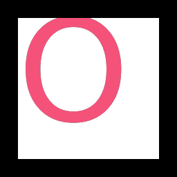

#+title: Slug: Bézier outlines in the pixel shader
#+startup: overview

* The 2026 release removes two different restrictions
:PROPERTIES:
:ID: VDGHWX
:END:

Slug is Eric Lengyel's method for evaluating quadratic outline curves directly
for each covered pixel.  It does not rasterize a glyph into a bitmap or a
signed-distance field first.  The original description is the 2017 JCGT paper
[[https://jcgt.org/published/0006/02/02/][“GPU-Centered Font Rendering Directly from Glyph Outlines”]].  The current
reference is the shader repository at commit
[[https://github.com/EricLengyel/Slug/tree/be3c13eb7d63f9e8aa5c583e42d92c374cb91d98][=be3c13eb7d63f9e8aa5c583e42d92c374cb91d98=]] (15 April 2026), not the
paper's sample code.

There are two separate freedom claims:

- In [[https://terathon.com/blog/decade-slug.html][“A Decade of Slug”]], Lengyel says that US patent 10,373,352 was
  irrevocably dedicated to the public domain by filing USPTO form SB/43 and
  paying its fee, effective 17 March 2026.
- The released [[https://github.com/EricLengyel/Slug/blob/be3c13eb7d63f9e8aa5c583e42d92c374cb91d98/LICENSE][shader source is dual-licensed]] under MIT or Apache-2.0.  Its
  [[https://github.com/EricLengyel/Slug/blob/be3c13eb7d63f9e8aa5c583e42d92c374cb91d98/NOTICE][NOTICE]] identifies Eric Lengyel as copyright holder, and the README requires
  credit in distributed software.

These are the patent owner's announcement and the repository's license terms,
not legal advice.  The Google Patents snapshot for
[[https://patents.google.com/patent/US10373352B1/en][US10373352B1]] still labels the patent “Active”, but that site also says its
legal-status field is an unverified assumption and shows no 2026 event.  It is
therefore a lagging aggregator, not evidence against the later dedication.

* A pixel asks the outline for its winding
:PROPERTIES:
:ID: 3T0JD9
:END:

For a quadratic curve with control points =p1=, =p2=, and =p3=, Slug writes

#+begin_example
C(t) = a t^2 - 2 b t + p1
a    = p1 - 2 p2 + p3
b    = p1 - p2
#+end_example

At a pixel, the control points are translated so that the pixel is the origin.
For a horizontal ray, the shader solves =C_y(t) = 0= and accumulates a signed
contribution from the x coordinate of each eligible intersection.  It repeats
the calculation with x and y exchanged for a vertical ray.  The magnitude of
the resulting winding quantity distinguishes the inside from the outside,
while the continuous intersection coordinate supplies antialiasing across the
boundary.

For one axis, the quadratic roots are

#+begin_example
t1 = (b - sqrt(max(b^2 - a p1, 0))) / a
t2 = (b + sqrt(max(b^2 - a p1, 0))) / a
#+end_example

where =a=, =b=, and =p1= above mean the selected scalar components.  The
current reference treats =abs(a) < 1/65536= as linear and uses
=t = p1 / (2 b)=.  Clamping the discriminant to zero keeps the square root
defined in finite-precision arithmetic.

* Root eligibility, not a floating-point range test, supplies robustness
:PROPERTIES:
:ID: S2F8SA
:END:

Testing whether a computed root lies in =[0,1]= is numerically unstable at
shared endpoints.  Slug instead classifies the signs of the three control
coordinates before calculating roots.  Let =s1=, =s2=, and =s3= be one only
when the corresponding coordinate is strictly positive; zero is non-positive.
The exact eligibility table from the paper is:

| s3 | s2 | s1 | root 2 | root 1 |
|----+----+----+--------+--------|
|  0 |  0 |  0 |      0 |      0 |
|  0 |  0 |  1 |      0 |      1 |
|  0 |  1 |  0 |      1 |      1 |
|  0 |  1 |  1 |      0 |      1 |
|  1 |  0 |  0 |      1 |      0 |
|  1 |  0 |  1 |      1 |      1 |
|  1 |  1 |  0 |      1 |      0 |
|  1 |  1 |  1 |      0 |      0 |

The reference shader extracts the two bits from the constant =0x2E74=.  Luv's
proof emits the same table as float arithmetic so that it needs no integer
bit operators.  In particular,

#+begin_example
e1 = s1 (1 - s2 s3) + (1 - s1) s2 (1 - s3)
e2 = s3 (1 - s1 s2) + (1 - s3) s2 (1 - s1)
#+end_example

The source-level =signum= operator lowers to GLSL.std.450 =FSign= for SPIR-V
and =sign= for MSL.  Its zero result preserves the table's strict inequality
at an on-curve endpoint.

* Coverage turns intersections into antialiasing
:PROPERTIES:
:ID: P9FDUS
:END:

If =r= is an intersection's coordinate along the ray in pixel units, its
coverage contribution is =saturate(r + 0.5)=, multiplied by its eligibility
bit and added or subtracted according to which root it is.  This gives a
one-pixel-wide linear transition without supersampling.

The current [[https://github.com/EricLengyel/Slug/blob/be3c13eb7d63f9e8aa5c583e42d92c374cb91d98/SlugPixelShader.hlsl][2026 pixel shader]] combines horizontal and vertical results
instead of trusting one ray direction:

#+begin_example
w(r)     = saturate(1 - 2 abs(r))
coverage = max(abs(xcov*xweight + ycov*yweight)
               / max(xweight + yweight, 1/65536),
               min(abs(xcov), abs(ycov)))
#+end_example

Each axis weight is the maximum =w= of its eligible intersections.  The
weighted term prefers the ray whose crossing is closest to the pixel centre;
the minimum term preserves coverage when both weights vanish.  The reference
then clamps for nonzero fill, or applies =abs(fmod(coverage + 1, 2) - 1)= for
even-odd fill.  An optional square root supplies optical-weight adjustment.

* Bands make exact curves affordable
:PROPERTIES:
:ID: 8FJF9U
:END:

The full algorithm does not test every outline curve at every pixel.  A glyph
is divided into equal-thickness horizontal and vertical bands, each pointing
to the subset of curves that could cross rays in that band.  Adjacent bands
may share an identical list or a contiguous subrange.

The current reference has two textures:

- an RGBA16F curve texture.  One texel stores =(x1,y1,x2,y2)= and the next
  texel's first two channels provide =p3=; connected curves reuse their shared
  endpoint;
- an RG16U band texture whose two channels identify curve-list data.  A glyph
  may have any number of bands, chosen to minimize the largest per-band list.

The reference fixes the texture row width at 4096 texels.  Curves in a
horizontal band are sorted by descending maximum x; vertical bands use
descending maximum y.  The pixel shader can therefore stop once that maximum,
in pixel units, is less than =-0.5=.  The README recommends a =1/1024= em
overlap between bands.  Horizontal straight lines must be omitted from
horizontal bands and vertical straight lines from vertical bands because a
ray parallel to such a line has no winding contribution.  A straight segment
from =p1= to =p2= is encoded as ={p1,p2,p2}=.

* The 2026 reference is not the 2017 sample
:PROPERTIES:
:ID: 45K8GR
:END:

The decade retrospective records several material changes:

- Slug still uses no precomputed or cached glyph images.
- A former subdivision of each band into left and right curve lists was
  removed, halving the band texture from four 16-bit channels to two.
- The original supersampling layer was removed after the analytic coverage
  calculation improved.
- Colour emoji are drawn as multiple ordinary outline layers, one solid
  colour per layer, and SVG gradient meshes are a separate path.
- The vertex shader now performs dynamic dilation so the rasterized primitive
  conservatively reaches every pixel whose centre can receive coverage.

The repository's shader comments and data contracts should therefore be the
implementation reference; the paper remains the clearest derivation and
historical measurement.  Its benchmark and storage numbers describe 2017
hardware and the older layout, not current performance promises.

* Dynamic dilation is a rasterization guarantee
:PROPERTIES:
:ID: J0H590
:END:

The [[https://github.com/EricLengyel/Slug/blob/be3c13eb7d63f9e8aa5c583e42d92c374cb91d98/SlugVertexShader.hlsl][reference vertex shader]] expands the quad by half a pixel in screen
space.  It transforms a per-vertex dilation normal through the inverse of the
local-to-device Jacobian, while the model-view-projection matrix and viewport
size determine the em-space size of that half pixel.  This is not decorative
boldening: without conservative geometry, rasterization can omit a pixel
whose centre lies just outside the undilated quad even though the analytic
filter would assign it nonzero coverage.

The full vertex record is five =float4= values carrying position plus dilation
normal, texture coordinate plus packed glyph location and maxima, inverse
Jacobian, band transform, and colour.  Band and glyph data are marked
non-interpolated; only the render coordinate is interpolated.

* DONE One fixed contour proves luv's pixel-stage mathematics
:PROPERTIES:
:ID: OWR8OZ
:END:

Intent: prove that luv's shader DSL can state, lower, compile, and actually
draw the numerically important pixel-stage core before designing texture and
font-data machinery.

Evidence:

- [[file:../hal/shader/slug.lisp][=slug-quadratic-outline=]] is now a typed shader function over the eight
  points of a connected four-curve contour.  It composes ordinary typed
  =slug-axis-contribution=, root-eligibility, and coverage functions with
  lexical =let*=; no Slug helper constructs or returns shader source forms.
  The calculation still implements the eight-class eligibility table,
  quadratic/linear roots, both ray directions, intersection weights, and the
  current coverage combination.  #RO74NL records the language distinction.
- The ordinary Lisp function =slug-root-eligibility= exposes the same table to
  focused tests.  All eight classes and the strict treatment of zero are
  checked.
- The DSL's open operator protocol now admits Common Lisp =signum= and lowers
  it directly to SPIR-V =FSign= and MSL =sign=.  Both generated shaders pass
  =spirv-val= and Apple's Metal 4 compiler.
- Refactoring from form-generating source abstraction to typed function calls
  leaves the actual 256 by 256 Metal readback byte-identical.
- [[file:../hal/metal/probes/slug-bezier.lisp][The cold Metal probe]] draws a two-triangle quad into a 256 by 256 RGBA8
  texture, reads the real GPU result back, and writes this image:

Done when (met): a fixed four-quadratic heart crosses the normal mathematical
shader path, both backend compilers accept it, root classification has an
executable table oracle, and a Metal pixel shader produces the expected
antialiased outline from Bézier data rather than a sampled image.

* The fixed proof delineates the first milestone
:PROPERTIES:
:ID: LB46YZ
:END:

The proof bakes four curves and =204.8= pixels per em into one shader.  It has
no curve or band textures, variable-length band loop, font parser, glyph
layout, dynamic dilation, fill-rule flag, or optical-weight flag.  The quad
already includes ample margin, so it does not test the reference vertex
dilation.  SPIR-V validation proves the portable module, while the executed
offscreen probe is presently Metal-specific because that backend already has
a no-resource mathematical-pipeline seam.

This boundary matters historically: that image proves the hard per-pixel
mathematics and the DSL capability, not Slug's data-scale performance or a
usable text API.  The later data-driven and font proofs below cross this
boundary without removing the small fixed oracle.

* Full Slug is a structured fold over indexed outline data
:PROPERTIES:
:ID: ZXTZ5J
:END:

The 2026 reference pixel shader makes the next language requirements concrete.
For each horizontal and vertical band it loads a curve count and list offset,
iterates the indexed curves, loads two curve texels, exits when the sorted
maximum coordinate cannot reach the pixel, conditionally accumulates the two
eligible roots, and carries coverage and weight forward.  The required source
vocabulary is therefore:

- signed and unsigned scalar/vector values, conversions, comparisons, and the
  small bit operations used by packed glyph metadata;
- exact indexed texture or buffer loads rather than filtered sampling;
- fragment derivatives for pixels-per-em and flat glyph metadata;
- a counted loop carrying several named values, conditional updates, and an
  early termination condition; and
- the existing floating-point quadratic and coverage functions.

This is not a reason to embed MSL statements or SPIR-V branches in the source
language.  The loop is a value-producing fold in #8RQOF0.  Its result is the
four-value coverage state; target lowering chooses mutable locals in MSL and
structured loop/header/continue/merge blocks with phi values in SPIR-V.

* McCLIM already exposes the TrueType contour boundary
:PROPERTIES:
:ID: 7IVPIE
:END:

McCLIM's native TrueType renderer is a useful source path even though luv will
not use its software rasterizer.  =mcclim-native-ttf.lisp= obtains a glyph with
=zpb-ttf:find-glyph= and walks it with =do-contours= and
=do-contour-segments=.  Each visit supplies start point, optional quadratic
control point, and end point; consecutive off-curve TrueType points have already
acquired their implicit on-curve midpoint.  McCLIM then turns those segments
into =cl-vectors= paths and sweeps them into an alpha bitmap.  Luv can branch at
the earlier segment boundary and pack the exact quadratic outline instead.

TrueType =glyf= contours therefore need no curve fitting.  Lines use the Slug
encoding ={p1,p2,p2}=.  Cubic outlines, such as CFF/CFF2 or arbitrary vector
paths, are a preprocessing concern: subdivide and approximate them with
quadratics under an explicit font-unit error bound.  Current HarfBuzz GPU code
uses exactly this shape, adapting FontTools =cu2qu= with a default half-font-unit
tolerance before its Slug encoder.  HarfBuzz 14's experimental
=libharfbuzz-gpu= is consequently a valuable format and pixel oracle, but the
first luv path can remain Lisp-native through =zpb-ttf=.

* DONE Teach the shared language Slug's structured band fold
:PROPERTIES:
:ID: HMNMBU
:END:

Intent: add the smallest shared control-flow and indexed-data vocabulary that
states one Slug band traversal without burying its concrete data contract in a
generic scene abstraction.

Evidence needed: after shared function application #YZS04W, add represented
integer/index values, exact loads, comparison and conditional expressions, and
a counted value-producing loop with early termination.  Execute a CPU
realization over a small curve array, lower the same body to valid MSL and
SPIR-V structured control flow, and keep the current fixed shader as the pixel
oracle.

The neutral loop skeleton is now present: =counted-fold= accepts a runtime
count and one carried scalar or vector state, executes as =dotimes= on the CPU,
as an ordinary =for= loop in direct Metal, and as validated structured SPIR-V
with phi-carried index and state.  Its update is an expression body rather than
an artificially single call: a leading =let*= produces per-iteration lexical
bindings in the common AST, an inner Lisp =let*=, loop-local SSA values, and
named locals inside the emitted Metal loop.

Conditional accumulation is shared too.  =if= is a first-class value node
in the common expression graph, with checked scalar comparisons =<=, =<==,
=>=, =>==, and ===.  Lisp retains ordinary branch semantics; SPIR-V emits the
ordered comparison plus =OpSelect=; and direct Metal emits a ternary inside the
same =for= loop.  A bounded triangular fold executes on the CPU and compiles
from the same shape on both GPU targets.

The shader representation layer now supplies =uint= and =uvec2/3/4= values plus
an exact =texel-load= extension.  A count loaded from a =uint-texture-2d=
selects an unsigned fold index automatically; address addition, unsigned
division and the common =mod= operation stay typed throughout.  The same probe
emits =OpImageFetch=, =OpULessThan=, =OpUDiv=, =OpUMod=, =OpIAdd=, and
=OpConvertUToF= in SPIR-V, while Metal emits =texture2d<uint>.read(uint2)= and a
=for (uint ...)= loop with readable address locals.  Both =spirv-val= and the
Metal 4 compiler accept those generated products.  =mod= itself belongs to the
shared arithmetic vocabulary and executes through Common Lisp's ordinary
=mod=; the texture resource and exact load remain properly shader-specific.

[[file:../hal/shader/slug.lisp][=slug-banded-fragment-specification=]] now supplies the Slug-shaped traversal.
Two runtime unsigned curve counts control two =counted-fold= values.  Each
iteration reads its RG16U curve location and two adjacent RGBA16F curve texels,
creates ordinary lexical =let*= bindings for the reusable axis-contribution
function, and carries coverage plus maximum weight.  There is no host unrolling
and no form-generating Slug macro.

This exercised one subtle language rule that the scalar loop probes did not:
function-local bindings called from a fold belong to that iteration.  Direct
MSL lowering now materializes them inside the =for= body, while SPIR-V only
reuses a cached resource load in the basic block that owns it.  The latter rule
prevents a value defined inside one loop from being reused in another loop
where it does not dominate.  Regression tests inspect both generated products;
=spirv-val= and Apple's Metal 4 compiler accept them.

The first correctness shader intentionally uses one complete band per axis.
Sorted-coordinate early exit and multiple spatial bands are culling
optimizations over this same value-producing traversal, not prerequisites for
rendering an arbitrary outline.

Done when: a runtime curve count rather than source unrolling controls the
number of evaluated quadratics; CPU and GPU results agree at edge,
shared-endpoint, empty-band, and early-exit cases; and source/lowering tools
retain the loop, carried values, and emitted block provenance.

* DONE Pack arbitrary quadratic contours into Slug bands
:PROPERTIES:
:ID: TTE5JG
:END:

Intent: turn arbitrary connected quadratic contours into dense curve and band
data suitable for the shared Slug fold.

Evidence needed: a Lisp outline model preserving contour boundaries and
orientation, line-to-quadratic encoding, conservative band overlap, omission of
parallel straight lines, per-axis descending sort, and visible band-length
statistics.  Exercise an outer contour plus an inner contour before involving a
font loader.

The CPU-owned model and the first preprocessing boundary are now concrete.
=slug-outline= keeps closed contours, validates every curve junction, computes
quadratic contour orientation from the exact area integral, and flattens curves
in contour order.  Lines use ={p1,p2,p2}=.  =pack-slug-outline= builds
horizontal and vertical bands with the reference 1/1024 conservative overlap,
omits curves parallel to the relevant ray, and retains both descending-maximum
and ascending-minimum orders.  Tests exercise a counterclockwise outer square
with a clockwise inner hole and reject a disconnected contour.

The serialization boundary now preserves the released shader's exact texture
contract.  Luv first rounds every point through binary16, decodes those actual
shader-visible values, and only then recomputes bounds, bands, and sort keys.
The 4096-wide RGBA16F curve texture stores one ={p1,p2}= texel per quadratic;
the following texel supplies the shared =p3=, with one endpoint sentinel after
each contour.  The 4096-wide RG16U band texture stores all horizontal headers,
then all vertical headers, followed by their descending-maximum
=(curve-texture-x, curve-texture-y)= lists.  Tests deliberately use a one-third
coordinate to prove that packing observes the half-quantized value rather than
the original Lisp rational.

The portable GPU vocabulary now names the exact storage formats too:
=:rg16-uint= is four bytes per texel and =:rgba16-float= is eight.  The Metal
backend maps those names to =MTLPixelFormatRG16Uint= 63 and
=MTLPixelFormatRGBA16Float= 115; Vulkan maps them to
=VK_FORMAT_R16G16_UINT= 81 and =VK_FORMAT_R16G16B16A16_SFLOAT= 97.  Both upload
paths accept the serializer's two-dimensional specialized arrays directly and
compute row length, byte size, alignment, and foreign element width from the
format instead of assuming RGBA8.

The first serializer still describes one glyph beginning at texture origin
zero.  Atlas allocation and relocation remain open, but the complete one-glyph
data is now uploaded and rendered from those resources while preserving the
fixed-width addressing assumed by the released pixel shader.

Done when: several differently sized and holed quadratic outlines render from
uploaded data without changing shader source, and a CPU winding oracle agrees
with GPU pixels around extrema, shared endpoints, and contour holes.

* HarfBuzz places a run; Slug draws indexed outlines
:PROPERTIES:
:ID: 4G7064
:END:

Text shaping and outline rendering meet at a deliberately narrow seam.
[[lisp:shape-slug-text]] gives HarfBuzz the UTF-8 run and font bytes, then
returns dense records containing glyph IDs, byte clusters, advances, and
offsets in font units.  It does not ask HarfBuzz to rasterize.  The Slug side
uses each glyph ID with =zpb-ttf:index-glyph=, normalizes that outline to em
units, and places its quad from the corresponding HarfBuzz record.

The first run proof keeps resource ownership literal rather than anticipating
an atlas.  One shared vertex buffer contains six vertices per drawable glyph;
each slice carries clip position, outline coordinate, and pixels per em.  Each
glyph temporarily owns its own serialized band texture, curve texture, views,
and bind group.  The render pass switches bind groups and uses =first-vertex=
to draw each six-vertex slice.  This is intentionally expensive but makes
glyph selection, placement, outline data, and draw ownership visible before a
packing or caching policy hides them.

DejaVu Sans shapes =office affinity= into 11 glyphs rather than 14 drawable
characters: each =ffi= sequence becomes one ligature glyph.  The regression
test checks the =office= clusters =(0 1 4 5)=, proving that the three UTF-8
characters beginning at cluster 1 became one selected glyph.  The cold Metal
probe then renders the complete shaped run through the same public Slug vertex
and band-fragment specifications used by the earlier “O” proof:

The image also forced a useful correction that the symmetric “O” could not
show: target Y had been inverted.  Visual inspection of letters with ascenders
and descenders caught it, and the fitted text vertices now map font-up to
image-up.  Its blue background is also a composition check: the Slug fragment
emits premultiplied color and coverage, and the render target explicitly uses
=one= / =one-minus-source-alpha= blending instead of relying on the black
background that concealed transparent quad pixels in the first proof.
HarfBuzz 13.2.1 is part of the owned Nix runtime rather than an ambient host
dependency.

* DONE Shape and draw a HarfBuzz text run through Slug
:PROPERTIES:
:ID: DTBI99
:END:

Intent: join HarfBuzz shaping to the proven =zpb-ttf= outline boundary and
render a run as placed Slug glyph quads without a software rasterizer.

Evidence: #4G7064 records the owned HarfBuzz binding, =ffi= ligature and
cluster regression, glyph-ID-to-outline join, one-quad-per-glyph Metal draw,
and visually inspected =office affinity= image.  The complete luvcraft suite
passes with the per-vertex pixels-per-em shader input.

The font boundary is now working before any rasterizer.  The shader module in
=:luv= depends directly on =zpb-ttf= and converts its resolved
=(start,control,end)= segments into luv contours; a nil control becomes the
standard Slug line quadratic.  A =slug-glyph= also retains advance width, left
side bearing, and units per em, and the converter accepts an already selected
zpb glyph so a later HarfBuzz glyph index need not be turned back into a
character.  The reproducible test font is =cl-dejavu='s DejaVu Sans: its “O”
produces two opposite-winding contours, 16 quadratics, a 1612-unit advance, and
packs through the same arbitrary-outline path.  No =cl-vectors=, =cl-aa=, or
McCLIM raster object enters this system.

The Metal mark now crosses the complete boundary.  =normalize-slug-glyph-outline=
converts the font-unit points to em units while preserving the TrueType origin.
[[file:../hal/metal/probes/slug-glyph.lisp][The cold glyph probe]] loads DejaVu Sans “O”, serializes its 16 quadratics and
two contours, uploads its exact band and curve arrays, binds the two texture
views, draws the em-square quad through the public mathematical shader
specifications, reads back the GPU target, and writes this image:

Changing the outline changes only the uploaded arrays.  The fragment shader
contains no “O” points, contour count, or source-unrolled curve calls.  The
generated SPIR-V has two structured loops and at least six exact image fetches;
the generated MSL has two unsigned =for= loops with the reusable Slug
function's lexical locals scoped inside them.

Done when: HarfBuzz-selected glyph IDs and placements render as a legible run
through indexed Slug outlines, including a ligature that cannot be reproduced
by one cmap lookup per character.

* NEXT Compare Slug coverage at glyph edges
:PROPERTIES:
:ID: 9G0Z19
:END:

Intent: distinguish “a shaped run renders” from evidence that Slug's edge
coverage and geometry expansion are correct across backends.

Evidence needed: exercise the portable draw on Vulkan, compare boundary pixels
with a small CPU winding oracle, and test dynamic dilation on geometry whose
undilated quad actually loses edge coverage.  Atlas allocation and outline
reuse are separate performance work and should follow measurement.

Done when: representative extrema, shared endpoints, holes, and clipped edges
agree with the oracle on Metal and Vulkan, and dilation demonstrably recovers
coverage rather than merely enlarging an already sufficient quad.
