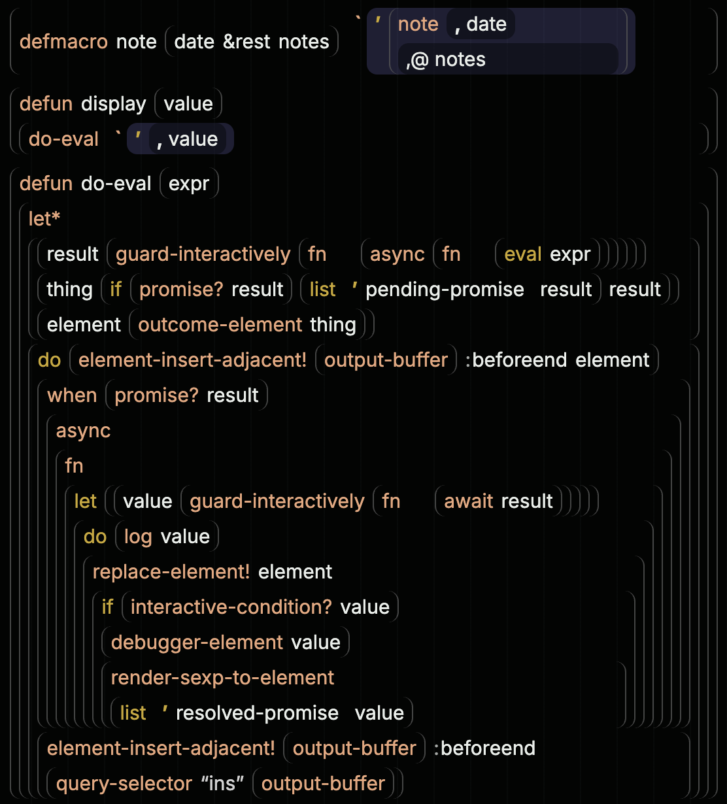

#+title: The wiki as a static site
#+startup: overview

* What this page is
:PROPERTIES:
:ID: BNH91U
:END:

The wiki is a set of Org files, and Org is pleasant to write in Emacs but
awkward to read anywhere else.  This page records how the wiki becomes a
browsable static site, why the build is expressed in ASDF, and what the
Org-subset reader deliberately does and does not understand.  It is a
design page for =luv-wiki=, the Lisp system in [[file:../wiki-org.lisp][wiki-org.lisp]],
[[file:../wiki-html.lisp][wiki-html.lisp]], and [[file:../wiki-asdf.lisp][wiki-asdf.lisp]], and for the corpus system
=luv/wiki= in [[file:../luv.asd][luv.asd]] whose components are the pages themselves.

The rendered site lives at [[https://mbrock.github.io/luv/][mbrock.github.io/luv]] once the Pages
workflow in [[file:../.github/workflows/wiki.yml][wiki.yml]] has run; locally, =make wiki= writes it to
=build/wiki/=.  Besides the pages it carries a figure index and, per
#58SVCM, the whole source of the luv systems as browsable dexp pages.

* Why ASDF, and how the wiki slots into it
:PROPERTIES:
:ID: RYHRUL
:END:

ASDF describes itself as a tool that "plays a role like make or ant" for Lisp
systems, and it warns that it is not a general installer.  Underneath, though,
its model is not Lisp-specific: a *component* has input files, an *operation*
applied to a component has output files, =perform= does the work, and the plan
is a dependency graph over (operation, component) actions with timestamps.
The manual invites extension by subclassing =operation= and =component= and
defining =perform=, =input-files=, =output-files=, and =component-depends-on=
methods.  cffi-toolchain uses exactly this to compile =.c= files: a =c-file=
component whose =compile-op= outputs an object file.

The wiki fits the same shape, and more naturally than a fresh script would:

- An =org-file= is a component of the =luv/wiki= system.  Its =load-op= reads
  the page into a =document= object and remembers it on the component, so
  "loading the wiki" means having the corpus in the image as inspectable Lisp
  objects, which is where the figure vocabulary of #F2N8VX wants to go
  anyway.  =org-file= inherits from =static-file=, so the ordinary =compile-op=
  is a no-op and dependency propagation works unchanged.
- =render-op= is a downward, selfward operation: rendering the system renders
  each page; rendering a page first loads it and, because =#ABC123= mentions and
  backlinks cross pages, also depends on the load of the whole system.  Every
  page's =input-files= are all the pages, so any edit re-renders the site;
  ASDF's timestamps make an unchanged corpus a no-op.
- The site is a build product, not a fasl.  =output-files= returns its
  second value true, which ASDF documents as "do not translate," so pages land
  in =build/wiki/= rather than the compiled-file cache.  A =static-file= such as
  an image is copied by the same operation; the stylesheet is compiled from
  Lisp definitions (#UODI74) by the system's own render.
- =:build-operation "luv.wiki:render-op"= makes =(asdf:make :luv/wiki)= build
  the site, matching how =luvcraft= is built.

Two ASDF details are worth remembering.  =defsystem-depends-on= cannot name a
system defined in the same =.asd= file (ASDF reports a circular =define-op=),
so the tooling is the primary system =luv-wiki= in its own file, and =luv.asd=
loads that file first.  Class names in a defsystem can be given as strings
such as ="luv.wiki:org-file"=, which ASDF reads in its own package; that avoids
interning anything into ASDF's package, which the manual asks extensions not to
do.

* The Org subset the reader understands
:PROPERTIES:
:ID: NS35X9
:END:

The reader is not a general Org parser.  It reads the subset the wiki actually
uses, chosen by surveying the pages: =#+title=, headings with property drawers,
paragraphs, bulleted and numbered lists with wrapped and blank-separated
items, =example= and =src= blocks, simple tables with an optional header rule,
TeX math as =$x^2$= or =\(...\)= inline and =\[...\]= or =$$...$$= on
display (drawn by KaTeX, loaded only when a page has math), Mermaid
diagrams in =#+begin_src mermaid= blocks (likewise), bracket links with
=file:=, =https:=, =id:=, =lisp:= or no scheme, a bare
=file:= link to an image in the wiki directory as an inline image (a
paragraph of only that link becomes a figure, and a paragraph of only a
=lisp:= link becomes the definition it names), the light =#ABC123= mention,
and the six emphasis markers with Org's pre- and post-character rules.  Anything else stays paragraph text, so an unfamiliar construct can
never fail the build; it can only render plainly.

Emphasis rules follow Org: a marker opens only after whitespace or an opening
bracket and closes only before whitespace or punctuation, so =2 * 3=,
=foo_bar=, and =../src/= are text.  Verbatim and code keep their contents raw.
Emphasis may cross one line break but not a blank line.  Headings whose title
starts with one of the work-mark words of #W3K9MK carry that word as a
=keyword= and render with a status badge.

The element model is CLOS: =document=, =heading=, =paragraph=, =plain-list=,
=list-item=, =example-block=, =src-block=, and =table= at the block level;
=emphasis=, =link=, and =mention= inline, with plain strings for text.
=render-html= is a generic function over those classes, so a new element is
one class and one method.  =reference-id= is the small protocol that lets both
mentions and =id:= links count as references when the site indexes backlinks.

The reader was written rather than borrowed.  deepfire's cl-org-mode (2018,
built on parser-combinators) parses headline, drawer, and block structure but
leaves section bodies as text and has no inline layer, links, lists, or HTML
output, so it would have supplied perhaps a hundred lines and cost two
dependencies and a second parser for the inside of sections.  Its layered
raw-AST/dressed-object design is a good precedent for the shape used here.

* Spinneret as the HTML layer
:PROPERTIES:
:ID: VRKEYI
:END:

Spinneret's =with-html= compiles keyword forms to tags and passes the value of
every other body form to its exported generic =spinneret:html=.  Three
consequences shaped the renderer:

- =ecase= inside =with-html= is misread, because its clause heads look like
  tags; a small kind-to-tag table with =:tag :name= is used instead.
- The pretty printer fills text and buffers a space after each write, so a
  dynamically written ="figure"= came out as ="figure "= inside its =<b>=;
  output is written with =*print-pretty*= off and
  =*suppress-inserted-spaces*= on, and rendering methods return no values so
  Spinneret has nothing to space.
- A bare string at the top of =with-html= is returned, not printed, so text
  is written explicitly with =spinneret:html=.

Mentions carry their target with them: each page embeds a small card per
figure it mentions (title, page, status, opening prose) and per definition
it links (kind, name, lambda list, file and line, docstring), and a few
lines of script in =site.js= show the card as a top-layer =popover= beside
the link on hover, focus, or a first tap, placed below the link or above it
when the viewport is short.  The same script loads KaTeX and Mermaid from
a CDN only for pages that carry math or diagrams.  The site stays static
and the links stay plain links.

Each page is one HTML file: a header linking to the index and the page's Org
source on GitHub, an =<h1>= from =#+title=, and a =<section>= per heading whose
=id= is the figure ID, so =page.html#ABC123= is the figure's stable address.
Mentions become links with the target's title as a tooltip; dangling ones are
struck through.  Each figure that is mentioned elsewhere ends with a
"Mentioned in" line, the disposable backlink index that #F2N8VX anticipates.
A =figures.html= page lists every figure by page with its work-mark status.

* DONE Render the wiki as a static site from ASDF
:PROPERTIES:
:ID: QH1ONS
:END:

Intent: make the wiki browsable outside Emacs without a second source of
truth, and express the build as an ASDF operation so it composes with the
rest of the project.

Evidence: =(asdf:make :luv/wiki)= renders all pages, =figures.html=, and the
stylesheet into =build/wiki/=; a second =make wiki= rewrites nothing and
touching a page re-renders.  The corpus loads with no dangling mentions.
=luv-wiki/tests= covers the reader, the site index, the rendered HTML, and the
=render-op= output placement.

Done when: the six tests pass and the site builds from a fresh SBCL.
Publishing is the next mark.

* The wiki from a shell: scripts/wiki
:PROPERTIES:
:ID: GB4FT0
:END:

Agents and people who want the table of contents, the work marks, one
figure's text, or the places a figure is mentioned should not need Emacs
or a browser.  =scripts/wiki= is a small executable built with ASDF's
=program-op= (system =luv-wiki/cli=, entry point =luv.wiki.cli:main=,
=build/wiki-cli=), rebuilt by its wrapper when the tooling changed and run
inside the Nix shell.  It reads the same objects the site renders — pages
through the Org reader, code through the Eclector index — so what it prints
agrees with the site.  Commands: =toc=, =marks=, =figure=, =page=,
=mentions=, =defs=, =dangling=, =ids=, =build=; =help= lists them.

Two details of the executable are worth recording.  The Nix =sbcl= wrapper
supplies =CL_SOURCE_REGISTRY= and =ASDF_OUTPUT_TRANSLATIONS= to SBCL
processes only, so a dumped image would look for compiled files in the
wrong place; =build-wiki.lisp= captures that environment before the dump
and =main= re-establishes it.  And =luv.asd= now loads =luv-wiki.asd= only
when the system is not already registered, so re-reading =luv.asd= inside
the executable does not redefine the system it is running from.

* DONE Serve the site from GitHub Pages
:PROPERTIES:
:ID: SIWPDS
:END:

Intent: publish =build/wiki/= at [[https://mbrock.github.io/luv/][mbrock.github.io/luv]] on every push
that touches the wiki or its tooling.

Evidence: [[file:../.github/workflows/wiki.yml][wiki.yml]] installs Nix, restores the closure with hestia
(chunked GitHub Actions cache; about a minute warm, replacing the
sunsetting magic-nix-cache), runs =make wiki=, and deploys with the Pages
actions.  Pages had to be enabled once by hand with
=gh api -X POST repos/mbrock/luv/pages -f build_type=workflow=; the
workflow token cannot create the site.  The index and source pages are
reachable at the public URL.

Done when: the workflow has succeeded once and the index page is reachable
at the public URL.  Both hold.

* A fluid dual system: code contributes to the wiki
:PROPERTIES:
:ID: F6B3NI
:END:

The wiki does not want to become Lisp forms; Org in Emacs is the better
writing surface, and the reader already gives the corpus to Lisp as objects.
The interesting direction is the reverse flow: the code contributing to the
discourse where that is more natural than prose, with less text and more
references and examples.  Two facts make that cheap.

Figure IDs are already valid, readable symbol names, and index.org anticipated
a =WIKI= package of them (#F2N8VX).  And code already mentions figures: the
=interpret-quantity-specification= docstring in [[file:../arithmetic.lisp][arithmetic.lisp]] cites
#PLRP3A and the tests in
[[file:../tests/arithmetic.lisp][tests/arithmetic.lisp]] cite #LNRY72 as the table they check.  Nothing yet
sees those mentions.  Three rungs, cheapest first:

- *The site sees code.*  =render-op= asks ASDF for the =cl-source-file=
  components of the luv systems (pathnames only, no loading), scans them for
  =#ID= mentions, and each figure gains a "Referenced from" line beside
  "Mentioned in", linking to the source line on GitHub.  Backlinks then span
  discourse and code, which is the point of string figures.
- *A WIKI package.*  =load-op= interns and exports each figure ID into =WIKI=
  and hangs the heading off the symbol as documentation or a property.  The
  figure index becomes the package: apropos, completion, and CLIM =accept=
  work on figures.  A no-op macro =(wiki:ref LNRY72)= is macroexpanded, so
  =who-macroexpands= finds every code reference, and it can note
  =(sb-c:source-location)= at compile time into the same table the scanner
  fills, with plain text as the fallback so the site never depends on the
  whole system compiling.  A symbol should mean only an identity; the heading
  is resolved late through the index, never stored in code.
- *The reverse direction.*  Wiki prose naming a Lisp symbol could resolve to a
  definition location when the system is loaded, which is what a McCLIM
  browser does natively with a symbol presentation and an Edit Definition
  translator.  Do it there first.

The 2021 "chronicle" experiment, dummy macros over dated =todo=, =hmm=,
=done= entries so xref finds notes embedded in source, is the same shape as
work marks with the status words renamed; what it adds is the reminder that
symbols in a package are the identity mechanism and that macroexpansion is
free cross-referencing.

* The model a McCLIM browser wants
:PROPERTIES:
:ID: AGTIO4
:END:

The loaded documents on the =org-file= components are already the browser's
data source.  What the element model still lacks is small and each piece is
motivated by a browser affordance:

- =figure= and =work-mark= as classes decided at read time, so presentation
  types map onto classes one to one and each needs one =present= method.
- Parent links and source line ranges on elements, for "which figure am I
  in", an Edit Figure command that jumps Emacs to the Org line, and HTML
  source links that point at the line.
- Mentions stay IDs, not object pointers; the site or index resolves them.
- A second renderer, not a second traversal: when a CLIM presenter exists,
  =render-html= should become =(render backend element)= dispatching on the
  relationship, with =html= and =clim= backends over one model.  Two
  consumers justify that; one does not.

The live loop is then: edit Org in Emacs, =(asdf:load-system :luv/wiki)=
re-reads only the changed page, the browser redisplays.  Mentions become
presentations that jump on click and offer backlinks on right-click; the
shader lab's presentation types could accept a figure to attach it to a
definition.

* Code views: a dexp renderer for Common Lisp
:PROPERTIES:
:ID: N06GKK
:END:

Source links that leave the page for GitHub are a poor reading experience,
especially on a phone.  The wiki should show code in place, and the way it
should show it comes from wisp's structure editor, whose "dexp" renderer draws
Lisp as nested boxes rather than text with indentation:

The mechanism is small and, since flexbox does the work, responsive for
free.  Every cons is a =div.list= with =display: flex; flex-wrap: wrap= and a
small column gap; atoms are inline spans.  Forms flow horizontally while they
fit and wrap when they do not, so there is no line-breaking logic anywhere.
The parentheses are the box's own left and right borders with rounded
corners, so a wrapped list becomes a bracket around a paragraph of code, and
depth is visible as nesting rather than indentation.  Structure is carried in
attributes, =data-callee= on the list and =data-package= and
=data-symbol-name= on symbols, and CSS does the rest: body forms of =defun= or
=let= take full width so they stack; quote, backquote, and unquote hide their
symbol and paint ='=, =`=, and =,= with =::before=; keywords get their colon
the same way; the current package's prefix is hidden; the head of a list is
coloured by =:first-child= with no separate classification pass.  Ordinary
prose text and code then share one flowing layout, which is what a wiki
wants.

Two things change in the Common Lisp version.  Dexp renders sexp data, so
comments and original formatting are gone; the wiki shows source
definitions and needs a reader that keeps them, see #SKNK2N.  And dexp keeps
per-operator layout in CSS selectors that cannot see method qualifiers or
lambda-list keywords; the wiki renderer should assign roles in Lisp, using
the same table the parinfer checker already keeps in [[file:../parinfer.lisp][parinfer.lisp]]
(=*binding-form-heads*=, =*clause-form-heads*=, =child-role=), and emit
=class="head"= or =class="body"= so the stylesheet needs only
=.list > .body { width: 100% }=.  Everything else transfers verbatim: side
borders as parentheses, quote glyphs, keyword colons, home-package hiding,
head colouring, and =;= comments as full-width children.

The same renderer serves three places: the "Referenced from" backlinks of
#PF39II, where a figure's code references expand in place; a =lisp:= link
protocol, =[[lisp:luv.arithmetic:interpret-quantity-specification]]=, that
resolves against a definition index and shows the definition; and the wiki's
own =#+begin_src lisp= blocks, which are read and drawn structurally with
the =<pre>= as fallback whenever reading fails.  A paragraph consisting only
of a =lisp:= link becomes the definition itself, drawn from luv's source at
build time:

[[lisp:luv.arithmetic:interpret-quantity-specification]]

Inside a definition, =#ID= mentions in strings and comments are links to
their figures, so the loop closes: the docstring above points back at
#PLRP3A, and that figure lists this definition under "Referenced from
code".

* Layouts are objects chosen by operator and role
:PROPERTIES:
:ID: BGIM3I
:END:

The first renderer assigned layout with a table of head counts and a
growing set of role strings and special cases; =let= bindings drawn as a
two-column grid, =loop= keywords starting rows, and lambda lists whose
sublists are =(var default)= clauses made that untenable.  The design that
replaced it follows clos-design: a =layout= is an object, and a list is
drawn by the layout that its *operator* and the *role its parent gave it*
select together (dispatch on the relationship, not on one participant).

- =list-layout (list role)= chooses: a child the parent called
  =bindings= gets a =grid-layout= whatever its first element; =lambda-list=
  gets a =lambda-list-layout=; =clause= or =stacked-clause= their clause
  layouts; otherwise the operator's own layout from a small table
  (=define-layout=), with =with-=/=define-=/=def= naming conventions as the
  default and =flow-layout= last.
- =child-role (layout list index child)= answers the role of each argument
  (comments are drawn where they occur and never counted): =body-layout=
  stacks after a head count, =bindings-layout= marks the binding list,
  =variables-layout= (=multiple-value-bind=) marks a variable list,
  =spec-layout= (=dolist=, =with-open-file=) marks one clause,
  =lambda-layout= and =method-layout= find the lambda list, =clauses-layout=
  (=cond=, =case=, =handler-case=, =defstruct=) makes body forms stacked
  clauses, =grid-layout= makes children clauses, =loop-layout= gives loop
  keywords =row-start=.
- =render-layout (layout list)= draws: the general routine with roles, or a
  clause's name and =.rest= cell so a grid can align columns.

Hand-written layouts are only hints for the standard forms whose lambda
lists say too little (=let=, =cond=, =defmethod=, =loop=).  For everything
else, luv's own macros above all, the layout is *derived from the real
lambda list*, the way SLY's =slynk-indentation= derives indentation from
macro arglists: =scripts/wiki introspect= loads the systems, resolves every
operator symbol the corpus uses against its file's =in-package=, records
its kind and =sb-introspect:function-lambda-list=, and writes
[[file:arglists.sexp][arglists.sexp]], one readable form per operator, keyed by home package
(2151 operators today).  From such a lambda list a =derived-layout= knows
that what precedes =&body= is the head, that a destructuring pattern in a
position makes that argument a clause (=with-block-content-storage
((domain palette indices) chunk &body body)=), that =&key= marks where
pairs begin, and, from SBCL's own parameter names, that =BINDINGS=,
=DEFINITIONS=, or =SLOT-SPECS= mean a binding grid and =LAMBDA-LIST= or
=VARS= a lambda list.  The file is committed, so the site renders without
loading luv, and it is among =render-op='s inputs; run the pass again after
adding or changing macros.

Two rules apply across layouts.  A trailing run of =:keyword value=
arguments is drawn pair by pair in a =.pair= container that never breaks
between key and value; where the pairs are body forms, as in the options
of a definer, each pair is a row with the keys aligned, so =define-unit=
and =define-quantity= read as small tables.  And an operator known only by
its =def= prefix is inspected rather than assumed: a list in second
position makes it a lambda form, anything else a name followed by options.

The stylesheet knows only roles: a list with body forms is =.stacked=, a
grid of rows with the head in a =.head= span (#993QQQ); =.bindings= is a
CSS grid, its =.clause= children subgrids spanning two columns; a
=.clauses= form is a two-column table of =.stacked-clause= rows
(#4175NC); =.rest= a cell, =.pair= an inline unit, =.break= a zero-height
row break before a =row-start=.  The rules live beside the layouts, as
style definitions (#UODI74).  Adding a form's layout is one
=define-layout= line or one class with two methods, and nothing else
changes.

* DONE Boxes hug their widest row
:PROPERTIES:
:ID: 993QQQ
:END:

/Intent./ In the rendered source pages a nested body form stretches to
its parent's full width (=.body= is =flex-basis: 100%=), and worse, a
wrapping flex box's intrinsic width is the /single-line/ sum of its
children, so even an argument box like a multi-line =(lambda …)= comes
out far wider than its tallest row.  Closing parentheses pile up at the
right margin, far from what they close.  This costs more readability than
any operator-specific layout, and it needs no operator knowledge to fix.

/Evidence./ Injecting CSS into the built =shader-expression.lisp= page:
when a list with body forms becomes a grid of rows (a =.head= flex row
holding the operator and head arguments, then one row per body form)
with =width: fit-content; max-width: 100%=, every box hugs its widest row
and the page reads like a pretty-printer's output — =(unless operands
(error …))= is exactly as wide as its =error= row.  Row gaps and baseline
alignment survive unchanged.

/Done./ The drawing routine now works in two passes: =layout-items=
groups a list's children into items (a comment, a child with its role,
or a keyword pair), and =render-children-with-roles= draws them; when
any item is a body form the list is =stacked=, its head items in a
=.head= span and every body item a row (a comment just before the first
body form is a row too).  The =stacked= style group draws it as a
one-column grid with =width: fit-content=.  On the shader-expression
and streaming pages every box hugs its widest row at every depth;
=(unless operands (error …))= is as wide as its =error= row, a
=(lambda …)= argument as wide as its longest body row, and top-level
definitions still start at the left margin.  What remains of the
flex-wrap intrinsic-width problem is inside flow boxes: a function call
holding a stacked argument, like =(every (lambda …) types)= as a =cond=
test, is still sized as if its children stood on one line, so the
argument after the lambda floats right of a gap; that wants the call
layout of #ACX8LK.

* DONE Clauses as tables: cond, case, typecase, handler-case
:PROPERTIES:
:ID: 4175NC
:END:

/Intent./ A =cond= clause today stacks its test and its result as two
identical rows, so =(null vectors)= and =(find-shader-type :float)= look
like siblings and the reader cannot tell test from consequent.  What the
=let= grid did for bindings (#BGIM3I) should be done for clauses: a
two-column table, key or test in the first column, result in the second,
aligned across all clauses of the form.

/Evidence./ The same page with a two-column subgrid on =clauses-layout=
bodies: =(null vectors) → (find-shader-type :float)=, =(every …) → (first
vectors)=, =t → (error …)= line up, and a clause with several body forms
stacks them in the second column.  A tall test keeps the result on its
first baseline.  Nothing operator-specific is needed beyond what
=clauses-layout= already marks, and every luv macro whose lambda list
says =&body clauses= or =cases= gets it through the derived layout.

/Done./ =clauses-layout= carries a =clause-head-count=, 1 for =cond=,
=case=, =typecase= and their variants, 2 for =handler-case= and
=restart-case=; each clause is drawn by a =stacked-clause-layout= with
that head count (and, for the two-element key, the lambda list marked as
one) as a =.head= cell and a =.rest= cell of stacked body forms.  The
=clauses= style group makes the form a two-column grid, =fit-content(50%)=
for the keys and the remainder for the bodies, each clause a subgrid
row.  On the source pages =cond= reads as test → result with the results
aligned, =handler-case= as =error () → "<unprintable>"=, and =defstruct=,
which already used the clauses layout, became a slot table with names in
one column and defaults and options in the other for free.  Tests cover
a =cond= with a multi-form clause and a =handler-case=.  Alongside, the
=data-callee= attribute is now decided by =layout-callee-p=, a generic
with methods on the clause, grid, and lambda-list layouts, which also
stopped lambda lists from claiming their first parameter as a callee.

* DONE The stylesheet as Lisp definitions
:PROPERTIES:
:ID: UODI74
:END:

/Intent./ =wiki/style.css= is 850 lines of hand-written CSS that the
renderer's roles must agree with by convention.  luv already compiles
several small languages from S-expressions (#C6E3LA the shader language, #SQC5JN
the arithmetic language, MSL); the stylesheet should be one more: rules
written as Lisp definitions in the wiki system, compiled to CSS at build
time, so a layout class and its rules can live side by side, be
re-evaluated in the running image, and be read by the same tools as the
rest of the site.

/Evidence./ The CSS in use needs only a small vocabulary: selectors with
nesting and =&=, properties with keyword, string, number, and list
values, =var()= and a handful of functions (=clamp=, =minmax=, =repeat=,
=color-mix=), one =@media= query for dark mode and one for narrow
screens.  A compiler for that is a page of Lisp.

/Done./ [[file:../wiki-css.lisp][wiki-css.lisp]] is the compiler, the package =luv.css=, in three
parts.  A reader syntax, =luv.css:syntax= (a named readtable that makes
the digits and the hyphen read a token), reads CSS quantities and
references as objects: =0.85rem= and =94%= are =dimension= instances,
=0.72rem/1= a =slash=, =--ink= a =variable-reference=; no number-and-unit
symbols are interned.  A syntax tree of CLOS instances -- =style=,
=rule=, =at-rule=, =declaration=, =selector-list= of =complex-selector=
strings, and the value classes -- is built by the =rule= and
=define-style= macros, whose bodies alternate =:property= keywords with
values: bare symbols are CSS words (=grid=, =solid=), strings are written
verbatim, and lists are Lisp, so =(clamp 1rem 4vw 3rem)= calls the CSS
function and =(gutter)= or =(palette :dark)= call the sheet's own
helpers, whose values, declarations, or rules join the enclosing rule
(=add-item= dispatches on what a form returned).  Nested rules combine
with the parent, =&= standing for it, groups as lists of strings crossed
with groups -- nothing is ever split on a comma -- and =(:media "query"
…)= is an at-rule, hoisted around what it wraps.  =write-css= is the text
backend, a generic over the tree, so another backend can walk the same
objects.  [[file:../wiki-style.lisp][wiki-style.lisp]], package =luv.wiki.style=, holds the sheet:
the palette is a table of light and dark values that =(palette scheme)=
turns into declarations, the mark and definition-kind colours are loops,
and the layout rows the dexp boxes share (=flowing-row=, =stacked-rows=,
=subgrid-row=) are functions returning declarations.  The generated
=style.css= was diffed against the previous one: identical apart from
the =--fg=/=--bg= aliases and one repeated font stack, both removed, and
groups with equal declarations merged.

* TODO Pairs, loop tables, and layouts from arglists alone
:PROPERTIES:
:ID: ACX8LK
:END:

/Intent./ Smaller layout wins in the order they pay: keyword pairs on
rows aligned by a subgrid instead of a guessed =min-width= for the key;
=loop= as a keyword table, each clause a row of keyword and rest as
Emacs indents it; and function calls whose arguments wrap continuing
under the first argument, which would also size a call holding a
stacked argument by its rows rather than by one imagined line.  Done
already: =setf=, =setq=, =psetf=, =psetq= draw as a place/value table
when they have more than one pair (=pairs-layout=; a single pair stays
inline), and symbol names no longer break at hyphens.

Underneath, fold =derived-layout= into constructors of the existing
layout classes so that a table entry and an introspected lambda list
produce the same objects — =(bindings &body body)= a =bindings-layout=,
=(keyform &body cases)= a =clauses-layout= — and every refinement above
applies to both; extend the parameter-name heuristics with =PLACE=,
=KEYFORM=, =TEST-FORM=, =SPECIALIZED-LAMBDA-LIST=, =OPTIONS=; then trim
the hand table to true overrides.  Alongside, the renderer's remaining
=typecase= and =typep= on layout classes (=lambda-list-of=,
=docstring-position-p=, =layout-pairs-index=, the =data-callee= test)
become generics with methods on the layouts, and =child-role= answers a
placement and a child layout rather than a space-separated role string
that =role-p= parses back, per =clos-design=.

/Done when./ Each item lands as its own small commit with the source
pages checked in the browser; the layout table is shorter than today;
=luv-wiki/tests= pass.

* Reading source without loading it: Eclector
:PROPERTIES:
:ID: SKNK2N
:END:

The site is built by =luv-wiki=, which does not and should not load luv
itself; the Vulkan and SDL systems have no business in a documentation
build.  So definitions must be read from files without interning their
symbols or evaluating anything.  Eclector is the ally here: a portable Common
Lisp reader whose client protocol lets =interpret-symbol= return a token
(package prefix, name, and whether the package is the file's current one)
instead of interning, whose parse-result protocol yields source ranges for
every object, and which reports skipped input, comments and =#+= branches
included, as results too.  It reads =#'=, =#p=, =#(=, =,@=, and reader
conditionals correctly, which a hand-rolled tokenizer would not; parinfer's
tokenizer is deliberately a repair heuristic and stays that.

Reading with Eclector gives a *definition index* beside the figure index:
for every =cl-source-file= in the registered luv systems' component trees,
each top-level form with its kind, name, qualifiers or specializers, file,
line range, comment text, and the =#ID= mentions inside it.  Figures ask it
who references them; =lisp:= links ask it where a name is defined; the
McCLIM browser can present it directly.  Reader conditionals and =#.=
are rendered as visible tokens, never evaluated.

Platform availability belongs to ASDF's =:if-feature= metadata, not to a
=#+darwin= conditional around the =defsystem= form.  ASDF therefore registers
the Objective-C and Metal systems and constructs their component trees on
Linux, while their compile and load actions remain invalid there.  The wiki
deliberately walks those complete trees rather than ASDF's active
=sub-components=, so a Linux documentation build renders the Darwin sources
without loading them.  Individual files such as the Cocoa canvas helper use
the same component-level =:if-feature= convention.

* Dexp on McCLIM
:PROPERTIES:
:ID: CEON0R
:END:

The token tree from #SKNK2N is a model, like the Org elements, and can be
drawn by more than one backend.  In McCLIM the natural rendering is the
same idea in a different medium: a list is an output record with a rounded
border, its children laid out by =formatting-item-list= or a small flow
layout, symbols are presentations of a =lisp-symbol= type with translators
to Edit Definition and to the wiki figures that mention them.  Since McCLIM
is meant to become a significant part of the 3D world's own interface, a
dexp view of live definitions inside luvcraft is not far-fetched.  As with
the wiki browser, the HTML backend should come first and the CLIM one should
drive the =(render backend element)= refactor of #AGTIO4.

* Browsing the whole source from the wiki
:PROPERTIES:
:ID: 58SVCM
:END:

Once every source file is read into nodes, showing all of it is one more
render.  Each file of the =luv=, =luvcraft=, and =luv-wiki= systems (the
wiki reads itself, so how it renders is on the site too) becomes a page
under =source/=, drawn entirely as dexp boxes: a table of its definitions on
top, every top-level form anchored by its starting line (=#L956=), the
file's =in-package= hiding that package's prefix, comment blocks kept as one
box each.  [[source.html][source.html]] lists the files by system; on a wide screen a source
page keeps a sidebar of the systems and their files on the left, the
current file's system open, and the status bar reads as a breadcrumb trail
(=Source › system › file=; on wiki pages =Pages › title=).  The reference graph runs
both ways through these pages: any symbol that names a definition anywhere
in the corpus links to that definition (a defining form is preferred over a
method), "Referenced from" summaries and =lisp:= links point at the local
page with GitHub as a secondary =↗=, and =#ID= mentions in docstrings and
comments point back at the wiki.  Source pages use a wider column than
prose, and since dexp needs no monospace alignment the boxes are set in the
system sans-serif.

Docstrings, =:documentation= strings, any multi-line string, and comment
blocks are not code and are not drawn as code: their content goes through
the same reader as wiki prose and comes out as paragraphs and lists set in
the prose face inside the box, with =#ID= mentions and =verbatim= markup
live.  One rule differs from Org: in code prose =*name*= without spaces is a
special variable and reads as code, not bold.

This is the reading surface for keeping up with the codebase: the pages
are regenerated by =render-op= whenever a source file changes, since the
files are among its inputs.

* DONE Browse the source as dexp pages
:PROPERTIES:
:ID: 2KK966
:END:

Intent: make the whole codebase readable from the rendered wiki, per
#58SVCM, so that following a figure into code and code back into figures
never leaves the site.

Evidence: [[file:../wiki-source.lisp][wiki-source.lisp]] adds =source-file= objects (path, system, text,
nodes, definitions), =render-source-page=, and =render-source-index=;
=render-op= on the system lists =source.html= and one page per file among
its =output-files=.  =find-named-definition= backs symbol links; the mesher
page alone carries a few hundred.  Adjacent comment lines are merged into
one node, and clause lists (=let= bindings, =defclass= slots, lambda lists,
=cond= clauses) do not colour their first element as an operator.

Done when: every source file has a page reachable from the site header,
definitions are anchored and linked from symbols, and code references open
locally rather than on GitHub.  All hold.

* DONE The site shows code references to figures
:PROPERTIES:
:ID: PF39II
:END:

Intent: the first rung of #F6B3NI.  Build the definition index of #SKNK2N
during =render-op= on the system and render a "Referenced from" line per
figure naming the definitions that mention it, each expandable in place to
the definition drawn by the dexp renderer of #N06GKK, with the GitHub line
link as the secondary action, so #PLRP3A and #LNRY72 pay off.

Evidence: =render-op= on the system reads the =cl-source-file= components
of every registered =luv= and =luvcraft= system (67 files, about 2500
definitions, under a second) and every page's =input-files= include them, so
a source edit re-renders the site.  #PLRP3A now shows
=interpret-quantity-specification= and #LNRY72 shows the
=define-quantity :light-level= form that follows its section comment, each
as a =
= whose summary is kind, name, and =file:line= source link and
whose body is the definition as dexp boxes; the =#ID= in the docstring links
back.  =[[lisp:name]]= links resolve against the same index.  Dangling code
mentions are warned about like dangling wiki mentions and are covered by a
test; luv-wiki's own sources are excluded because their docstrings use
placeholder IDs.

Done when: those two figures show their referencing definitions inline on
the site, the index and renderer are covered by tests, and a dangling code
mention is reported like a dangling wiki mention.  All three hold.

* DONE Read luv sources with Eclector into a definition index
:PROPERTIES:
:ID: YFDCSB
:END:

Intent: the reader of #SKNK2N as part of =luv-wiki=: an Eclector client that
produces a token tree with source ranges and comments without interning, and
a definition index over the =cl-source-file= components ASDF lists.

Evidence: [[file:../wiki-lisp.lisp][wiki-lisp.lisp]].  =source-reader= subclasses Eclector's
=parse-result-client=; =interpret-symbol= returns a token with the package
prefix as written, quote-like macros and =#.= return marker lists that
=make-expression-result= turns into =lisp-prefix= nodes, feature expressions
are evaluated by name against =*features*= with the skipped branch kept as a
=lisp-conditional= from its source text, and comments arrive through
=make-skipped-input-result= as =lisp-comment= nodes, inside forms as well as
between them.  Every luv source file reads without error; the index names
=interpret-quantity-specification= at =arithmetic.lisp:956= with its
=#PLRP3A= mention, and no package or symbol is created (the tests check).

Done when: every luv source file reads without error, the index names
=interpret-quantity-specification= with its line range and its #PLRP3A
mention, and a reader conditional appears as a token rather than a choice.
All hold; the last is a =lisp-conditional= node with sign, feature, and form.

* DONE The dexp HTML renderer
:PROPERTIES:
:ID: Z50KYF
:END:

Intent: render a token tree from #YFDCSB as dexp boxes per #N06GKK, with
roles assigned in Lisp and painted by the wiki stylesheet, and use it for
=#+begin_src lisp= blocks first, since the wiki already has those.

Evidence: [[file:../wiki-dexp.lisp][wiki-dexp.lisp]] and the =.lisp= rules in [[file:style.css][style.css]].  A list is
a flex-wrapping =div.list= with side borders; roles come from the layout
objects of #BGIM3I and are emitted as =operator=, =body=, =bindings=,
=lambda-list=, =clause=, and =row-start= classes, comments not counting as
arguments.  The
stylesheet does =.body { flex-basis: 100% }= and paints operators, keywords,
strings, numbers, comments, and prefixes.  All =lisp= source blocks in the
wiki now render structurally, readable at phone width; input that reads to
nothing falls back to =<pre>=.  The screenshot above is not yet reproduced
from luv's code, but the same shapes are visible in the definitions the
figures now show; a luv-flavoured version can replace it later.

Done when: the source blocks of the wiki render structurally and readably on
a phone-width viewport, fall back to =<pre>= on read failure, and the
screenshot above can be reproduced from luv's own code.  The first two hold;
the third is left as a nice-to-have.

* TODO A wiki browser frame in mcluv
:PROPERTIES:
:ID: NPZWLR
:END:

Intent: a McCLIM application frame over the loaded =luv/wiki= documents, with
figure and mention presentations, page navigation, and backlinks; the
exercise that tells us what the model in #AGTIO4 is missing.

Evidence: none yet; the shader lab in [[file:../mcclim/shader-lab.lisp][shader-lab.lisp]] shows the
presentation-type pattern to follow.

Done when: every wiki page can be read in the frame, clicking a mention jumps
to its figure, and re-loading =luv/wiki= after an Org edit redisplays.

* WAIT A WIKI package of figure symbols
:PROPERTIES:
:ID: MAE5RT
:END:

Intent: the second rung of #F6B3NI: intern figure IDs as external symbols of
a =WIKI= package at =load-op=, attach the heading, and offer =wiki:ref= for
xref-visible references from code.

Evidence: waits on #NPZWLR, which should show what accepting or invoking a
figure symbol ought to do before the notation is fixed.

Done when: ='wiki:LNRY72= names a figure at the REPL, =(wiki:ref LNRY72)= is
found by xref, and the site's "Referenced from" line uses the compile-time
table when available.

* IDEA Structural associations through the MOP
:PROPERTIES:
:ID: D0NQ54
:END:

Beyond textual mentions, a metaclass mixin or class option could make the
association between a class or generic function and its wiki figures
structural: =(defclass ... (:metaclass documented-class) (:figures LNRY72))=
or a =wiki:figures= slot on a metaobject, so the browser and the site can ask
an object which figures explain it and a figure which definitions realize
it.  clos-design's rule applies: use the MOP only when the definition itself
carries the meaning.  Vague on purpose until the package and browser exist.

* IDEA Source-anchored file links
:PROPERTIES:
:ID: MJQDRA
:END:

Org =file:= links with a =::(defun name= search string presently point at the
file on GitHub without the search.  A later render step could resolve the
search to a line number at build time, since the source is in the same tree.
