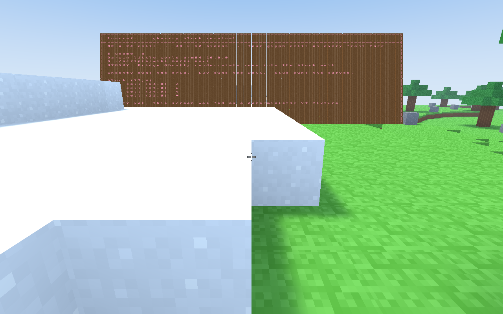

#+title: A terminal in the little world
#+startup: overview

* A terminal is a world-native interactive surface
:PROPERTIES:
:ID: NMAD2U
:END:

The luv terminal should be an object in the little world, not a conventional
terminal window captured into a texture.  Its rectangular cell grid has a
position, orientation, depth relationship, and input surface in the scene.
Ghostty supplies terminal semantics; luv's Slug path supplies glyph outlines;
the ordinary scene pass supplies projection, depth, composition, and eventual
lighting policy.

This is a stronger version of the existing McCLIM gadget experiment.  The
gadget proves that a live interactive surface can share luvcraft's canvas and
GPU device, occupy a perspective-projected quadrilateral, and receive pointer
events translated back through that quadrilateral.  It still paints a CPU
raster mirror and samples the resulting texture.  The terminal should retain
the placement and event lesson while replacing the raster mirror with native
cell, decoration, and Slug glyph draws.

The result is not merely sharper terminal text.  A world-native renderer can
reuse scene depth, animate or transform the surface without rerasterizing a
bitmap, update only changed rows, and keep text as inspectable terminal cells
until draw data is built.  The shaped world-text proof #QW7P96 and its
per-device outline cache #U5X6DY show that the necessary outline path already
participates in a real frame.

* The McCLIM gadget leaves a useful interaction seam
:PROPERTIES:
:ID: 0U22KN
:END:

[[lisp:open-luvcraft-widget-lab]] constructs an embedded McCLIM frame against
the world session's existing canvas, context, and device.
[[lisp:encode-luvcraft-overlay]] lets that object contribute draws to the open
scene pass, while [[lisp:handle-luvcraft-overlay-event]] lets the frontmost
overlay consume an input event.  The gadget implementation also performs the
perspective-correct inverse mapping from a canvas pointer coordinate to a
coordinate on its world plane.

Those are semantic boundaries worth keeping open.  A terminal surface can be
another overlay implementation with its own placement, focus, input, and
release methods.  The terminal's rows, cells, glyph instances, and generated
vertices should remain dense data inside that object rather than acquiring
individual CLOS identity.  One dispatch per overlay or frame is useful; one
dispatch per terminal cell would put the extensibility boundary in the hot
loop.

The first terminal need not inherit from a McCLIM mirror or frame.  Reusing the
world-overlay relationship is the architectural result; sharing the CPU raster
machinery would preserve precisely the indirection this experiment is meant to
remove.

The terminal took that advice and the McCLIM instruments built after it did
not, which is now visible rather than theoretical: #AX9ZTA describes the
raster path they share, and #I3G0S7 measures what it costs their type.

* Modal focus is a player relationship
:PROPERTIES:
:ID: 8JCMA5
:END:

Luvcraft owns one optional modal focus independently of its overlay list.  A
focused object receives canvas events while ordinary walking, looking, block
editing, jumping, and material selection are suspended.  Entering or leaving
focus clears held player input and releases relative-pointer capture, so a
movement key cannot remain stuck across the boundary.

=Tab= is the temporary world interaction verb.  With no modal focus it chooses
the best overlay under the centre view: terminal displays recognize a ray hit
on any block in their authored rectangle, while McCLIM surfaces recognize the
crosshair inside their projected quadrilateral.  A terminal-material ray hit
without an existing display activates that authored face, starts its Bash PTY,
and focuses the resulting display.  Once focused, ordinary =Tab= belongs to
the terminal for shell completion; =Shift-Tab= leaves modal focus.  Focus
captures the player's view, then eases the camera toward a pose supplied by
the focused object.  A terminal supplies its complete authored rectangle: the
camera moves square to that plane at a distance which contains every corner
inside a six-percent picture margin.  Screen overlays independently report
obscured edge insets, so the McCLIM hotbar is excluded from the usable viewport
without making terminal code depend on McCLIM.  Leaving focus eases back to the
captured aim and the player's current eye position.  Focus also narrows the
lens from 70 to 50 degrees and hides the world crosshair.

This is the same player-facing transition whether the object is a McCLIM
surface, a Ghostty terminal, an open book, or a mounted boat.  Those objects do
not need a common UI superclass.  They implement focus-entered, focus-left,
focused-event, and optionally focus-camera-pose methods according to their own
semantics; other protocols can separately govern rendering, simulation,
camera attachment, viewport insets, or vehicle motion.  Removing a focused
overlay or stopping the session leaves focus before releasing its resources.

Evidence: the terminal projection test checks all four surface corners against
the safe rectangle at a representative hotbar inset, then checks complete pose
restoration.  In the live 1920 by 1280 Metal game, focus entered both from the
saved player view and from a deliberately close, low aim at the wall's left
edge; both approaches converged to the same uncropped head-on composition with
114 pixels reserved for the hotbar.

There is deliberately no universal Escape binding in this layer.  Escape and
Tab are both meaningful terminal input.  The provisional shared world
interaction uses =Tab= only to enter and =Shift-Tab= to leave; a future named
gameplay action can replace those raw bindings while continuing to call
[[lisp:toggle-luvcraft-session-focus]].

* Ghostty owns terminal semantics, not the surrounding application
:PROPERTIES:
:ID: OAFDXL
:END:

The =luv/ghostty= spike pins Ghostty revision
=26df373ec83fb1cebb4fee0a8394144ae984a9b8= and creates, feeds, formats, and
releases a =GhosttyTerminal=.  The next layer should continue to treat
libghostty-vt as a semantic engine rather than an application framework.

| Owner | State and responsibility |
|-------+--------------------------|
| world terminal | placement, focus, lifecycle, and participation in luvcraft's overlay protocols |
| PTY owner | child process, master descriptor, readiness, writes, exit, and shutdown |
| =GhosttyTerminal= | VT parser, primary and alternate screens, scrollback, modes, cursor, selection, and protocol effects |
| =GhosttyRenderState= | renderer-owned visible snapshot, colors, cursor presentation, and dirty rows |
| Slug terminal renderer | device glyph cache, dense row geometry, decorations, pipelines, and draw encoding |

This split follows libghostty-vt's own C surface.  Its
[[https://github.com/ghostty-org/ghostty/blob/26df373ec83fb1cebb4fee0a8394144ae984a9b8/include/ghostty/vt/terminal.h][terminal API]]
accepts VT bytes and exposes effects, but does not create a PTY, event loop, or
render thread.  Its
[[https://github.com/ghostty-org/ghostty/blob/26df373ec83fb1cebb4fee0a8394144ae984a9b8/include/ghostty/vt/render.h][render-state API]]
copies the visible state needed by a custom renderer.  Ghostty labels the C API
work in progress, so the Nix revision pin is also the binding's ABI boundary;
updating it should be an intentional tested change.

* PTY traffic has one serialized owner
:PROPERTIES:
:ID: K3KFGZ
:END:

libghostty-vt does not pull bytes from a process.  Luv creates a PTY, starts a
child, reads the master descriptor when ready, and passes each byte slice to
=ghostty_terminal_vt_write=.  Feeding bytes mutates the terminal immediately.
It does not emit a damage callback; the host merely requests a later render
update and lets the render state say whether anything visible changed.

#+begin_src mermaid
flowchart LR
  P[PTY master readable] --> R[owner reads bytes]
  R --> V[Ghostty VT write]
  V --> E[synchronous effects]
  V --> F[request a frame]
  E --> Q[copy replies into PTY write queue]
  K[key, mouse, paste, focus] --> I[Ghostty input encoders]
  I --> Q
  Q --> P
  F --> S[update render state]
  S --> D[draw dirty rows with Slug]
#+end_src

Effects such as bell, title changes, clipboard requests, and terminal-generated
query responses are synchronous callbacks made inside the VT write.  The
=WRITE_PTY= effect is therefore a route back to the PTY, not the incoming data
path.  A callback must copy borrowed bytes and enqueue them quickly; it must not
recursively feed the same terminal or block the PTY reader.

Keyboard and mouse encoders read the terminal's current modes before producing
bytes for the PTY.  Resizing similarly crosses both sides: resize Ghostty with
the new cell and pixel dimensions, and apply =TIOCSWINSZ= to the PTY.  A first
implementation can serialize all of this in one owner thread.  If PTY reading
later moves to a worker, every access to the mutable terminal still needs one
explicit lock or owner queue.

* Render state is the frame boundary
:PROPERTIES:
:ID: XNMV61
:END:

=GhosttyRenderState= is the retained renderer-facing object that the formatter
spike deliberately avoided.  Updating it from the terminal yields a global
dirty state of clean, partial, or full.  A partial update exposes dirty rows in
viewport order; a full update makes every row effective damage.  Each row then
offers reusable cell iteration, a bulk raw-cell view, wrapping and selection
information.  Each cell exposes its grapheme, style, resolved colors, wide-cell
role, semantic content, and selection state.

This is row damage rather than an arbitrary pixel rectangle.  That fits a
terminal renderer well: regenerate the dense instances for each dirty row and
leave other row ranges untouched.  Cursor and palette changes live in the
same snapshot and can promote the frame to full damage when necessary.  After
a complete successful draw, luv calls =ghostty_render_state_clean=; updating
does not implicitly acknowledge the damage.

The two-phase update is the thread boundary if one becomes necessary.  Under
the terminal lock, =ghostty_render_state_begin_update= copies what it needs.
After unlocking, =ghostty_render_state_end_update= completes work using only
render-state-owned memory.  The renderer can then traverse a stable snapshot
while PTY input continues.  Borrowed rows and cells remain valid until the next
render-state update, not indefinitely.

* Viewport cells form a finite domain
:PROPERTIES:
:ID: RD8AEI
:END:

The visible terminal grid is a small, honest client of luv's finite-domain
vocabulary.  A =terminal-grid-domain= can own the current column and row counts,
answer =domain-cardinality= with their product, map =(x,y)= to a row-major
offset, and map an offset back to a cell coordinate.  Row-major order is not
just convenient storage: Ghostty reports damage and traversal by viewport row,
so one damaged row is one contiguous domain slice.

Domain identity must mean more than equal cardinality, as #B8R3KF requires.
An 80 by 24 grid is not the same domain as a 96 by 20 grid even though both
contain 1920 cells.  Resizing creates a new domain and a new exact
materialization rather than mutating the meaning underneath existing arrays.
The world surface's placement and cell extent remain properties of the owning
terminal surface; they do not change which discrete cell a domain offset names.

This first domain is deliberately only the visible viewport.  Primary screen,
alternate screen, and scrollback identity remain Ghostty's concern.  A history
domain should appear only when a real search, selection, or scrollback renderer
needs one; exposing every terminal concept as a domain in advance would be a
framework exercise rather than a client-led design.

Conversely, PTY bytes are an ordered stream, not a domain; synchronous effects
are protocol events, not fields; and a dirty-row report is a transient choice
of domain slices to republish, not another persistent bundle.  The domain
vocabulary earns its place specifically where many visible cells share one
indexing and materialization contract.

* Cell presentation is a derived materialization
:PROPERTIES:
:ID: AI83XS
:END:

The renderer needs data that survives the borrowed =GhosttyRenderState= cell
iterators, but it does not need a second implementation of terminal semantics.
A fixed columnar materialization over #RD8AEI should therefore retain only the
normalized cell presentation consumed by later shaping and drawing.  Ghostty
remains authoritative; this is a checked cache with an explicit source
revision, in the sense of #V6T1QS and #A6X2RT.

A tentative physical row is:

#+begin_src lisp
(records:define-columnar-materialization terminal-cell-presentation
  (grapheme-start 0 :type (unsigned-byte 32))
  (grapheme-count 0 :type (unsigned-byte 32))
  (style-index 0 :type (unsigned-byte 16))
  (flags 0 :type (unsigned-byte 16))
  (semantic-content 0 :type (unsigned-byte 8)))
#+end_src

A =terminal-presentation= product owns this fixed materialization plus one
replaceable packed UTF-8 arena and normalized-style table per viewport row.
The lanes contain row-local byte offsets, counts, and indices into those side
tables, not per-cell strings or style objects.  Row-local side tables match
Ghostty's damage unit and let one update replace variable-length graphemes
without an ever-growing global arena or compaction of unrelated rows.  =flags=
can retain such closed facts as text presence, narrow/wide/spacer role, and
selection.  Foreground, background, underline, inverse, and decoration policy
belongs in the style table until a concrete projection chooses packed GPU
values.  Fields should be added only when a renderer or interaction client
actually consumes them.

For a dirty row, the bridge reads Ghostty's borrowed cells into temporary row
storage, builds candidate grapheme and style side tables, copies every lane
into the row's contiguous domain slice, and publishes the side tables and that
row's source revision last.  Errors before publication leave the previously
complete row visible rather than a mixture of old and new lanes.  Full damage
visits every row; partial damage visits only the reported rows; a clean update
changes no materialization.  Calling =ghostty_render_state_clean= acknowledges
the source damage only after the complete candidate has been accepted.

* Draw populations are narrow columnar projections
:PROPERTIES:
:ID: BIXI1P
:END:

The fixed cell materialization is still not a GPU draw list.  One cell can emit
no glyph, one glyph, or several glyphs for a grapheme; backgrounds may merge
into spans; underlines and the cursor are different geometry with different
lifetimes.  Following #Y0TPND, membership policy should remain separate from
the physical lane layouts.  The first renderer can derive several small
dynamic columnar buffers:

- a glyph-instance population containing cell position, glyph-resource key,
  placement, color, and Slug parameters;
- a rectangle population for backgrounds and selection spans; and
- a decoration population for underlines, strikes, overlines, and cursor.

Each population has the changing ordinal domain =[0,length)=.  Its definition
fixes specialized lanes; reset and append policy decides membership; one closed
projection kernel borrows the raw columns and packs the existing GPU instance
or vertex ABI.  Device glyph resources remain owned by the Slug cache and are
named by compact keys inside the population rather than CLOS objects per glyph.
This is the aggregate-dispatch seam in #J7A2KD: select the terminal renderer
once, then traverse arrays.

The current generated dynamic buffer supports reset and append but not
arbitrary replacement of a middle range.  The first terminal should not invent
a private row allocator to conceal that fact.  On any published damage it can
rebuild these compact populations from the fixed visible-cell materialization;
on a clean frame it does nothing.  Typical terminal grids are small enough for
that to be a useful baseline.  If measurement shows that row-local rebuilds
matter, the compaction and range vocabulary developed by #34G2K8 can inform a
shared solution rather than terminal-specific skewed lengths and forwarding
tables.

* DONE The derived 2 by 2 block wall exposed the wrong abstraction
:PROPERTIES:
:ID: SX12U7
:END:

Intent: test the literal grid correspondence as aggressively as possible.
Every derived display block carried a =2 x 2= tile of terminal cells, so an
=80 x 24= viewport became a =40 x 12= wall without losing character
resolution.

The mapping is exact and intentionally dull.  Cell =(column,row)= belongs to
block =(floor(column/2),floor(row/2))= and quadrant
=(mod(column,2),mod(row,2))=.  Odd viewport dimensions round the derived block
extent upward; empty edge quadrants remain empty.  Resize replaces the
authoritative cell domain and derives a new block extent.  It never changes
Ghostty's cell coordinates to accommodate the scene.

Evidence: the exercised =terminal-grid-domain= owns an exact row-major
=80 x 24= fixture viewport.  Its block projector derives =40 x 12= complete
shallow cubes, or =17,280= ordinary block vertices, and emits one Slug instance
for every drawable fixture character.  The cubes use luvcraft's ordinary block
pipeline and scene uniforms; the glyphs use the existing Slug atlas and live
Slug pipeline in a second instanced draw.  Since both draws occupy world space
and the Slug pass retains depth testing, terrain can correctly pass in front of
the wall without either renderer knowing about the other.

The fixture bytes were fed through an actual owned Ghostty terminal.  The
proof copied Ghostty's plain formatter output into the dense viewport.  That
copy proved ownership, placement, geometry, resource release, and the 2-by-2
projection; it did not claim styled cells, grapheme width/spacer roles, cursor
state, or damage tracking.

This is the ordinary visible Metal session after opening the overlay through
SLY.  Snow and terrain occlude the lower wall through the shared depth buffer;
the terminal is neither composited afterward nor pasted into a texture:

The result is useful negative evidence.  The reduced =0.32=-unit derived
bodies and their gaps do not belong to the authored voxel lattice, while a
literal one-world-unit body per tile makes the display absurdly large.  The
screenshot is therefore historical proof of an exhausted design, not visual
evidence for the current terminal.  #7ZM22R keeps the successful Ghostty and
Slug crossings but replaces the derived mini-block wall with real adjacent
world blocks and one fitted surface-wide terminal grid.

Done: the experiment made the scale and seam failure visible from an ordinary
player view, and established that the glyph pass can share scene projection
and depth.  Its block/quadrant mapping is deliberately not retained as the
terminal architecture.

* Adjacent terminal-material blocks define one unified display surface
:PROPERTIES:
:ID: 7ZM22R
:END:

The current implementation begins with ordinary authored voxel blocks of the
dedicated terminal material.  When exposed faces of those blocks form a
maximal coplanar rectangular component, that rectangle has one derived
=terminal-surface= identity.  Its native chunk meshes remain the solid display
body: the terminal overlay contributes only a Slug glyph population fitted
across the whole rectangle.  Consequently adjacent block faces meet exactly
as ordinary terrain faces do.  There are no derived bodies, inset cells, or
decorative gaps to make the terminal foreign to the world.

The font grid is independent of block count.  An =80 x 24= viewport can fit
across an =8 x 5= block rectangle because the surface computes one physical
width and height, applies a margin, and selects the limiting font scale.  No
voxel owns ten columns, four rows, or any other permanent cell subdivision.
The block rectangle gives the magic television its world identity; Ghostty's
viewport gives its changing screen content a separate finite domain.

Verified now:

- the terminal material is an authored, placeable block kind with its own
  graphite atlas tile and provisional surface emission;
- exact row-major viewport indexing and whole-surface fitting have executable
  tests;
- adjacency discovery accepts exposed rectangular components and rejects a
  rectangle after one constituent block is removed;
- the deterministic fixture crosses an owned Ghostty terminal before its
  characters become fitted Slug instances; and
- dependency stamps delay invalidation until the native owner chunk meshes are
  current, so old block geometry and old glyphs remain one last-known-good
  visible cohort rather than tearing across a publication boundary.

The present adjacency finder is intentionally a correctness scaffold, not the
hot maintenance architecture.  It builds coordinate lists and a hash table
while discovering a surface and rescans its boundary after relevant authored
chunk revisions.  Opening a display and reconciling a changed dependency are
cold enough for this proof; doing equivalent allocation or graph discovery per
frame would be unacceptable.  The frontier vocabulary in #K3PCP3, the compact
work representation in #RR9ODK, and the publication discipline in #QHBZJZ are
the route toward one reusable materialized adjacency system shared with light,
liquids, fire, redstone-like networks, and later terminal-surface maintenance.

Visual acceptance remains open.  The old screenshot above does not prove this
new geometry looks good.  A fresh visible luvcraft session should place a
moderately sized rectangle, open the overlay, and inspect it from oblique and
frontal angles at near, ordinary play, and long distances.  The evidence gate
is continuous real block geometry, stable depth and orientation, legible
surface-wide fitting, and no flicker or stale-glyph cohort while editing an
edge block.

* The terminal grid remains authoritative through Slug
:PROPERTIES:
:ID: I9U71F
:END:

Ghostty supplies grapheme clusters and cell occupancy, but not shaped glyphs.
Luv must join those cells to the HarfBuzz and Slug boundary in #4G7064 without
allowing proportional shaping to reflow the terminal.  Cell coordinates and
narrow, wide, or spacer roles remain authoritative.  A wide spacer tail emits
no glyph; backgrounds and decorations use cell-aligned geometry; a grapheme's
outline is placed at its declared cell origin and clipped or scaled according
to an explicit terminal font policy.

The simplest correct first representation is dense data per dirty row:

- the fixed cell presentation in #AI83XS, updated by contiguous row slice;
- glyph instances keyed by font, glyph ID, style, cell origin, and terminal
  advance;
- cell background, selection, underline, strike, overline, and cursor
  geometry; and
- narrow draw populations whose first policy may rebuild the visible grid as
  one batch.

The existing per-device Slug outline cache #U5X6DY is the natural resource
owner.  The atlas and instancing pass #AT7L3S has replaced the former
one-texture-pair and one-draw-per-glyph proof, while #D4R1VX selects spatial
bands and derives coverage scale in the fragment.  A terminal will now make
the next limits visible: atlas pages shared across overlapping glyph sets,
pipeline reuse across rows, font fallback, row/run aggregation, and measured
edge quality.  Those are renderer iterations, not reasons to obscure the
initial Ghostty-to-row boundary.

* NEXT Bridge styled Ghostty render-state rows into the block wall
:PROPERTIES:
:ID: NTQ5KY
:END:

Intent: replace the formatter fixture bridge in #7ZM22R with world-native
render-state rows, while keeping process and input concerns out of the first
crossing.  The unified surface-wide fit and native-body/Slug-overlay split
remain projections of the resulting cell materialization.

Evidence: the current binding already owns a terminal and feeds arbitrary VT
bytes; the Nix environment owns the exact shared library.  Ghostty's pinned
render API supplies dirty-row and cell iteration.  The world overlay seam
#0U22KN and the working Slug world-text path #QW7P96 already supply placement,
depth-tested drawing, shaping, and device outline ownership.  The finite domain
#RD8AEI, fixed presentation #AI83XS, and compact projections #BIXI1P give the
crossing a concrete luv-shaped representation without making cells objects.

The live Bash iteration establishes a deliberately coarser baseline without
claiming this mark complete.  PTY output marks its display dirty; the frame
owner borrows Ghostty under the PTY lock, formats one complete plain-text
snapshot, builds a complete dense instance candidate, and atomically replaces
the old GPU instance buffer.  Ordinary printable ASCII shares one stable Slug
atlas, output bursts coalesce at the frame boundary, an empty screen emits no
draw, and backend destruction carries replaced buffers past their last
submission.  Styling, backgrounds, cursor state, true dirty rows, and resize
still require the render-state crossing named by this mark.

Done when: a fixed styled VT fixture produces visible Slug-rendered rows on the
block wall, including cell backgrounds and cursor; Ghostty cells populate
an exact domain-bound columnar materialization; a second unchanged render-state
update performs no materialization or draw-population rebuild; changing one row
publishes only that materialization slice even if the first compact draw policy
rebuilds the small visible batch; resize replaces the domain coherently; and
terminal, render-state, iterator, side-table, columnar, and GPU resources all
have explicit release paths.

* DONE Attach a live PTY independently of the render boundary
:PROPERTIES:
:ID: 9OFAII
:END:

Intent: make the world terminal interactive without folding process ownership
or callback reentrancy into its renderer.  The PTY owner can now advance beside
the render-state work rather than waiting behind it: both meet at the owned
Ghostty terminal and neither needs the other's representation.

Evidence: the separate =luv/terminal= system now supplies one concrete
=pty-device= rather than a speculative device framework.  Its worker owns the
child process and bidirectional PTY stream; a mailbox serializes caller input,
Ghostty's copied synchronous reply bytes, resize, and stop with PTY reads and
terminal mutation.  Renderer-side snapshot work can borrow the terminal under
the same explicit lock.  The device does not own the semantic terminal, so a
fixture, Lisp inspector, or later non-PTY producer can drive that terminal
without inheriting process machinery.

Focused cold tests exercise a shell exchanging text with the host, a cursor
position query which makes the complete child → PTY → Ghostty → response
callback → PTY → child round trip, matching =TIOCSWINSZ= and =stty size= with
Ghostty grid resize, natural child exit, forced shutdown, idempotent release,
and survival of the caller-owned terminal after device close.  The child gets
a deliberate =xterm-256color= baseline rather than inheriting a headless
=TERM=dumb= development environment.

Keyboard input now follows the same portable boundary already used by McCLIM:
SDL translates its native ABI into =canvas-key-event=, and the optional
=luv/terminal/canvas= adapter projects that fact into Ghostty's W3C physical
key vocabulary.  The PTY mailbox carries semantic key facts rather than stale
escape strings; its owner synchronizes Ghostty's reusable encoder from the
live terminal immediately before encoding.  This preserves cursor application
mode and the later Kitty keyboard modes.  The portable event now retains the
layout-produced character and its unshifted counterpart, which is enough for
ordinary Ctrl and shifted-key encoding without promoting SDL types into the
application vocabulary.

Observed completion: aiming at an authored terminal wall and pressing =Tab=
now creates its display, launches =/bin/bash= in the project's current
directory, and focuses it.  A live Metal session sent =pwd= through
=canvas-key-event= and the Ghostty encoder, displayed =/Users/mbrock/luv= on
the wall, and published six successive output snapshots without stopping the
frame loop.  Pressing Tab reached Bash completion; =Shift-Tab= is the separate
world unfocus gesture.  The focused PTY and luvcraft suites exercise prompt
output, text and special-key input, terminal replies, resize, exit, dirty
notification, and release.  Rich composed text input remains later device-side
work rather than a condition on this first playable Bash crossing.
